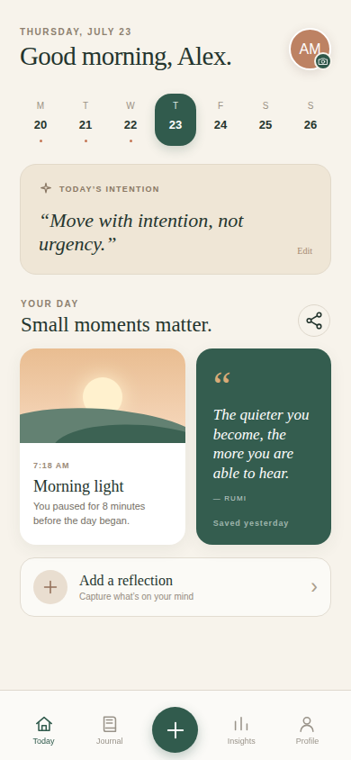

# AI Engineering

## Capacitor iOS application

This repository now includes a working React + TypeScript implementation of
the Daymark mobile experience, not only the accompanying guide. The application
uses Capacitor Camera, Share, Preferences, and Keyboard plugins and includes a
generated Xcode project under `ios/`.

```bash
npm ci
npm run dev       # Browser development
npm run ios:sync  # Production build + native plugin sync
npm run ios:open  # Open the generated project in Xcode (macOS)
```

Replace the example bundle ID in `capacitor.config.ts` and Xcode before signing
or distributing the app. See the [implementation guide](docs/2026/99_Misc/06_react_capacitor_ios.md)
for permissions, signing, privacy, and release details.



### Install it on an iPhone now

Yes—the native project is ready for device installation. The final signing and
installation steps must run on a Mac because Xcode is only available on macOS.
You need Xcode, an Apple ID added to Xcode, an iPhone running iOS 16 or newer,
and a USB cable (the first installation should be wired).

1. On the Mac, clone this repository and prepare the native dependencies:

   ```bash
   npm ci
   npm run ios:sync
   npm run ios:open
   ```

   If `ios:sync` reports that CocoaPods is unavailable, install it with
   `brew install cocoapods`, then run `npm run ios:sync` again.

2. Connect and unlock the iPhone. Tap **Trust** if the phone asks whether to
   trust the Mac, and enable **Settings → Privacy & Security → Developer Mode**
   if iOS requests it.
3. In Xcode, select the blue **App** project, then **TARGETS → App → Signing &
   Capabilities**. Enable **Automatically manage signing**, select your Team,
   and replace `com.example.daymark` with a unique bundle identifier such as
   `com.yourname.daymark`. Make the same `appId` change in
   `capacitor.config.ts`, then run `npm run ios:sync` once more.
4. Choose the connected iPhone in Xcode's run-destination selector and press
   **Run** (or <kbd>⌘R</kbd>). Keep the device unlocked during installation.
5. If iOS blocks the developer certificate, open **Settings → General → VPN &
   Device Management** on the phone, trust the listed developer identity, and
   run the app again.

An Apple Developer Program membership is not required for a basic personal
device test when Xcode offers a **Personal Team**, but it is required for
TestFlight and App Store distribution. Personal Team signing is intended for
development and may require periodic re-signing. Camera behavior must be tested
on the physical phone; sharing and saved intentions work on both web and iOS.

After every React change, run `npm run ios:sync` before pressing Run in Xcode.
Do not edit `ios/App/App/public` because Capacitor regenerates that directory.

## Docs by year
- [2025](docs/2025/README.md)
- [2026](docs/2026/README.md)

---
## Generating mkdocs.yml
> Files ending with `__x.md` will be skipped
```bash
pip install -r requirements-netlify.txt
python scripts/generate_mkdocs.py
# .\scripts\generate_mkdocs.bat
mkdocs serve
```
---
## coding agent

| Tool                       |                         Price | Best For                                             |
| -------------------------- | ----------------------------: | ---------------------------------------------------- |
| **Claude Code**            |    Free (limited) / ~$20–$100 | Excellent for large codebases and terminal workflows |
| **Gemini CLI**             |                      **Free** | Great free terminal coding agent                     |
| **OpenAI Codex (ChatGPT)** |       Free limited / Plus $20 | Full-stack development, debugging, architecture      |
| **GitHub Copilot**         |                     $10/month | IDE autocomplete and chat                            |
| **Continue.dev**           |                      **Free** | VS Code extension using your own LLM                 |
| **Cline**                  | Free (pay only for API usage) | Powerful autonomous coding in VS Code                |
| **Aider**                  |      **Free** (API cost only) | Git-based coding agent from the terminal             |
