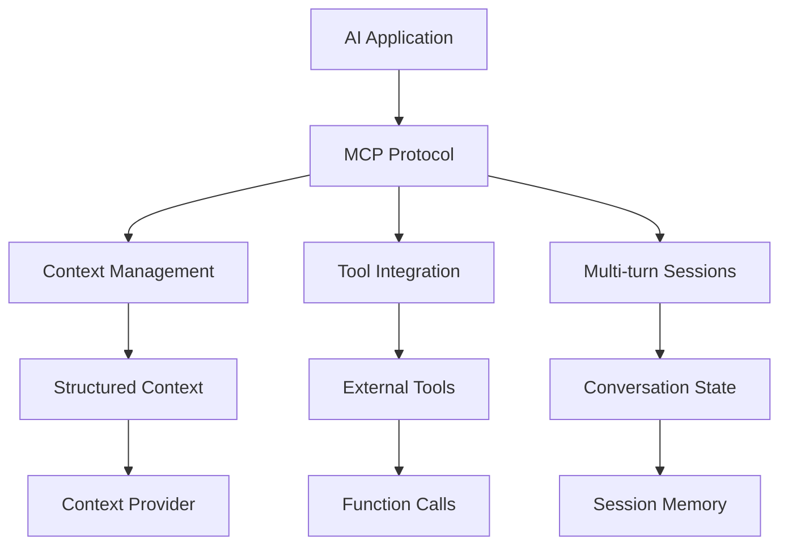

## MCP
### **MCP introduction** 
- (source: kodeKloud)

<iframe width="560" height="315" src="https://www.youtube.com/embed/RhTiAOGwbYE?si=HuBgRGjNBcMZmIje" 
allowfullscreen></iframe>

- [MCP lab](https://learn.kodekloud.com/user/courses/youtube-labs-mcp?utm_source=youtube&utm_medium=video&utm_campaign=mcpcrashcourse_part1&utm_id=mcpcrashcourse_p1&utm_term=&utm_content=)
- [https://kode.wiki/4lFwf5p](https://kode.wiki/4lFwf5p)
- [https://www.perplexity.ai/search/mcp-introduction-explained-in-_WiQ4FksREuKr5HJlKqznw](https://www.perplexity.ai/search/mcp-introduction-explained-in-_WiQ4FksREuKr5HJlKqznw)

- protocol or interface that defines how information (context) is structured, sent, and used 
- when interacting with an AI model - especially multi-turn, tool-using, or agent-like systems.
- AI models need context to do intelligent reasoning
- `mcp[cli]` --> both sdk + mcp tools (mcp inspector)
- Resources 
    - provide read-only data access to AI systems
    - @mcp.resources("file://abc) / FastMCP

```json
{
    "mcpserver": {
        "flight-booking-server": {
            "command":"uv",
            "args":["run","python","server.py"]
        }
    }
}
```

- **MCP Architecture Diagram**

---
## UV
- https://github.com/astral-sh/uv 
    -  install :: powershell -ExecutionPolicy ByPass -c "irm https://astral.sh/uv/install.ps1 | iex"
    - uv self update
    - uv init proj-1
- MCP documentation specifically recommends UV
- UV is a modern, fast Python package and project manager written in Rust. 
- It's designed to replace tools like pip, virtualenv, and poetry with a single, unified solution

```bash
Official Recommendation: MCP documentation specifically recommends UV
Speed: 10-100x faster than pip for dependency resolution
Project Management: Handles dependencies, virtual environments, and Python versions
Modern Standards: Uses pyproject.toml (PEP 518) for configuration
Rust Performance: Built in Rust for maximum speed and reliability

# old | new
pip install package	            | uv add package
python -m venv env	            | uv init project
pip install -r requirements.txt	| uv sync
```


---
## Reference/s
- [https://docs.anthropic.com/en/docs/mcp](https://docs.anthropic.com/en/docs/mcp)
- [bbgo links](https://github.com/lekhrajdinkar/solution-engineer/blob/main/docs/10_System_Design/blogs_01_byteByteGo.md#%EF%B8%8Fagentic-ai)
