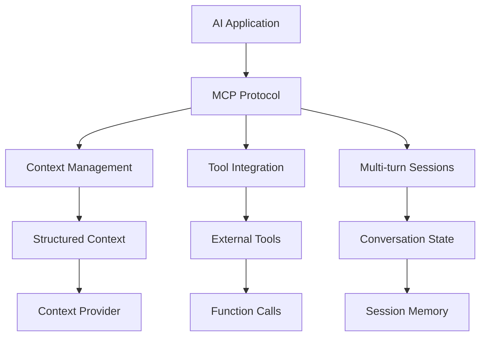

## MCP
### **MCP introduction** 
- (source: kodeKloud)

<iframe width="560" height="315" src="https://www.youtube.com/embed/RhTiAOGwbYE?si=HuBgRGjNBcMZmIje" 
allowfullscreen></iframe>

- [MCP lab](https://learn.kodekloud.com/user/courses/youtube-labs-mcp?utm_source=youtube&utm_medium=video&utm_campaign=mcpcrashcourse_part1&utm_id=mcpcrashcourse_p1&utm_term=&utm_content=)
- [https://kode.wiki/4lFwf5p](https://kode.wiki/4lFwf5p)
- [https://www.perplexity.ai/search/mcp-introduction-explained-in-_WiQ4FksREuKr5HJlKqznw](https://www.perplexity.ai/search/mcp-introduction-explained-in-_WiQ4FksREuKr5HJlKqznw)

- protocol or interface that defines how information (context) is structured, sent, and used 
- when interacting with an AI model - especially multi-turn, tool-using, or agent-like systems.
- AI models need context to do intelligent reasoning


### MCP Architecture Diagram


---
## UV
- https://github.com/astral-sh/uv 
    -  install :: powershell -ExecutionPolicy ByPass -c "irm https://astral.sh/uv/install.ps1 | iex"
    - uv self update
    - uv init proj-1
- MCP documentation specifically recommends UV
- UV is a modern, fast Python package and project manager written in Rust. 
- It's designed to replace tools like pip, virtualenv, and poetry with a single, unified solution

```bash
Official Recommendation: MCP documentation specifically recommends UV
Speed: 10-100x faster than pip for dependency resolution
Project Management: Handles dependencies, virtual environments, and Python versions
Modern Standards: Uses pyproject.toml (PEP 518) for configuration
Rust Performance: Built in Rust for maximum speed and reliability

# old | new
pip install package	            | uv add package
python -m venv env	            | uv init project
pip install -r requirements.txt	| uv sync
```

---
## POC
### ✔️flight-booking-server
```bash
uv init  flight-booking-server
cd flight-booking-server
uv add mcp[cli]
```

- `mcp[cli]` --> both sdk + mcp tools (mcp inspector)
    - mcp = FastMCP()
    - @mcp.resource("file://abc") # provide `read-only` data access to AI systems
    - @mcp.tool
    - @mcp.prompt

- configure mcp server
```json
{
    "mcpserver": {
        "flight-booking-server": {
            "command":"uv",
            "args":["run","python","server.py"]
        }
    }
}
```

### ✔️k8s-mcp-server
- docs: https://github.com/reza-gholizade/k8s-mcp-server
- manage cluster with natural language
```
docker pull ginnux/k8s-mcp-server:latest
docker images | grep k8s-mcp-server
docker inspect ginnux/k8s-mcp-server:latest
```

- configure mcp server
```
{
  "mcpServers": {
    "k8s-mcp-server": {
      "command": "sudo",
      "args": [
        "docker",
        "run",
        "-i",
        "--rm",
        "-v",
        "C:\Users\Manisha\.kube\config:/home/appuser/.kube/config:ro",
        "ginnux/k8s-mcp-server:latest",
        "--mode",
        "stdio"
      ]
    }
  }
}
```

- Key Features:
```
16 Kubernetes Tools - Complete cluster management capabilities
Pod Operations - List, describe, get logs, delete pods
Node Management - Get node information and metrics
Resource Operations - Create, update, and manage Kubernetes resources
Helm Integration - Install, upgrade, and manage Helm charts
Event Monitoring - Get cluster events and troubleshooting information
```

- Benefits:
```
Natural language cluster management
AI-powered troubleshooting
Automated resource management
Seamless integration with Roo-Code
```

- Hands on:
```
🚀 Task 1: Create an Nginx Pod

Ask Roo-Code: "Create an nginx pod with nginx image"
Verify the pod was created successfully
Check the pod status using Roo-Code

🔍 Task 2: Verify Pod Creation

Ask Roo-Code: "Show me the status of the nginx pod"
Confirm the pod is running
Check pod details and logs if needed

⚠️ Task 3: Simulate a Broken Scenario

Create a pod with an incorrect image: "Create a pod named test-pod with image BUSYYBOX"
Ask Roo-Code to identify the root cause of the issue
Use natural language to troubleshoot: "Why is my test-pod not starting?"

🎯 Learning Objectives:

Practice creating Kubernetes resources with AI
Learn to verify resource creation
Experience AI-powered troubleshooting
Understand how to ask for help with broken resources
```

---
## Reference/s
- [https://docs.anthropic.com/en/docs/mcp](https://docs.anthropic.com/en/docs/mcp)
- [bbgo links](https://github.com/lekhrajdinkar/solution-engineer/blob/main/docs/10_System_Design/blogs_01_byteByteGo.md#%EF%B8%8Fagentic-ai)
