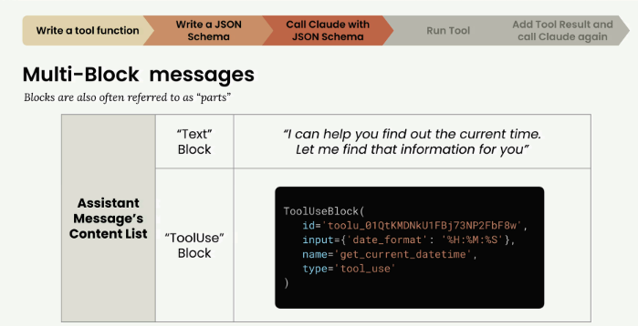
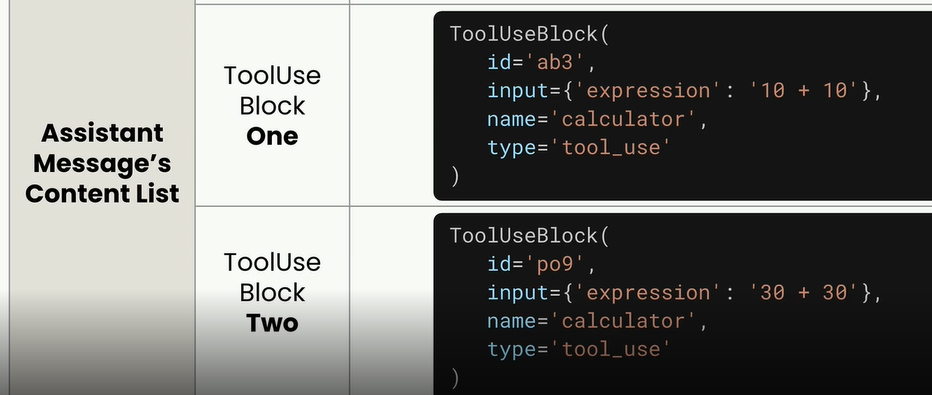
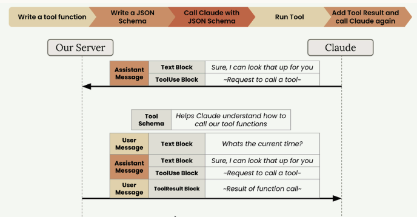
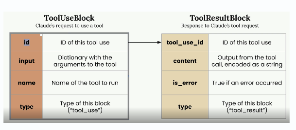
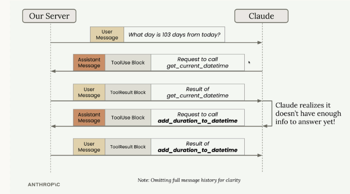
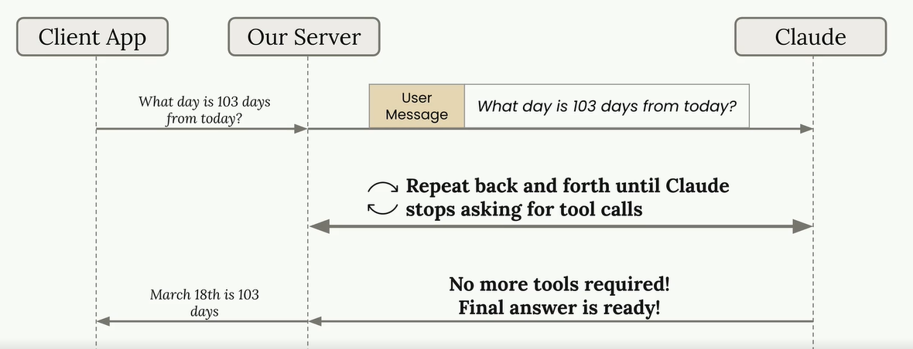
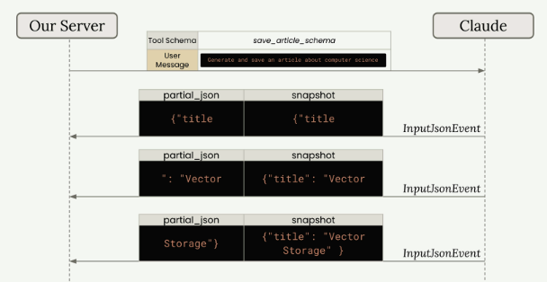
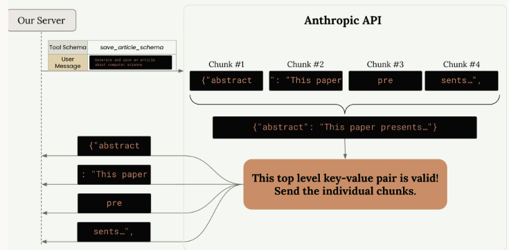
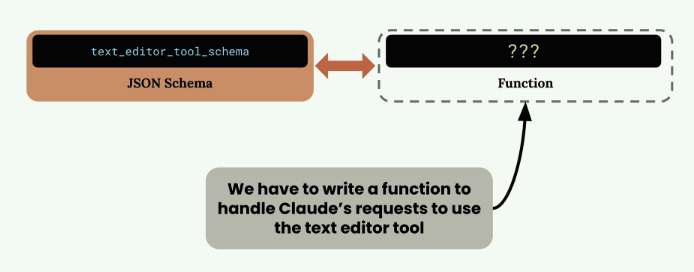

# Tools
## Reference
- https://anthropic-partners.skilljar.com/claude-with-the-anthropic-api/287747
- [README.md](../README.md)

---
## 1. Create: Tool Function
> tool 
> - plain Python function that gets executed automatically 
> - when Claude decides it needs extra information to help a user
> - eg: weather tool function

Best Practices for Tool Functions
- **Use descriptive names**: Both your function name and parameter names should clearly indicate their purpose
- **Validate inputs**: Check that required parameters aren't empty or invalid, and raise errors when they are
- **Provide meaningful error messages**: Claude can see error messages and might retry the function call with corrected parameters

```python
def get_current_datetime(date_format="%Y-%m-%d %H:%M:%S"):
    if not date_format:
        raise ValueError("date_format cannot be empty")
    return datetime.now().strftime(date_format)
```

---
## 2. Create: Tool Schema
JSON Schema
- AI community adopted it because it's a convenient way to describe function parameters and validate data.
- Instead of writing JSON schemas from scratch, you can use Claude itself to generate them
- Include the Anthropic documentation on tool use as context

```python
get_current_datetime_schema = {
    "name": "get_current_datetime",
    "description": "Returns the current date and time formatted according to the specified format",
    "input_schema": {
        "type": "object",
        "properties": {
            "date_format": {
                "type": "string",
                "description": "A string specifying the format of the returned datetime. Uses Python's strftime format codes.",
                "default": "%Y-%m-%d %H:%M:%S"
            }
        },
        "required": []
    }
}

# For better type checking, import and use the ToolParam
from anthropic.types import ToolParam
get_current_datetime_schema = ToolParam(get_current_datetime_schema)
```

---
## 3. Handle Multi-Block message
### Make call with Tool
- you need to include a `tools` parameter in your API call
- Look at the **stop_reason** field for `tool_use`

```python
messages = []
messages.append({
    "role": "user",
    "content": "What is the exact time, formatted as HH:MM:SS?"
})

response = client.messages.create(
    model=model,
    max_tokens=1000,
    messages=messages,
    tools=[get_current_datetime_schema],
)
```
### handle  Response
> no longer plain text, now
- **Text Block** - Human-readable text explaining what Claude is doing (like "I can help you find out the current time. Let me find that information for you")
- **ToolUse Block** - Instructions for your code about which tool to call and what parameters to use
    ```ToolUseBlock
    - An ID, for tracking the tool call
    - The name, of the function to call (like "get_current_datetime")
    - Input parameters, formatted as a dictionary
    - The type designation, "tool_use"
    ```


There might **multiple ToolUse Block**




```python
# update : This preserves both the text block and the tool use block,
messages.append({
    "role": "assistant",
    #"content": response.content[0].text
    "content": response.content
})
```

---
## 4. Sending tool results
### ToolResult block
- After Claude requests a tool call, 
- you need to **execute** the function with input suggested by **ToolUse block** : `get_current_datetime(**response.content[1].input)`
- send the results back

```tool-result-block
- "tool_use_id" :" Must match the id of the ToolUse block that this ToolResult corresponds to",
- "content" : "Output from running your tool, serialized as a string",
- "is_error" : "True if an error occurred"
```

Making the Final Request
- you must still include the tool schema
- The tool use workflow is now complete

```python
messages.append({
    "role": "user",
    "content": [{
        "type": "tool_result",
        "tool_use_id": response.content[1].id,
        "content": "15:04:22",
        "is_error": False
    }]
})
```




---
## 5. Multi-turn conversations with tools
### Example-1
> what the current in HH:MM and SS

Tool: `get_current_datetime` : 
- claude can request to call multiple times
- one for HH:MM time
- another for SS time

### Example-2
> prompt: "Set a reminder for my doctors appointment. Its 177 days after Jan 1st, 2050."

Above prompt requires **multiple Tools**
- `get_current_datetime` 
- `add_duration_to_datetime`
- `set_reminder`
- ...

```python
def run_tool(tool_name, tool_input):
    if tool_name == "get_current_datetime":
        return get_current_datetime(**tool_input)
    elif tool_name == "add_duration_to_datetime":
        return add_duration_to_datetime(**tool_input)
    elif tool_name == "set_reminder":
        return set_reminder(**tool_input)
```



### Tool infrastructure 
Building a Conversation Loop,  that continues until Claude stops requesting tools



Once you have the core tool infrastructure, **adding new tools** follows this pattern:
- Create the tool function implementation
- Define the tool schema
- Add the schema to the `tools` list in run_conversation
- Add a **case** for the tool in run_tool

### Final Code 👩🏿‍💻
@[code:257-277](../../../../src/y2026/claudeApIProject/001_tools_009.ipynb)

---
## 6. Tool streaming
### Default streaming behaviour
- The Anthropic API doesn't immediately, send you every chunk as Claude generates it
- Instead, it **buffers chunks and validates them first**.
- The API waits for complete **top-level key-value pairs**
- this adds delay ⭐

```json
{
  "abstract": "This paper presents a novel...",
  "meta": {
    "word_count": 847,
    "review": "This paper introduces QuanNet..."
  }
}
```




### Fine-Grained Tool Calling
- If you need **faster**, more granular streaming 
- you can enable fine-grained tool calling.  `fine_grained=True`

```working
- You get chunks as soon as Claude generates them
- No buffering delays between top-level keys
- More traditional streaming behavior
```
> Critical: JSON validation is disabled - your code must handle invalid JSON ⭐

---
**Your application needs to handle these cases gracefully**

```python
try:
    parsed_args = json.loads(chunk.snapshot)
except json.JSONDecodeError:
    # Handle invalid JSON appropriately
    print("Received invalid JSON, continuing...")
```
---
**Consider enabling fine-grained tool calling when:**
- You need to show users real-time progress on tool argument generation
- You want to start processing partial tool results as quickly as possible
- The buffering delays negatively impact your user experience
- You're comfortable implementing robust JSON error handling

### Final Code 👩🏿‍💻
@[code:1-1](../../../../src/y2026/claudeApIProject/003_tool_streaming_completed.ipynb)

---
## Built in Tools
### 1. text edit tool (schema only)
> text editor tool, lets you replicate much of the functionality of a fancy AI-powered code editor within your own applications

- use other tools, you write both the JSON schema and the function implementation. 
- **text edit tool**
  -  tool **schema** is built into Claude, 
  - you still need to provide the actual **implementation** / functions
    > Think of it this way - Claude knows how to ask for file operations, but you need to write the code that actually performs those operations.

Also While the main schema is built into Claude, you do need to include a **small schema stub when making requests.**

```json
 {
  "type": "text_editor_20250728",
  "name": "str_replace_based_edit_tool",
}
```



@[code:348-365](../../../../src/y2026/claudeApIProject/005_text_editor_tool.ipynb)

### 2. web search tool

```schema-Stub
web_search_schema = {
    "type": "web_search_20250305",
    "name": "web_search",
    "max_uses": 5,
    "allowed_domains": ["nih.gov"]
}
```

response contains several types of blocks:

| Block Type                   | Description                                     |
| ---------------------------- | ----------------------------------------------- |
| **Text blocks**              | Claude's explanation of what it's doing.        |
| **ServerToolUseBlock**       | Shows the exact search query Claude used.       |
| **WebSearchToolResultBlock** | Contains the search results.                    |
| **WebSearchResultBlock**     | Individual search results with titles and URLs. |
| **Citation blocks**          | Text that supports Claude's statements.         |

The web search tool works best for:

```use-cases
- Current events and recent developments
- Specialized information not in Claude's training data
- Fact-checking and finding authoritative sources
- Research tasks requiring up-to-date information
```
Final Code 👩🏿‍💻
@[code:55-71](../../../../src/y2026/claudeApIProject/006_web_search_complete.ipynb)