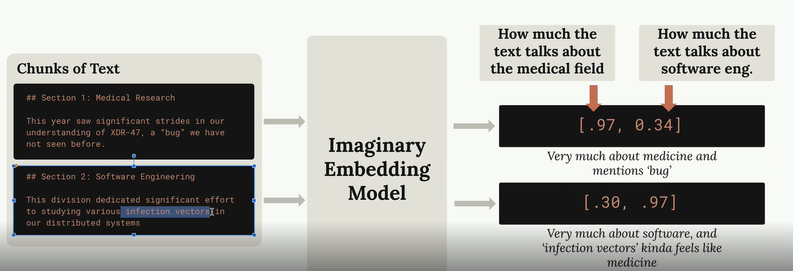

# RAG and Agentic Search
## Reference
- https://anthropic-partners.skilljar.com/claude-with-the-anthropic-api/287763 | RAG
- [README.md](../README.md)
- [KodeKloud : RAG](../../02_AgenticAI/04_RAG) 

## RAG 
### Introduction
- Retrieval Augmented Generation
- technique that helps you work with large documents that are too big to fit into a single prompt.
- Instead of cramming everything into one massive prompt, 
- RAG breaks documents into chunks and only includes the most relevant pieces when answering questions.
- RAG trades simplicity for **scalability and efficiency**⭐

> RAG pipeline: Chunking > Text embedding > Sematic Search > ...

### Benefits

| **Benefit**                         | **Description**                                     |
| ----------------------------------- | --------------------------------------------------- |
| **Relevant content**                | Claude can focus on only the most relevant content. |
| **Scalability**                     | Scales up to very large documents.                  |
| **Multiple documents**              | Works with multiple documents.                      |
| **Lower cost and faster execution** | Smaller prompts cost less and run faster.           |


### Challenges

| **Challenge**         | **Description**                                                                             |
| --------------------- | ------------------------------------------------------------------------------------------- |
| **Preprocessing**     | Requires a preprocessing step to chunk documents.                                           |
| **Search mechanism**  | Needs a search mechanism to find “relevant” chunks.                                         |
| **Missing context**   | Included chunks might not contain all the context Claude needs.                             |
| **Chunking strategy** | There are many ways to chunk text, making it difficult to determine which approach is best. |

---
## 1. Text chunking strategies
### Size-based chunking
-  simplest approach, fallback, default.
- Words get cut off mid-sentence
- Chunks lose important context from surrounding text
- you can add overlap between chunks.

@[code:2-17](../../../../src/y2026/claudeApIProject/001_chunking.ipynb)

### Structure-Based Chunking
-  document's natural structure - headers, paragraphs, and sections | md files
- cleanest, most meaningful chunks
- only works when you have guarantees about your document structure
- Many real-world documents are plain text or PDFs without clear structural markers

@[code:45-55](../../../../src/y2026/claudeApIProject/001_chunking.ipynb)

### Sentence-Based Chunking
- You split the text into individual sentences using **regular expressions,**
- then group them into chunks with optional overlap
- eg: chunk_by_sentence. `re.split(r"(?<=[.!?])\s+", text)`

@[code:24-41](../../../../src/y2026/claudeApIProject/001_chunking.ipynb)

### Semantic-Based Chunking
- the most sophisticated approach.
- You divide text into sentences, then use **natural language processing** to determine how related consecutive sentences are.
- method is computationally **expensive** but produces the most relevant chunks.
---


## 2. Text embedding
### Semantic Search
- After breaking a document into chunks,
- the next step in a RAG pipeline is finding which chunks are most relevant to a user's question. 
- This is essentially a **search problem**
-  most common approach for finding relevant chunks is **Semantic Search**
- semantic search uses **text embeddings** to understand the meaning and context:
  - numerical representation of the meaning `-1 to +1`
  - Each number in an embedding is essentially a "score" for some quality
  - The actual meaning of each dimension is learned by the model during **training**



### VoyageAI for Embedding

```python
# VOYAGE_API_KEY="your_key_here"
# pip install voyageai

from dotenv import load_dotenv
import voyageai

load_dotenv()
client = voyageai.Client()

def generate_embedding(text, model="voyage-3-large", input_type="query"):
    result = client.embed([text], model=model, input_type=input_type)
    return result.embeddings[0]
```