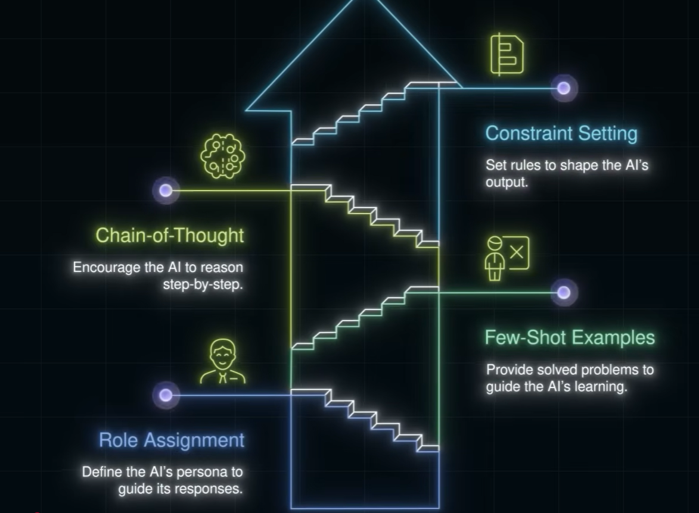
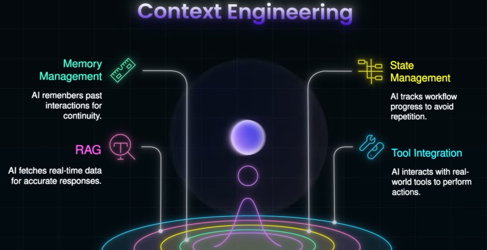
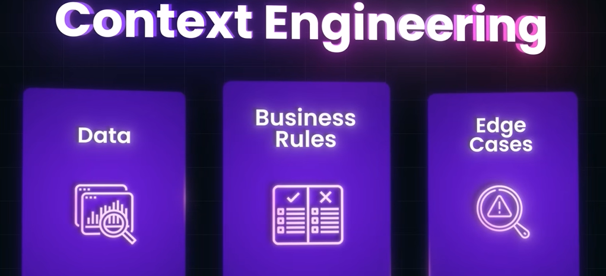
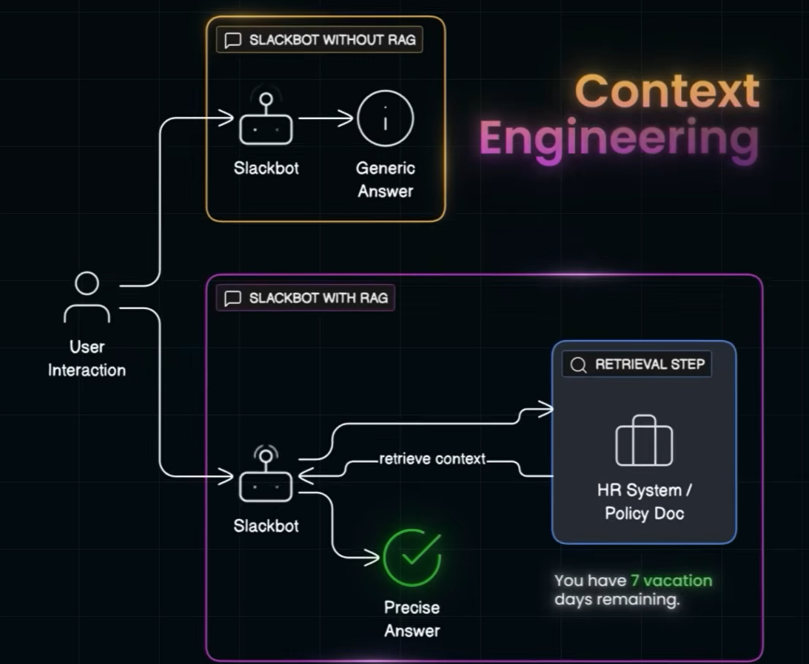

## ✔️prompt engineering

- [02_03_prompt_eng.md](../01_AWS_AIF-C01/02_03_prompt_eng.md)
- **demo-to-production gap**. ◀️
  - better prompt --> better output from LLM. good for Demo/poc.
  - prompt engineering is the practice of designing and refining prompts to get accurate, useful, and reliable model outputs.
  - But it **doesnt solves** real industry problem.
- therefore, we need to build **environment for AI agent to solve act(action) to solve real world problem**.
- **Context Engineering** helps to build that environment.

---
## ✔️Context Engineering

### ➖ Memory mgt
- store previous interaction in vector db.
- store data across multiple session
- thus improve context for AI agent.

### ➖ State mgt
- remember previous step, so dont need to re-explain again.
- or start from scratch.
- track **workflow** progress and state.
- thus improve context for AI agent.

### ➖ RAG
- [01_02_RAG.md](01_02_RAG.md)
- Solve Out dated knowledge, limited context window, **hallucination problem** of LLM.
- thus improve the context for AI agent.
- since model is not limited to knowledge in training data.

### ➖ Tool Integration
- Tool are ext api to act/action.
- API integration improved with **MCP**
- [03_01_MCP.md](03_01_MCP.md)
- [04_01_MCP_security.md](04_01_MCP_security.md)

### More

### 🔸Example1 : Slackbot
- slackBot is giving response by revolving around company's data instead of generic data
- by using RAG to fetch context from company data base.
