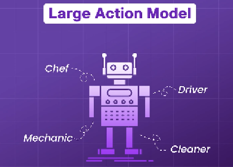
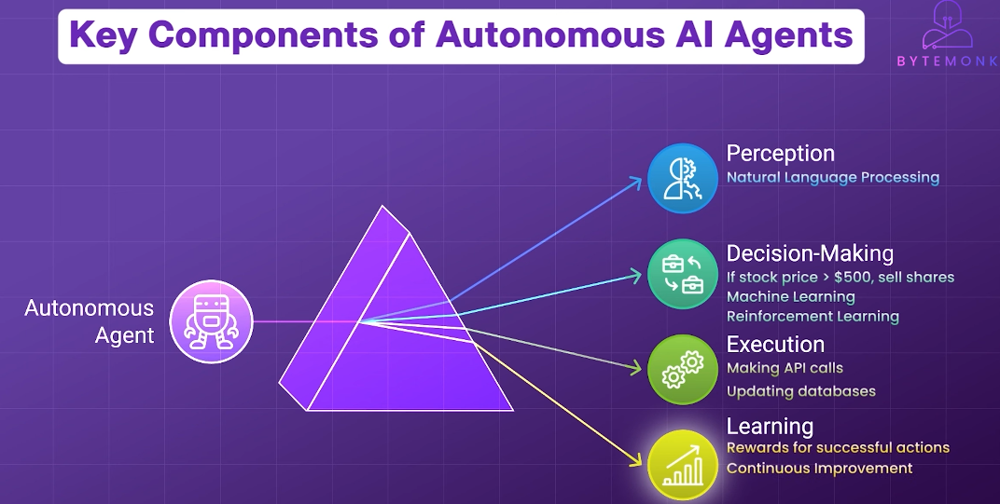
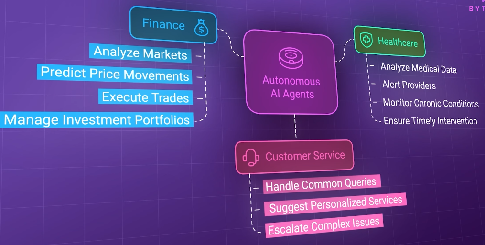

# AI application
## ✔️AI assistant
- eg: ChatGPT
- just answers Questions.
- doest not take action - like running command, etc
- zero shot

## ✔️LAM
- https://youtu.be/JYN6O5Gbxlc?si=pG2wePL8GwZind57
- 
- can switch to multiple roles === think of **general purpose agent**
- can to more complex task than agent but **less autonomous** ( need human instruction, feedback, etc.)
- can learn from UI interactions.
  
## ✔️Autonomous AI Agent  👈🏻👈🏻
### Overview
- https://www.youtube.com/watch?v=SYHqSAWQ4NY&list=PLJq-63ZRPdBu38EjXRXzyPat3sYMHbIWU&index=11
  - Analyze Surrounding
    - **Adapt** to changing market conditions
    - learn from previous actions
  - Make/optimize Decision on pre-defined Goals
  - **Execute Action**
  - Autonomous : **No human instruction, feedback, etc**. But not 100% reliable. ◀️
  - 
  - 
- More:
  - Existing Application (passively follows instructions) + Add **additional layer (LLM)**
  - thus makes, s/w to think, reason, make decision, take action.
  - next level to **automation** approach
  - eg: Github Copilot, Copilot Studio, etc
  - But  LLM have limitations:
      - lack of up-to-date knowledge
      - limited context window (cant remember long conversation)
      - hallucination (wrong info/confidently wrong)
      - **solution**: MCP, RAG, memory, guardrails, orchestration, etc.

- **Application**
    - 
  
- **Open-Source Projects**:
    - https://github.com/lavague-ai/LaVague
    - https://github.com/TransformerOptimus
    - https://github.com/microsoft/autogen

### Architecture of AI Agent
- **Component**:
    - LLM
    - MCP, A2A
    - Knowledge Base and RAG
    - memory (user session),
    - guardrails
    - orchestration (monitoring, logging, RT insights, etc)

### agentic-workflow-types
- single-agent,
- multi-agent,
- human-in-the-loop,
- routing,
- parallelism,
- evaluator-optimizer,
- orchestrator,
- Truly Autonomous

### agentic-design-patterns

### agentic-security

### agentic-mlops

