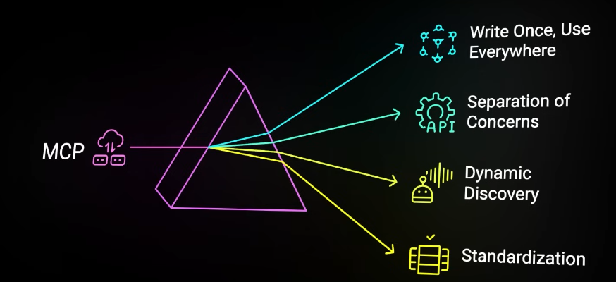
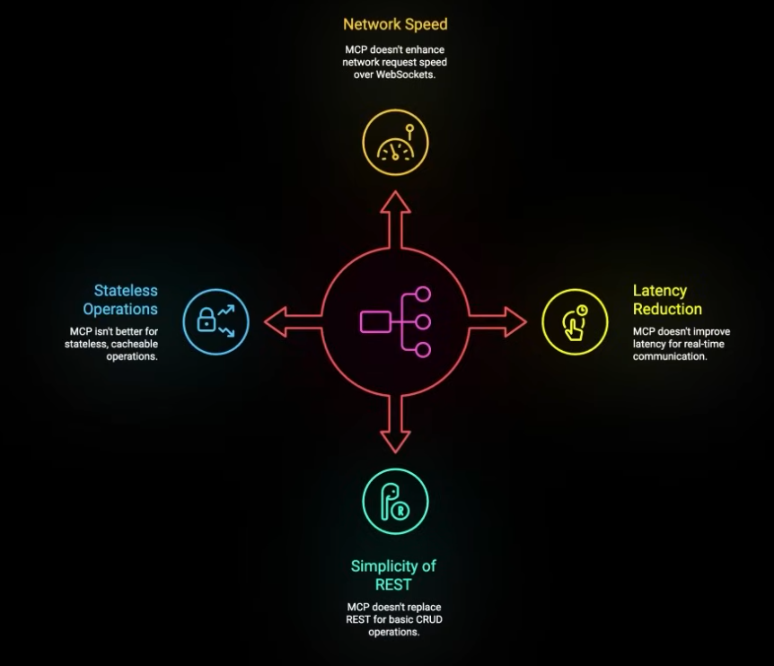
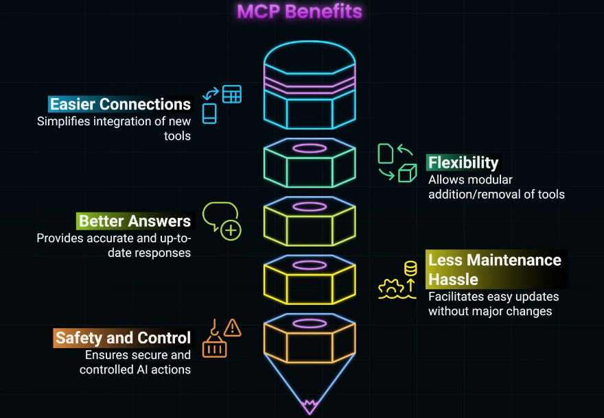
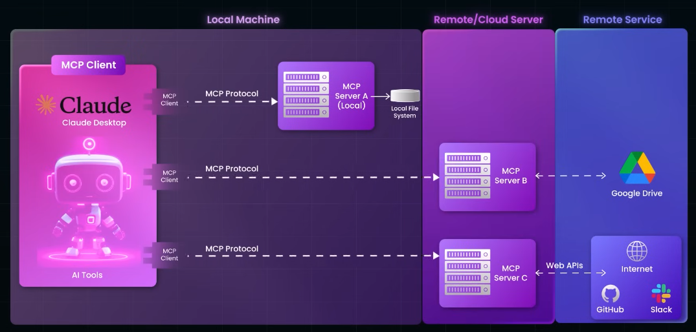
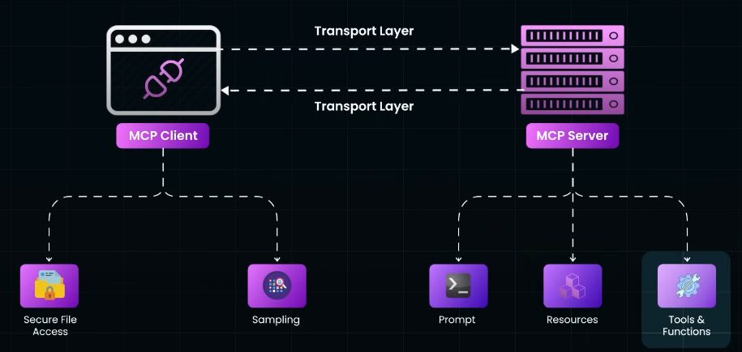
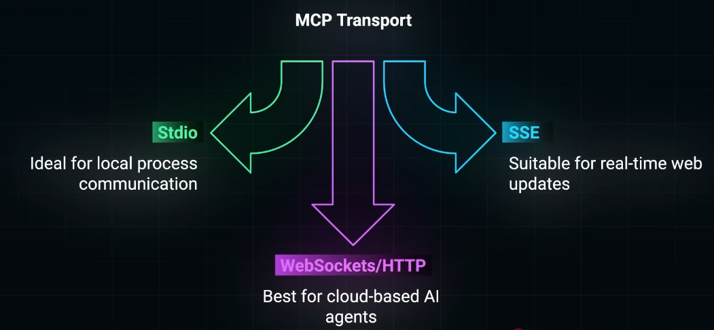
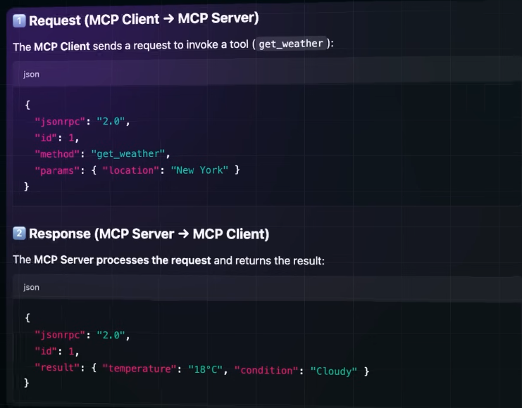
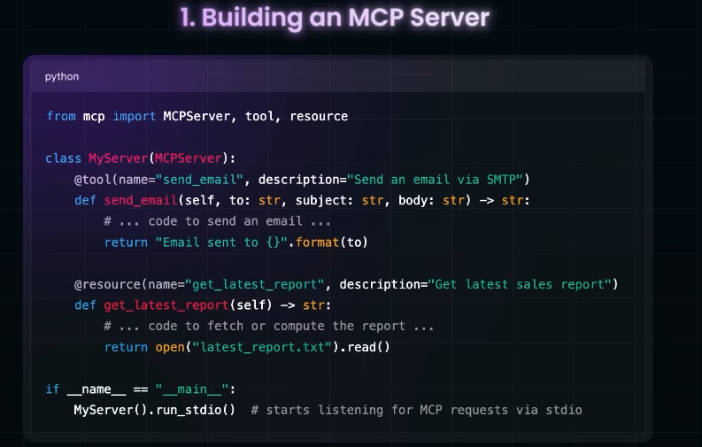
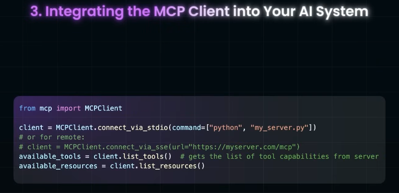

# MCP (**Anthropic**)

## Why/ solves what ?
- Standardize **API Integration complexity** between AI agents and external tools/data sources
  - multiple transport : REST/WS/gRPC/GraphQL/webhooks
  - juggling between multiple - API specs, auth, rate-limiting, error-handling, data-formatting
  - calling and handling 3 github api vs calling 3 tools
  - https://youtu.be/-b6rGrIEG0w?si=A7SgF5D31U7RPhm3
- think sof universal adaptor b/w AI model and external tools/data sources

## Overview
- model-agnostic,  meaning it can work with different AI models and platforms.
- acts as a bridge between "AI agent" and "external tools or data sources". 
  - It enables AI agent to access information beyond its built-in knowledge/training of LLM
  - ai-agent-1|2|...(mcp-client)  <--> mcp-server-1|2|...(re-use) <--> external tools (vendor api, etc)
  - handle **multi-turn conversations** seamlessly
  - manage context effectively, to do intelligent reasoning and decision-making

## benefits

## Architecture 

- **MCP Schema** - how req and response is structured

- **Python SDK**
  - 
  - 

- **LLM Loops** 
  - Take Model Response and decide which MCP Tool/Resource to invoke

- **Components**:
  - **MCP Server** | hosted:  locally, cloud, k8s,  3rd-party vendors
    - 🔸Tools : actions that AI can perform (e.g., database queries, API calls, file operations)
    - 🔸resources: data sources that AI can access (e.g., documents, databases, web pages)
    - 🔸Prompts: predefined instructions/templates to guide AI interactions on tools/resources
    - **Reusability** : can reuse same mcp-server for multiple agents ◀️
    - has all the implementation logic for action. no code changes needed on client side/ agent side ◀️
  - **MCP Client** ( AI agents, act as clients connecting to MCP servers)
    - 🔸Sampling
    - 🔸Elicitation
    - 🔸Root: FileSystem, DB | eg: keep user preference

## reference:
- https://www.youtube.com/watch?v=RhTiAOGwbYE
- [MCP lab-1](https://learn.kodekloud.com/user/courses/youtube-labs-mcp?utm_source=youtube&utm_medium=video&utm_campaign=mcpcrashcourse_part1&utm_id=mcpcrashcourse_p1&utm_term=&utm_content=)
- [https://kode.wiki/4lFwf5p](https://kode.wiki/4lFwf5p)
- [https://www.perplexity.ai/search/mcp-introduction-explained-in-_WiQ4FksREuKr5HJlKqznw](https://www.perplexity.ai/search/mcp-introduction-explained-in-_WiQ4FksREuKr5HJlKqznw)
- [https://docs.anthropic.com/en/docs/mcp](https://docs.anthropic.com/en/docs/mcp)
- [bbgo links](https://github.com/lekhrajdinkar/solution-engineer/blob/main/docs/10_System_Design/blogs_01_byteByteGo.md#%EF%B8%8Fagentic-ai)
- byteMonk

---
