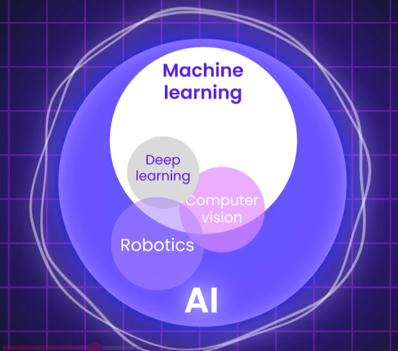

## ✔️AI history and Hierarchy
```
- AI Artificial Intelligence
  ├── ML Machine Learning
  │   └── DL Deep Learning (Neural n/w, stacker layer)
  │       └── GenAI Generative AI (CSE) === NLP, LLM, Diffusion model
- Computer vision
- Robotics
```
| Term       | Full Form               | What It Means                                                                     | Examples                                              |
| ---------- | ----------------------- | --------------------------------------------------------------------------------- | ----------------------------------------------------- |
| **AI**     | Artificial Intelligence | The broad field of building machines that mimic human intelligence                | Chatbots, self-driving cars, recommendation systems   |
| **ML**     | Machine Learning        | A subset of AI where machines learn from data without being explicitly programmed | Spam detection, fraud detection, image classification |
| **DL**     | Deep Learning           | A subset of ML using deep neural networks for complex tasks                       | Face recognition, speech-to-text, GPT models          |
| **Gen AI** | Generative AI           | A type of AI (often using DL) that generates new content (text, image, etc.)      | ChatGPT, DALL·E, GitHub Copilot, Sora                 |



## ✔️Common Questions
### 1. When to Use Service/API
- Problem has clear rules, business logic, or deterministic behavior
- Input → predictable processing → output

### 2. When to Use an AI Model
- Problem involves uncertainty, prediction, or pattern recognition
- No clear rules — you need the model to “learn” from data
- Examples:
    - Extract **insights** from documents (NLP/IDP)
    - Analyze sentiment, classify images, **recommend** products
    - **Strategic tasks** like content generation or forecasting
 
### 3. Popular ML/DL Models That Shaped FM Foundational Models
| **Model Type**                          | **Model Name / Concept**                            | **Purpose / Use Case**                  | **Foundation Model Dependency**                | **Python Library**                                   |
| --------------------------------------- | --------------------------------------------------- | --------------------------------------- | ---------------------------------------------- | ---------------------------------------------------- |
| ✅ Transformers                          | **BERT, GPT, T5, XLNet, RoBERTa**                   | Language understanding & generation     | Core of all LLMs                               | `transformers` (HuggingFace), `LangChain`            |
| ✅ RNNs / LSTMs                          | LSTM, GRU                                           | Early NLP & time series                 | Predecessors of transformers                   | `keras`, `torch.nn`                                  |
| ✅ CNNs                                  | AlexNet, VGG, ResNet                                | Image classification, vision tasks      | Used in multi-modal models                     | `torchvision`, `tensorflow.keras.applications`       |
| ✅ GANs                                  | DCGAN, StyleGAN, CycleGAN                           | Image generation, augmentation          | Used in diffusion, creative GenAI              | `tensorflow`, `torch`, `diffusers`                   |
| ✅ VAEs                                  | Variational Autoencoders                            | Image generation, compression           | Inspired diffusion models                      | `Pyro`, `TensorFlow Probability`                     |
| ✅ Diffusion Models                      | DDPM, Stable Diffusion                              | Image & video generation                | Part of GenAI stack (e.g. Bedrock Titan Image) | `diffusers`, `comfyui`, `invokeAI`                   |
| ✅ Seq2Seq                               | Encoder-Decoder (attention)                         | Translation, summarization              | BERT, T5, GPT follow this architecture         | `OpenNMT`, `Fairseq`, `transformers`                 |
| ✅ Audio Models                          | WaveNet, Tacotron                                   | Speech synthesis (TTS)                  | Underlies Amazon Polly, Google TTS             | `ESPnet`, `torchaudio`                               |
| ✅ RL (Reinforcement Learning)           | DQN, PPO, A3C                                       | Model training with reward (e.g., RLHF) | Used in ChatGPT/Claude refinement              | `stable-baselines3`, `Ray RLlib`                     |
| ✅ IDP (Intelligent Document Processing) | LayoutLM, Donut                                     | Form understanding, OCR+NLP             | Supports document GenAI use cases              | `transformers`, `paddleocr`, `layoutparser`          |
| ✅ Multi-modal                           | CLIP, Flamingo, BLIP                                | Text + image understanding              | Supports image captioning, vision+LLM models   | `transformers`, `OpenCLIP`, `vision-language-models` |
| ✅ Retrieval Models                      | BM25, Dense Passage Retrieval (DPR), FAISS, ColBERT | RAG & semantic search                   | Used in Bedrock RAG, LangChain                 | `faiss`, `chromadb`, `sentence-transformers`         |

### 4. Key Python Libraries to Work with These Models
- **streamlit UI**
- **Jupyter Notebooks** for experimentation

| **Library**                      | **Use Case**                                              |
| -------------------------------- | --------------------------------------------------------- |
| `transformers` (HuggingFace)     | NLP, LLMs, vision-language, BERT/GPT/etc.                 |
| `diffusers`                      | Diffusion-based image generation (e.g., Stable Diffusion) |
| `torch`, `tensorflow`            | Low-level DL model building                               |
| `llama-index`                    | RAG pipelines, document ingestion, vector integration     |
| `faiss`, `chromadb`              | Vector storage and semantic search                        |
| `sentence-transformers`          | Sentence embeddings, semantic similarity                  |
| `OpenNMT`, `Fairseq`             | Seq2Seq model training (translation, summarization)       |
| `ESPnet`, `torchaudio`           | Speech/audio models                                       |
| `layoutparser`, `paddleocr`      | Document layout and OCR for IDP                           |
| `stable-baselines3`, `Ray RLlib` | Reinforcement learning (e.g., RLHF)                       |

- `datasets`
- `Trainer`
- `langGraph`
- `AutoGen`
- `CrewAI`
- `diffusers`
- `TensorFlow`
- `pytorch`
- `LangChain`
    - Python/JavaScript framework for building applications with LLM
    - integrate LLMs with real-world data (APIs, SQL, docs)
    - Orchestration of LLMs, agents, tools, memory
    - prg ideas:
        - Document Q&A system (e.g., chat with PDF, DB, storage)
        - Chatbot with memory
        - Enterprise search engine (RAG pattern)
        - Connect your GenAI app to a document set
        - Build a chatbot + FastAPI
        - Try Hugging Face demos

