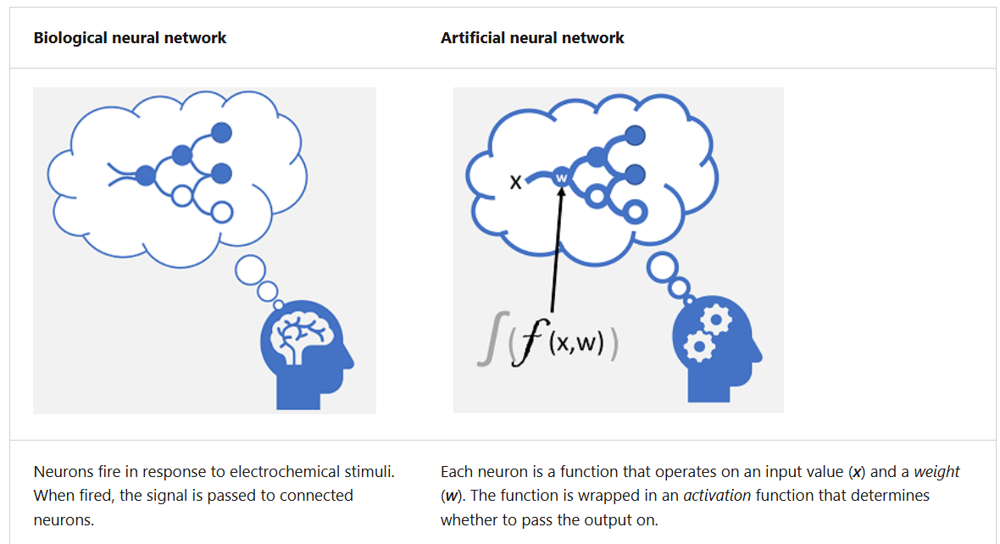
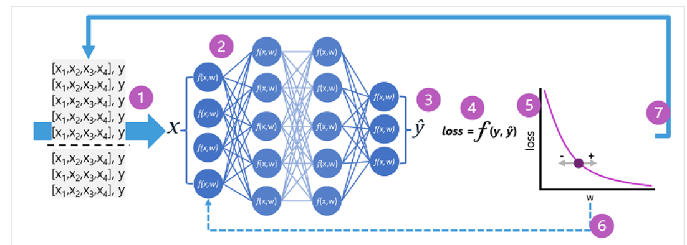
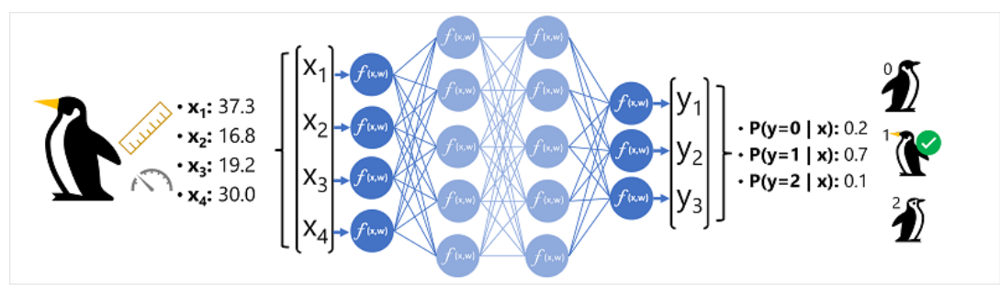

# Deep learning

## Overview
- 👉https://learn.microsoft.com/en-us/training/modules/fundamentals-machine-learning/8-deep-learning?pivots=video
- emulate the way the human brain learns.
- creation of an `artificial` neural network that simulates **electrochemical activity** in biological neurons **by using mathematical functions**



## NN ( Artificial - NN neural networks )
- tiny Nodes (Artificial neurons) === f1(x1,x2,x3, `weight`), organized in layer.
- Since entire network is essentially **one large nested function**,
- can use **differential calculus function**, to evaluate the influence of each `weight` in the network on the loss
- and determine how they could be adjusted (up or down) to reduce the amount of overall loss
- changes to the weights are backpropagated to the layers in the network
- The process is repeated over multiple iterations (known as `epochs`) until the loss is minimized and the model predicts acceptably accurately.

- **Sample flow**:
    - expected label/output is y
    - epoch-1, f(x1,x2,x3, w1) = y1^ , loss/error = f(y, y1^) , w1 adjusted to `w2`
    - epoch-2, f(x1,x2,x3, `w2`) = y2^ , loss/error = f(y, y2^)  , w2 adjusted to w3
    - ...
    - Note: freezing layer == make weight fixed ◀️
    - Training adjusts these weights to minimize errors and improve predictions.





```
  Input Layer (simple)    : Takes raw data (e.g., an image’s pixels).
  Hidden Layers -1           : Intermediate layers that learn feature like "edges"
  Hidden Layers -2           : Intermediate layers that learn feature like "shapes".
  Hidden Layers -3           : Intermediate layers that learn feature like "textures".
  ...
  ...
  Output Layer (complex)     : Produces the final prediction (e.g., picture is “cat” or “dog”).
```
  
## RNN (Recurrent Neural Networks)
- neural network to learn from  **sequence data** () time series, text, or speech)
- **GRU** Gated Recurrent Unit
- **LSTM** Long Short-Term Memory
- https://youtu.be/hNLhcSm0CDo?si=ioFANBxtelUEvuNW

## ResNet (Residual Network)
– Neural Network (CNN) used for image recognition tasks, object detection, facial recognition


