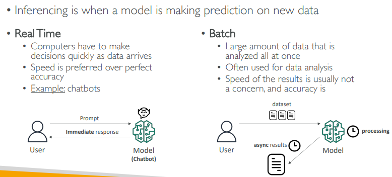

# GenAI : Model
> GenAI : 
> - generates new data/content (ext, images, audio, code, or video) 
> - that is similar to the **data it was trained on**.

## Models Overview
**Training** of Model

**Inference** Model
  - using model by API call.
  - Every API call goes through five steps: 
    - **tokenization** 
      - https://www.youtube.com/watch?v=08tL8ekwwM0 (Skip)
    - **embedding**, 
    - **prefill** (parallel/fast), 👈
      - model reads your entire input prompt all at once
      - During this stage, the model builds the internal state necessary to begin generating a response
    - **decode** (sequential/slow), 
    - **detokenization**
      - Output tokens typically cost 3 to 5x more than input tokens 
      - because generating them is a sequential process that requires a full pass through the model's parameters
        

      
---           
## Four Levers for Cost Optimization:
**Trim and Cap**: Reduce system prompt length and set max_tokens to the minimum necessary 

**Prefix Caching**: Cache the system prompt's prefill state to cut costs by 80-90% for repetitive prompts 

**Model Tiering**: Match the model size to the task difficulty; don't use frontier models for simple tasks 

**Provider Routing**: Use platforms like OpenRouter to route requests to the cheapest or fastest provider for the same underlying model

---
## Factors to Consider When Selecting a Generative AI Model
- Models are optimized for different tasks, so choosing the right one is crucial for achieving the desired results.
- **Model types** 
- **Performance requirements** : accuracy vs performance
- **Capabilities**
- **Constraints** 
  - Available GPU, memory, etc
  - size fof training data
  - onPrem vs cloud
- **Compliance**
  - Sensitive domains like healthcare, finance, and legal applications
  - One should consider factors such as fairness, transparency or traceability, accountability, hallucination, and toxicity
- **Cost**

---
## Business Metric for genAI App
- User satisfaction
- Average revenue per user ARPU
- Cross-domain performance
- Conversion rate
- Efficiency (resource utilization, computation time, and scalability)

---
## GenAI Models
### FM
- https://youtu.be/zg7nJrDQZ5s?si=EztmeLIgCiWlZU4u
- pretrained on **internet-scale data**
    - images, video, text, code, audio, website, article, books, etc.
- **backed by NN neural network/s** that can be adapted to many tasks.
- **Multimodal**
    ```
    - input/output = text or images
    - text --> image
    - image --> text
    - text --> graphics
    ```
- Can also serve as the starting point for developing more **specialized models**
- **Specialized AI datacenters**
    - requires massive compute, typically across thousands of GPUs over weeks/months. NVIDIA A100  H100.
    - supercomputers with 10,000–25,000 GPUs, interconnected by high-speed NVLink
    - Training data is stored in fast, distributed SSD/NVMe storage. Needs hundreds of TBs to petabytes.
    - Infiniband : 400 Gbps
  
### LLM (Specialized FM) 👈🏻
- [02_01_LLM.md](02_02_LLM.md)

### Diffusion models (DL)
- Used for generating images and videos
- **forward diffusion** : the system gradually introduces a small amount of noise to an input image until only the noise is left over.
- **Reverse diffusion** :the noisy image is gradually introduced to denoising until a new image is generated

### GANs

### VAEs 


