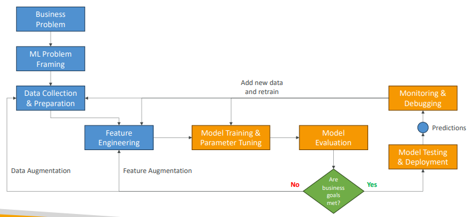
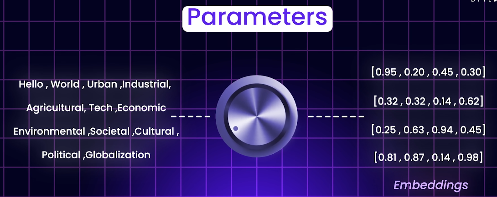
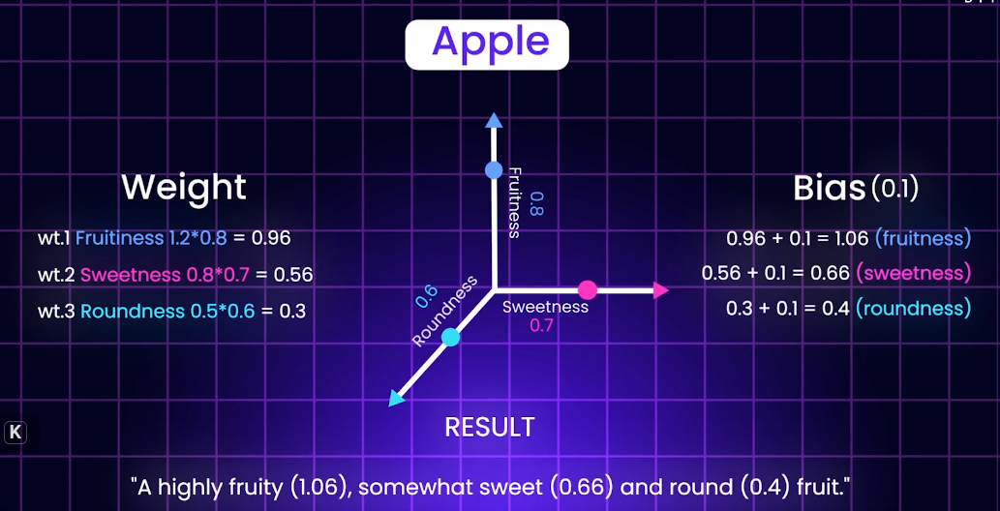
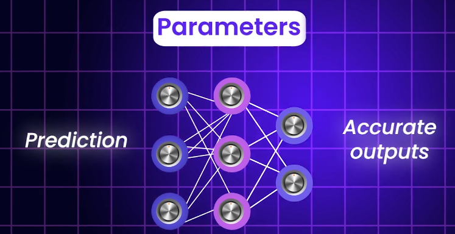
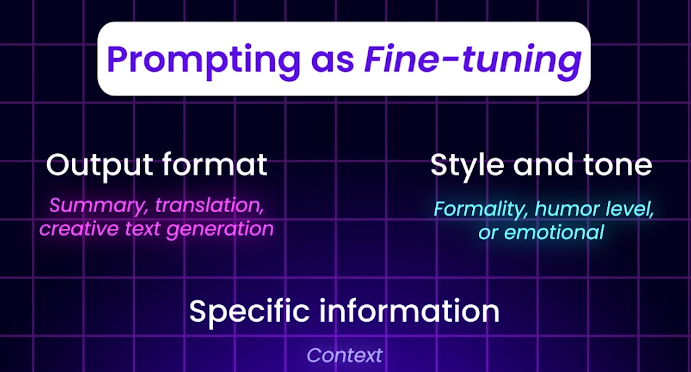
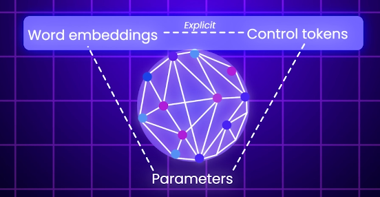
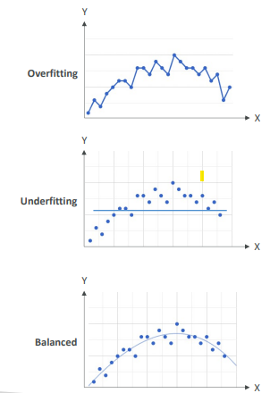

# Models : Training



## Training Data
- **Structure data** - csv,rdbms, timeseries data, etc
- **un-Structure data** - image(pixel),object, comments etc | have specific type of ML alog to deal with these.
- **label Data** - input+label | added by human/auto, use to define mapping x1 --> o1 | **supervised leaning**
- **un-label Data** - input | model itself tries to find pattern -inheritance,relationship, etc | **un-supervised leaning**

## Pretraining
- the initial phase where FM learns general patterns from diverse data

## Fine-tuning
- subsequent phase where FM is adapted to **specific tasks**,
- using datasets/trainingData (smaller & task-specific)
- unfreeze some layers and train both new and selected old layers

## Transfer Learning
- Freeze pretrained layer
- Add new Layer for our specific task and train only this layer

## Retraining
- Train all layers from scratch (no pre-learned knowledge)

```
Analogy:
    Retraining = Teach a student everything from zero 📖
    Transfer learning = Student already knows basics, you teach just the last chapter 📘
    Fine-tuning = Student knows a lot, but you adjust what they’ve learned to your topic ✏️
```
## parameter
- **tuning knobs for meaningful embedding**
  - 
- Has two main components:
  - **weight** - word meaning (how word is expressed in multi-dimension space)
  - **bais** - add final tone , humor, etc.
  - 
- think of internal setting of neural network.
  - 
- **Type**:
    - model parameters : 
      - learned during training (weights, biases). 
      - changing these requires retraining or fine-tuning.
      - computationally expensive.
    - prompt parameters : 
      - context-specific adjustments during inference (temperature, max tokens)
      - prompting as fine-tuning without changing model weights. ◀️
      - **Prompt engineer** filling gap b/w human intention and machine capability.◀️
      - prompting type: zero-shot, few-shot, chain-of-thought
      - 
      - 

## Hyperparameters
- set before training and control the learning algorithm and process
- tuning hyperparameters can significantly impact model performance and training efficiency.
- Example:
    - **learning rate** : how fast weight being updated
    - **batch size** : no og training item. 1000 in one go, or 50, 50, 50,,,
    - **number of epochs** : iterations
    - **regularization** : to adjust over/under fitting
    - **number of layers**

## Bias and Variance
- **bias** : Difference between - predicted vs actual **value**
- **Variance (sensitive)** : How much the **performance** of a model, on changes of similar training datasSet.
    - eg: worked well/overfited in dev, but underfit/prod in prod data.

## Confusion Matrix 

## Regression Matrix 

## Evaluation
```
Describes how well your model captures the patterns in training data.

    ✳️Underfitting    : 
        Model is too simple 
        misses patterns
    
    ✳️Overfitting     : 
        Model is too complex
        memorizes noise.
        model gives good predictions for training databut not for the new data
        
    ✳️balanced fit    : Balances bias and variance, performs well on both train and test data
```


---
