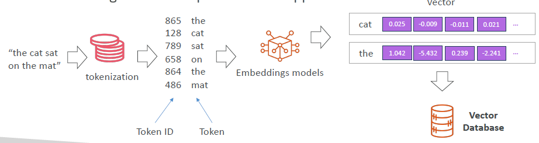
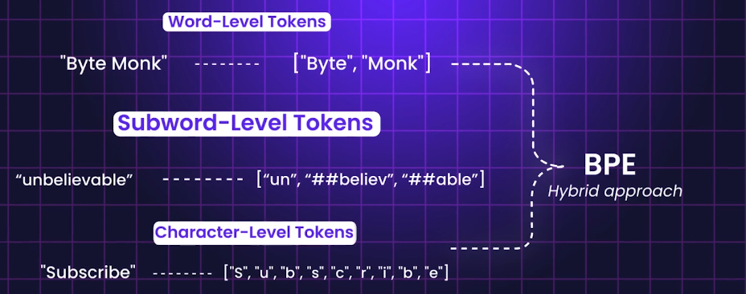
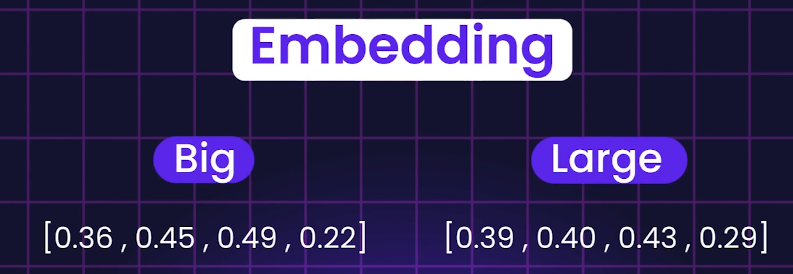
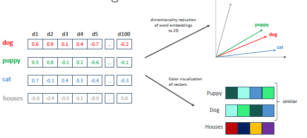

# Models : Core concepts

## Tokenization

- Tokens are the model's compute unit, not words or characters. 
- Different models use different **tokenizers**
- common patterns are cheaper (eg: of, the, etc)
- rare patterns are expensive, like UUIDs, code, or non-English text, which can significantly explode token counts

##  Embedding
- Numerical representations of data (text, images, etc.) in a high-dimensional space.
- Algo: `FastText`, `Word2Vec`, `ElMo`
- purpose: capture semantic meaning and relationships between data points.
- Application:
    - similarity analysis, 
    - semantic search, 
    - clustering & categorization, 
    - recommendation systems
- 
- 

## Vector

- the actual multi-dimension arrays of numbers that represent these embeddings.
- Capture semantic relationships between data points.
- Used in similarity search, clustering, and as input to ML models.
- Techniques: `cosine similarity`, `Euclidean distance`
- **Vector databases**
    - stores and manage these embeddings for efficient retrieval.
    - Format: FAISS
    - eg: Amazon OpenSearch, Pinecone, Redis with KNN
- **use cases**:
    - Used in RAG (Retrieval Augmented Generation) to enhance LLMs with external knowledge.
    - Demo: [udemy demo 1](https://www.udemy.com/course/aws-ai-practitioner-certified/learn/lecture/44886393#overview), [udemy demo 2](https://www.udemy.com/course/aws-ai-practitioner-certified/learn/lecture/44901525#overview)

## RAG (Retrieval Augmented Generation)
- [Agentic AI >> RAG ](../../02_AgenticAI/04_RAG)
- RAG combines LLMs with vector search to provide more accurate and context-aware responses.
- eg: LangChain, LlamaIndex
- Popular libraries: `sentence-transformers`, `transformers`, `faiss`, `chromadb`
- Applications: semantic search, recommendation systems, document retrieval

