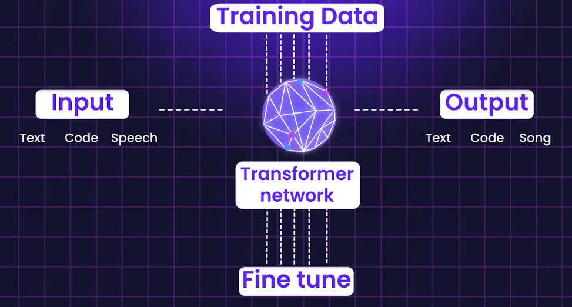
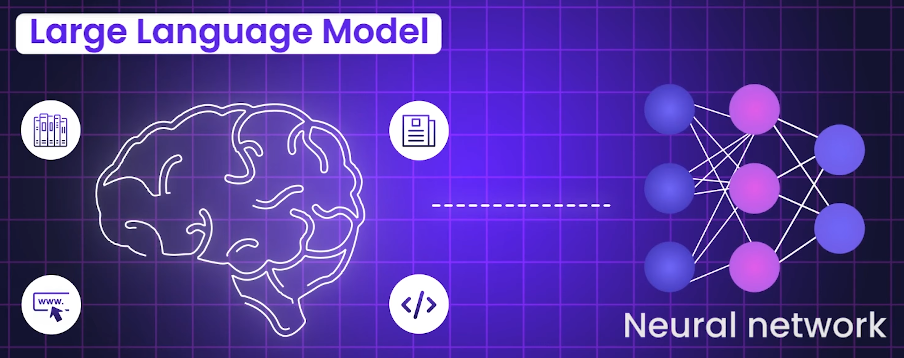

# LLM
- [00_LLM_provider.md](../../02_AgenticAI/00_02_LLM_provider.md)
- https://youtu.be/zg7nJrDQZ5s?si=EztmeLIgCiWlZU4u
- Digital Brain for generic task | internet scale data.
- self-supervised and adaptive learning.
- can fine-tune for specific tasks + evaluate, but expensive.
- Bigger the model, better the performance (more parameters, more data, more compute), but can mislead if not prompted well.
- Small and specialized open source model are better.
- NLP

## Overview
- A type of FM specialized in understanding and generating human language
  - NOT only - answer questions, summarize, lang translate, write code, creative content, etc
  - but also, understand context, intent, sentiment, symentics, meaning
  - **Basically Predict next word/token** from context, meaning, etc ◀️
- eg: 
  - google BERT (similar to GPT but read in both direction)
  - GPT (generative Pretrained Transformer)
     - claude, openAPI gpt family, gemini, perplexity
    

    
## Architecture

- Token-based model / **tokenization**
  - break text into smaller units (**tokens**) - words, subwords, characters
- **Embedding layer**
  - convert tokens into dense vectors (**embeddings**) that capture semantic meaning
  - similar words have similar vector representations
- **Multiple layers of transformers n/w** 👈🏻
  - helps to **understand the relationships** between tokens in a sequence 
  - each layer has attention mechanisms and feed-forward neural networks
  - billions/trillions of parameters
  - trained on massive datasets (internet text, books, articles, code)
  - helps to process by sentence, not by word
  - older: RNN (sequential processing, hard to scale, long-term dependencies)
  - https://youtu.be/XwYY0lCGWW8?si=lwh3YPAn0pmsE7Z3 ◀️

## problems
  - hallucination (confidently wrong)
  - fixed context window (cant remember long conversation)
  - lack of up-to-date knowledge
  - solution/s:
    - RAG (retrieval-augmented generation) https://youtu.be/MlhZPTfOJBo?si=VanFMzmlo501nH08
    - memory (long-term, short-term)
    - MCP (multi-modal, multi-cloud, multi-agent, multi-tool)
    - guardrails, orchestration, etc.
    
## Core components
  - tokens (words/phrase) https://youtu.be/OtccjevZ5uc?si=nkvExRPwcRkmwb2Y
  - embedding(number for token) 
  - vector(define relaton b/w words/token) https://youtu.be/TPYBYSyDRH4?si=TaMVaWbq-Kd46L3l
  - Vector database (store vectors) + RAG (retrieval augmented generation)
  - prompt https://youtu.be/A7lWqZ9_XpI?si=6FrQtjvH4bk7emDu

## Life Cycle of LLM/FM
```
⭕ pre-training
- Data collect : website, book, etc
- Data prep : struture/unstructure(image,etc) + labels, map() + unlabel(input), inheritance pattern, relationship
- Data train with ML alog == 🔺initial pre-training
⭕ Data evaluation

⭕ MODEL ready ✅

⭕ host on cloud (eg: bedrock::amz titan,nova)
use it (inference) - batch + realtime

⭕ 🔺optimized / Customization  / Continious pre-training
- prompt engineering
- Use adapters / LoRA layers
- retrieval-augmented generation (RAG)
- transfer learning(new layer) |  🔺fine tune (some layer) |  re-train (all layer)::rare/$$

>> evaluate again  ( metrics and benchmarks)
Training vs. Validation vs. Test Set

⭕ Deploy FM ::
- base(already hosted)
- add delta-layer at runtime, Bedrock will take care.

⭕ use it : Make API call to cutom/tuned

⭕ Monitoring & Feedback
-  the model's performance is continuously monitored
- feedback is collected from users, domain experts, or other stakeholders
```

## More:
- Turning test
