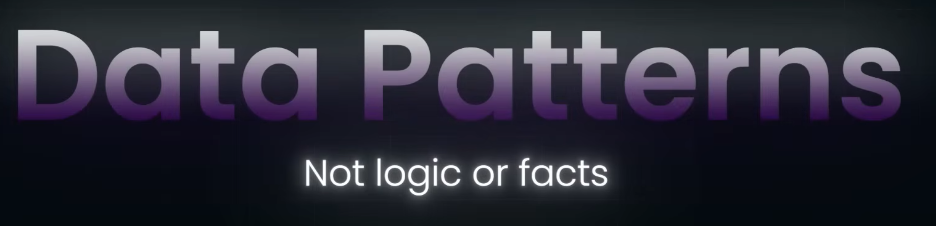
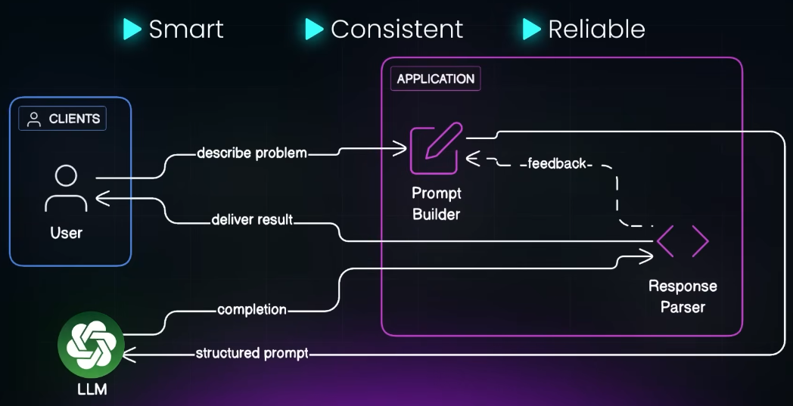
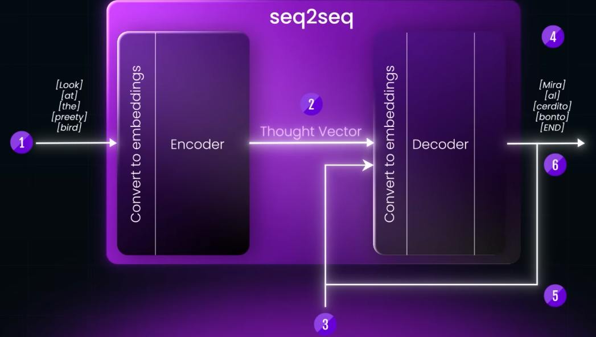
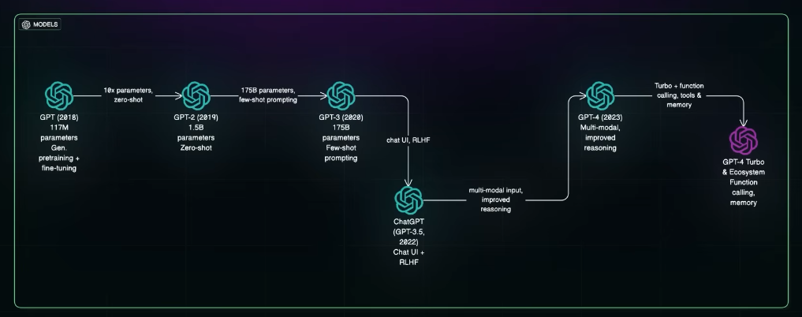

# prompt Engineering
- https://youtu.be/8RWfE9eDWXI?si=N52hqzSHowQNicmd
- https://www.perplexity.ai/search/30-prompt-gpt-history-https-yo-21Nh.hcVTjCH0ndunc3vIw
## Overview

- Input token (prompt) --> LLM (not thinking) --> completion/output (by **predict** next token)
- It's not actually "thinking", **just predicting next word** based on patterns learned during training.
- therefore, how you **structure the prompt** greatly influences the quality and relevance of the output
- **Prompt Engineering** is the practice of designing prompts to get accurate, useful, and reliable model outputs.
  - 
  - 

```
                    ┌────────────────────────┐
                    │   Prompt Engineering   │
                    |     strategies         │
                    └──────────┬─────────────┘
                               │
        ┌──────────────────────┴──────────────────────┐
        │                                             │
  ┌─────▼─────┐                               ┌───────▼────────┐
  │ Direct    │                               │ Structured     │
  │ Prompting │                               │ Prompting      │
  └─────┬─────┘                               └───────┬────────┘
        │                                            │
┌───────▼───────┐                        ┌───────────▼───────────┐
│ Zero-shot     │                        │ Chain of Thought (CoT)│
│ Few-shot      │                     
└───────────────┘                        └───────────────────────┘
                    ┌────────────┐
                    │    RAG     │ ← (external context)
                    └────────────┘

```

## prediction logic (history) 
  - **seq2seq with RNN** 
    - 
  - attention-mechanism/transformer (parallel processing)
    - Still has fixed context window in transformer
    - Didn't fix transformer, but scaled the model by trained with 2x data --> **GPT-1 came** 😵
    - GPT-2, trained with internet-scale data. Also researcher realized they dont need to pretain model for every task, just give prompt with zero-shot.
    - GPT-3 few shot learning
    - GPT-3.5 (added UI) -> chatGPT
    - GPT-4 (multi-modal)
    - 

---
## prompt
- input text or instruction you give to a foundation model FM
- **stateless** unless , build a conversational memory
- affected by :  temperature, top-p, system instructions, zero/few-shot
- prompt-template-1  = user **input** + instruction (task description itself) + context + output format

```json
{
  "model": "anthropic.claude-v2",
  "prompt": "Summarize the AWS Bedrock architecture in 3 bullet points.",
  "temperature": 0.7,
  "max_tokens": 200
}
```
| **Temperature Value** | **Effect on Output**                                            |
| --------------------- | --------------------------------------------------------------- |
| `0.0`                 | Very **deterministic**, always picks the most likely next word. |
| `~0.7`                | **Balanced** output — some randomness, still coherent.          |
| `1.0`                 | **Creative**, more diverse outputs, may take risks.             |
| `>1.0`                | **Highly random**, can become incoherent or off-topic.          |

---
## prompt parameters
- input prompt : “Write a short description of a sunset.”

| **Setting**                | **Parameter Values**                         | **Expected Output Style**                         | **Example Output**                                                  |
| -------------------------- | -------------------------------------------- | ------------------------------------------------- | ------------------------------------------------------------------- |
| **Greedy (Deterministic)** | `temperature=0.0`                            | Most likely tokens only (boring but consistent)   | “The sun sets beyond the horizon, casting a warm glow.”             |
| **Top-K Sampling**         | `top_k=50`, `temperature=0.7`                | Picks from top 50 likely tokens                   | “The sky explodes in hues of gold and violet as the sun dips.”      |
| **Top-P Sampling**         | `top_p=0.9`, `temperature=0.8`               | Chooses tokens with cumulative probability ≤ 90%  | “A watercolor sky melts into night, painted by the last light.”     |
| **Creative Sampling**      | `top_k=100`, `top_p=0.95`, `temperature=1.0` | Creative, diverse, sometimes poetic or surprising | “The day exhales a breath of fire before surrendering to twilight.” |

