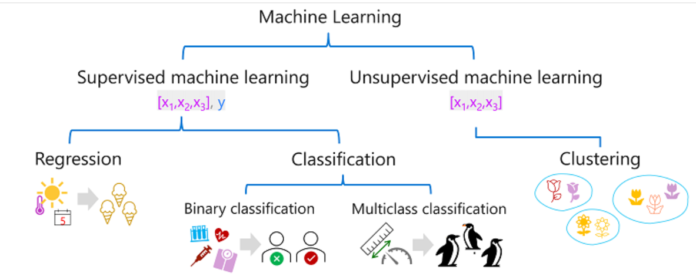
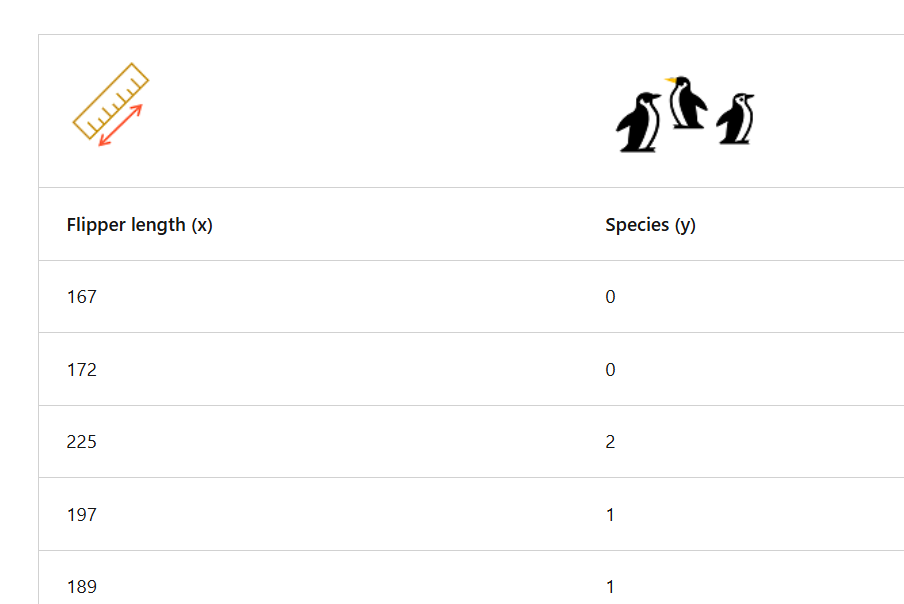
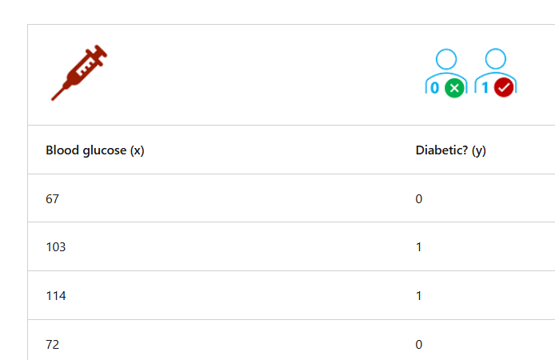
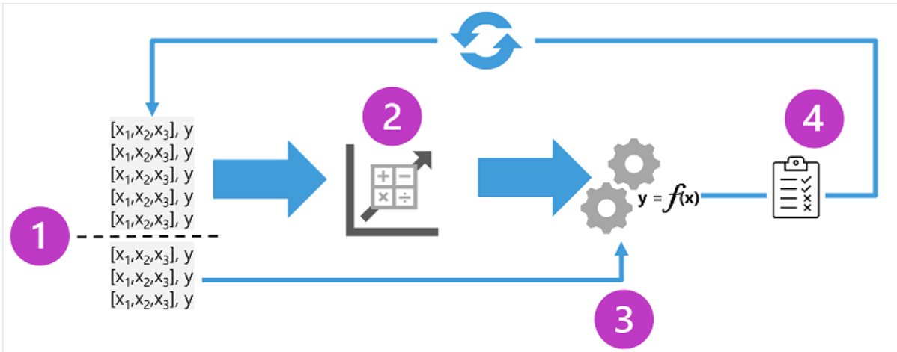

# ML
## Overview
- focuses on developing **algorithms and statistical models** 
- so that computer systems can **learn from data** 
- and make predictions or decisions without being **explicitly programmed**.
- learn patterns and relationships from data rather 
  - than relying on **hard-coded rules** for instructions
- ML statistical models 
  - are trained on large datasets, 
  - and their accuracy and performance improve more data training

## ML learning technique/types
- note: f(x1,x2,x3)= y123 
  - y is `label` | x is `feature/s`
- https://learn.microsoft.com/en-us/training/modules/fundamentals-machine-learning/
- https://learn.microsoft.com/en-us/training/modules/fundamentals-machine-learning/3-types-of-machine-learning?pivots=text

### **supervised**
- **multiclass classification**
    - label represents a categorization 👈🏻
    - 👉https://learn.microsoft.com/en-us/training/modules/fundamentals-machine-learning/6-multiclass-classification?pivots=text
    - f(x1,x2,x3)=y1 (group-1)
    - f(x1,x2,x4)=y1 (group-1)
    - ...
    - f(x1,x2,x5)=y2 (group-2)
    - f(x1,x2,x6)=y2 (group-2)
    - ...
    - 
  
- **Binary classification**
  - f(x1,x2,x3)= true(1) or false(0)
  - 👉https://learn.microsoft.com/en-us/training/modules/fundamentals-machine-learning/5-binary-classification?pivots=text
  - 
  
- **regression**
    - 👉https://learn.microsoft.com/en-us/training/modules/fundamentals-machine-learning/4-regression?pivots=text
    - determining a relationship between the features and labels by ML algo ( linear regression. etc)  👈🏻
    - Iterative training: train > evaluate > evaluation metrics
    - f(x1,x2,x3)=y123
    - f(x1,x2,x4)=y124
    - ...
    - 
  
### **un-supervised**
- training models using data that consists **only of feature values** 
- without any **known labels**
- **clustering**
  - clustering **algorithm** identifies similarities between observations based on their features, and groups them into discrete clusters
  - groups data into different clusters based on similar features or distances between the data point
  - In some ways, clustering is similar to **multiclass classification**
  - https://learn.microsoft.com/en-us/training/modules/fundamentals-machine-learning/7-clustering?pivots=text
- **dimensionality reduction**: 
  - technique used to reduce the number of features or dimensions in a dataset while preserving the most important information or patterns.

### **reinforcement**
