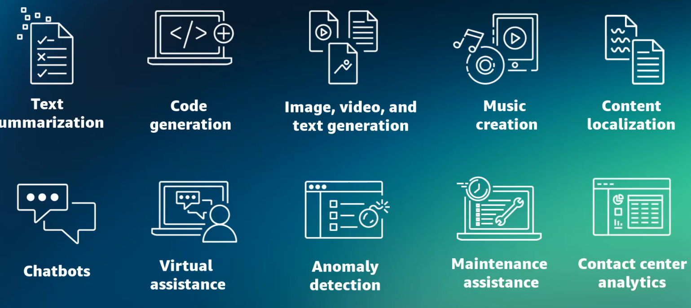

# AI Applications
## Overview
- AI endless possibilities to transform and shape the new world
- example:
  - enhance creativity 
  - elevate customer experience
  - streamline business operations
  - ...
  - 

## real-world - use cases
- **Media and entertainment**
  - **Content generation**: AI can create scripts, dialogues, or even complete stories for films, TV shows, and games.
  - **VR**: AI can create immersive and interactive virtual environments for games or simulations.
  - **Article generation**: AI can generate articles or summaries based on raw data or events.

- **Retail**
  - **Product review summaries**: AI can generate review summaries for products so consumers can quickly find pertinent information.
  - **Pricing optimization**: AI can model different pricing scenarios to determine optimal pricing strategies that maximize profits.
  - **Virtual try-ons**: AI can generate virtual models of customers for virtual try-ons, which can improve the online shopping experience.
  - **Store layout optimization**: AI can generate the most efficient store layouts to improve the customer shopping experience and boost sales.

- **healthcare**
  - **AWS HealthScribe**: This AWS service empowers healthcare software vendors to build clinical applications that automatically generate clinical notes by analyzing patient-clinician conversations.
  - **Personalize medicine**: By generating treatment plans based on a patient's specific genetic makeup, lifestyle, and disease progression, AI can contribute to more effective, personalized care.
  - **Improve medical imaging**: AI can enhance, reconstruct, or even generate medical images, like X-rays, MRIs, or CT scans, which can aid in better diagnosis.

- **Life sciences**
  - **Drug discovery**: AI can generate new potential molecular structures for drugs and accelerate the process of drug discovery and reducing costs.
  - **Protein folding prediction**: AI can predict the 3D structures of proteins based on their amino acid sequence, which is crucial for understanding diseases and developing new therapies.
  - **Synthetic biology**: AI can generate designs for synthetic biological systems, such as engineered organisms or biological circuits.

- **Financial services**
  - **Fraud detection mechanisms**: AI can help create synthetic datasets to improve AI and ML systems by simulating various money-laundering patterns.
  - **Portfolio management**: AI can simulate various market scenarios and help in the creation and management of robust investment portfolios.
  - **Debt collection**: AI can generate the most effective communication and negotiation strategies for debt collection to increase the rate of successful collections.

- **Manufacturing**
  - **Predictive maintenance**: By analyzing historical production data, AI can predict maintenance schedules that will provide the most efficient machine outputs and reduce downtimes.
  - **Process optimization**: AI can generate the most efficient production processes by modeling different scenarios and optimizing for variables such as cost, time, resource usage, and so forth.
  - **Product design**: AI can be used to create new product designs based on set parameters and constraints. It can generate multiple design options and optimize for factors like cost, materials, performance, and so forth.
  - **Material science**: AI can help generate new material compositions with desired properties.

## Application/s of AI
- **Natural language processing** ( NLP > LLM ) 👈🏻
    - deals with the interaction between computers and human languages
    - Deep learning has made significant strides in NLP
    - task: text classification, sentiment analysis, machine translation, and language generation
    - **example**: ◀️
        - Telecommunication companies use NLP to **analyze customer text messages and suggest personalized recommendations**.
        - education industry, students use Q&A chatbots to address questions.
        - Insurance companies can use NLP to extract policy numbers, expiration dates, and other personal information.
      
- **Computer vision**
  - DL has revolutionized computer vision 
  - by providing powerful techniques: image classification, object detection, image segmentation.
  - **example**: ◀️
    - Auto industry, self-driving cars safer and more reliable. 
    - facial-recognition can swiftly identify unlawful entries or persons. 

- **intelligent document processing (IDP)**
  - IDP is an application that extracts and classifies information from **unstructured** data, 
  - then generates summaries, and provides actionable insights
  - uses - NLP and OCR optical character recognition
  - **examples**: ◀️
    - medical : processing various document types, such as claims and doctor’s notes.
    - legal : processing documents such as contractual documents, agreements, court filings, and legal dockets
    - helps with the underwriting process by 
      - identifying incomplete tax forms, pay stubs, and other missing data

- **fraud detection**
  - **example**:◀️
    - payment fraud detection, transaction surveillance, and anti-money laundering (AML) sanctions.
    - Credit card and online retail fraud
    - New account fraud, claims processing fraud, and promotion abuse
    - telecom: Roaming, premium rate service, and subscription fraud