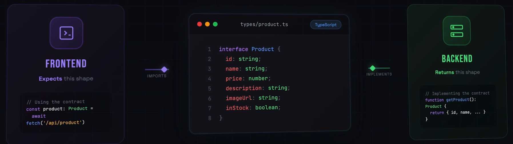
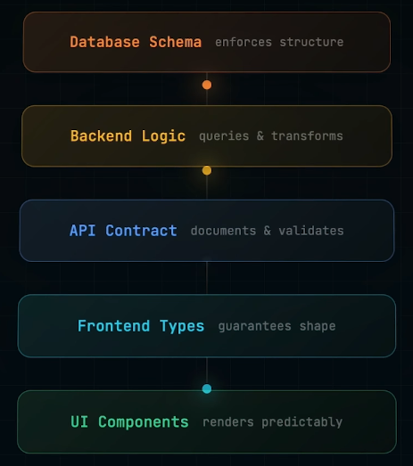
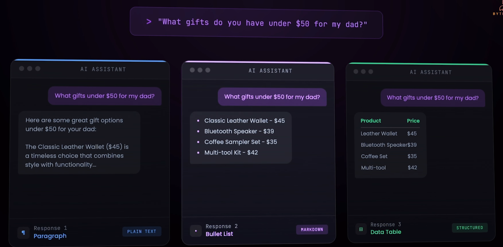
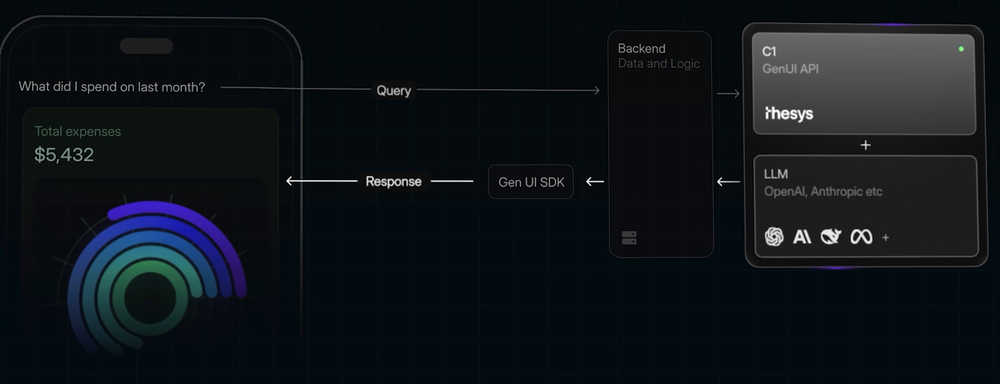

# Generative UI (google Research)
## Overview
- https://youtu.be/RSoy6zNamdM?si=i2fK7ObLDtEzATiw
- render unpredictable LLM response format ?
- **Before/without LLM layer in application**:
  - 
  - 
- After LLM Layer
  - ask same thing 3 time and check outbout format type:
  - 
  
## C1 Thesys
- generative UI for production.
- wrapper over LLm and generate UI out of LLM reponse text
- streams the response/UI-component (react)
- openai compatible, same sdk
- responsive
- Free Playground: https://console.thesys.dev/playground
- 