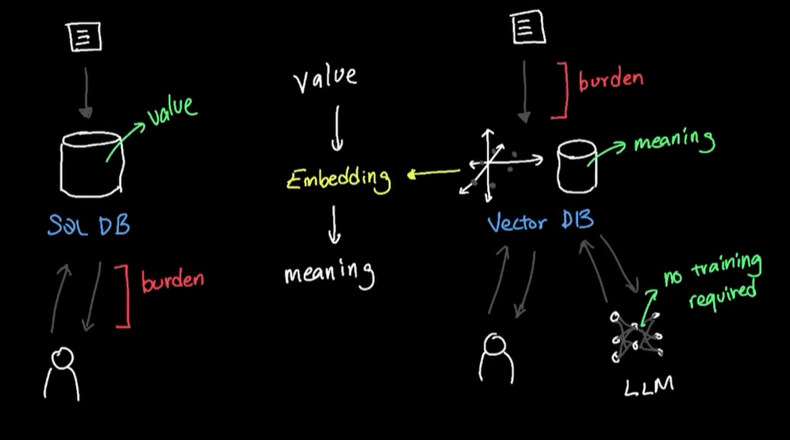
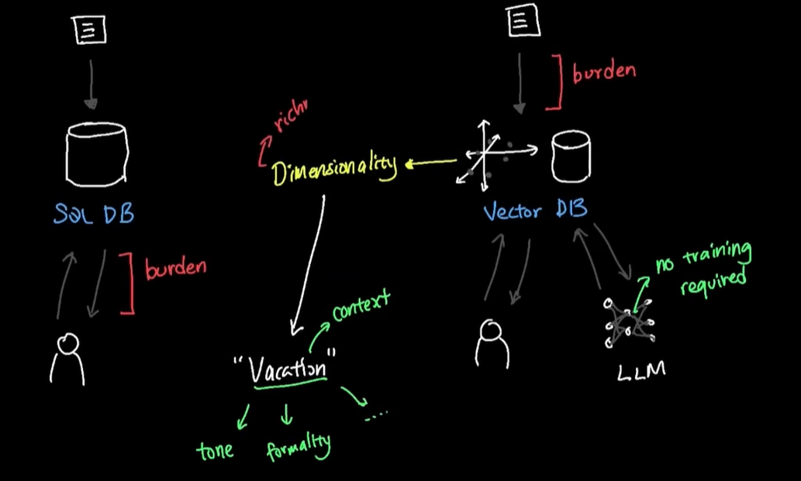
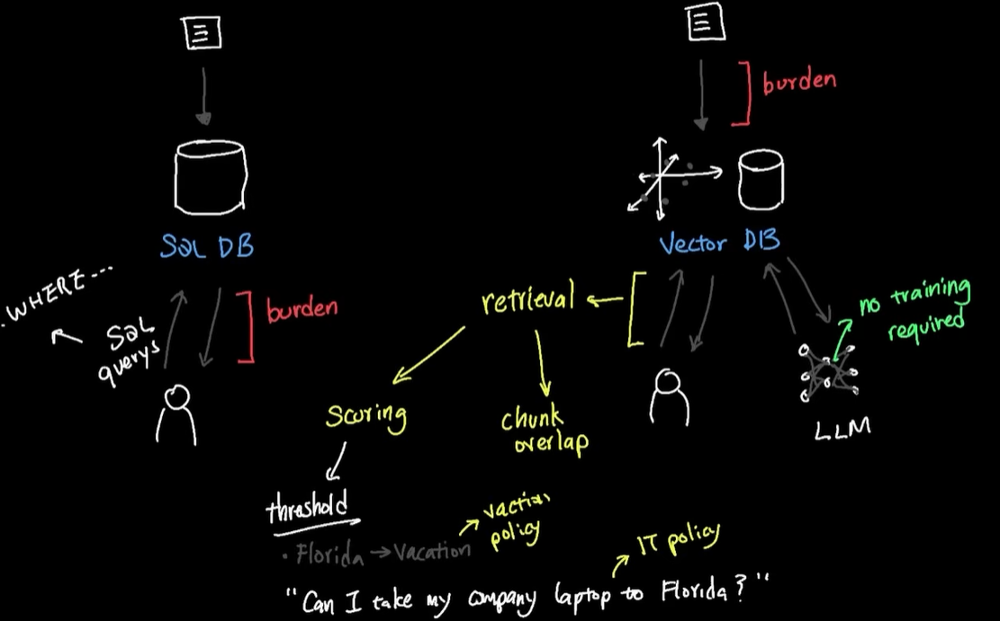

# vector
- [project-1](../../../src/2026/01_ai_lab_2026/04_vectors/README.md)

## overview
- 
- 
- 

---
## Embeddings & Semantic Search
- Think of embeddings as a "**GPS for meaning**":
  - Text gets converted into numbers (coordinates)
  - Similar meanings get similar coordinates
  - Computer can now measure "distance" between meanings
- Embeddings finally let computers understand that: 
  - "I can't log in" 
  - and "authentication failed" 
  - are talking about the SAME PROBLEM
- This is what makes semantic search so powerful!
- **New way**
```
- Storing data :
    - not by `value` (like SQL, NoSQL)
    - but by `meaning` (multi-dim vector), to capyute semantic meaning
- Searching data :
    - not by exact match (like SQL, NoSQL)
    - but by similarity match (vector distance calculation)
```
---

## Chunk Documents
- Large documents must be split into smaller pieces for embedding. 
- But we need to be smart about it!
- Chunk with **overlap** preserves context:
```
Document: [=========================================]
Chunk 1:  [==========]
Chunk 2:       [==========]
Chunk 3:            [==========]
^^^^ Overlap preserves context!
```

- **Optimal Settings**
```
Chunk size: 500 characters (balanced)
Overlap: 100 characters (20%)
Result: 40% better retrieval accuracy!
```
💡 LangChain's RecursiveCharacterTextSplitter handles this intelligently, respecting sentence boundaries!

---
## Vector Stores
- Vector stores are specialized databases designed to:
  - Store embeddings (vectors) efficiently
  - Find similar vectors **lightning-fast**
  - Scale to millions of documents
  - Attach **metadata** for filtering
- **Vector Search Working:**
```
  1. Document → Embedding → Store in DB
  2. Query → Embedding → Find Similar
  3. Return Top K Results (by cosine similarity)

Example:
Query: "remote work policy" [0.2, 0.8, ...]
  ↓
Finds: "work from home guidelines" [0.21, 0.79, ...]
       (98% similar!)
```

---
## ChromaDB
- Local-first: No cloud dependency
- Production-ready: Used by real companies 
- Metadata filtering: Search by tags, dates, categories
