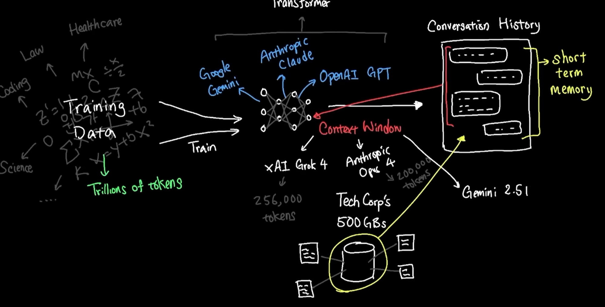
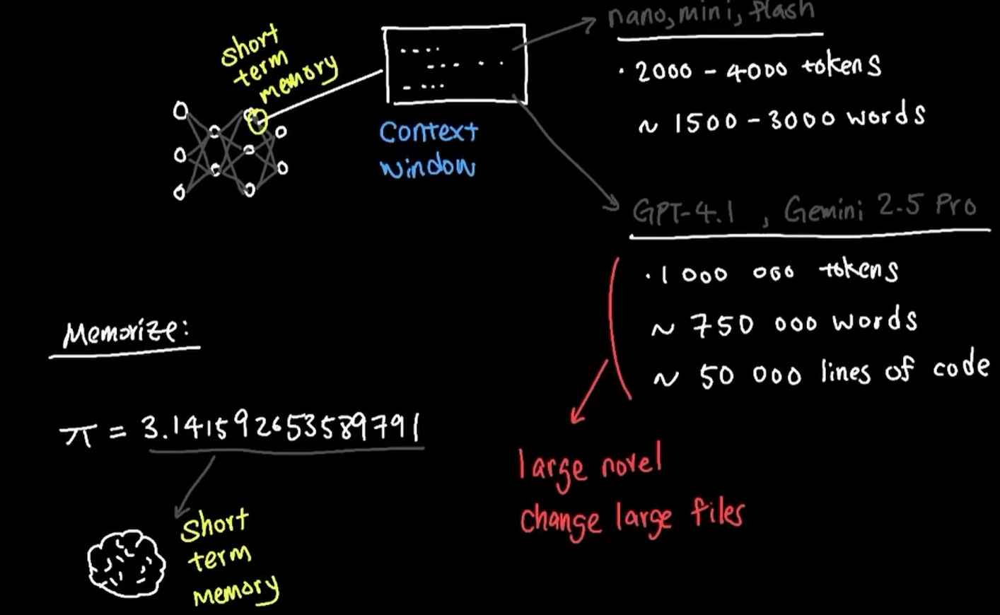
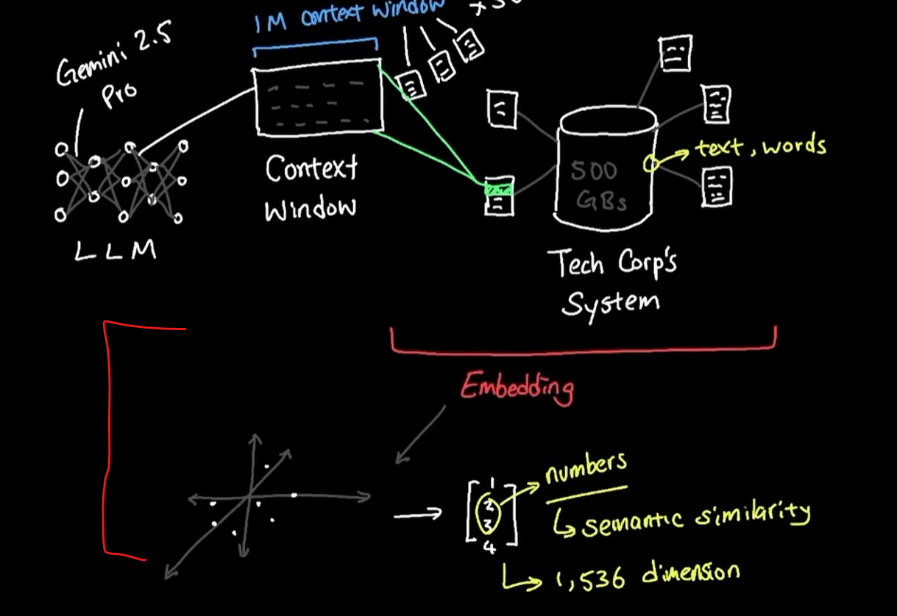
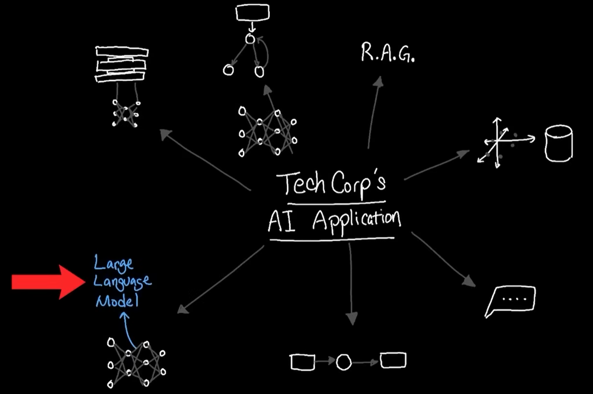
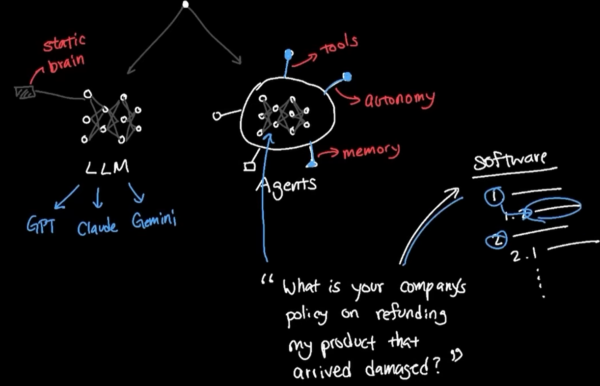
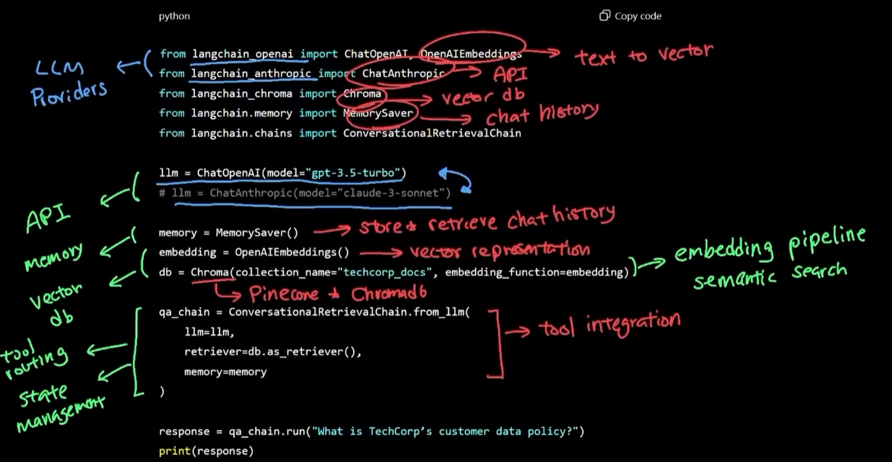

# AI fundamentals
## ✔️1. pass context to outdate-dated LLM model. how ?
### way-1 Context window (limited)
- 
- 

### way-2 Embedding
- 

---
## ✔️2. langchain
- Enterprise AI Application
- 
- static brain (LLm) vs LLM warpped with tools
- 
- langchain does all heavy lifting. so many **components**, need to tie together.
- API call, vector DB call, Conversation memory, tool, web search, local file system, etc 
- 