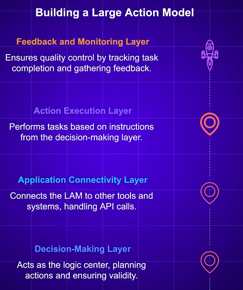
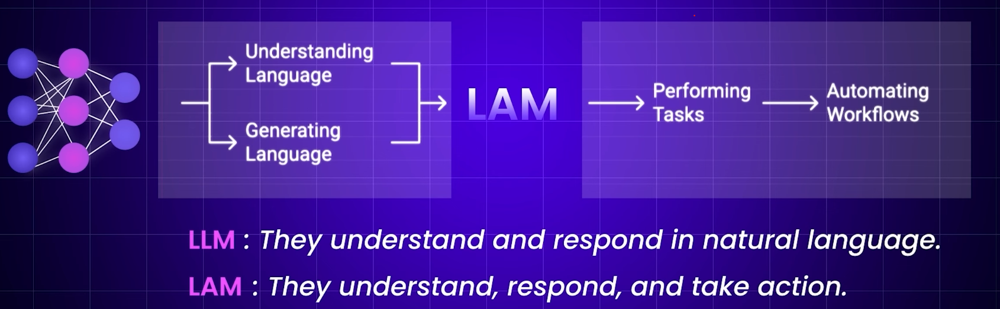
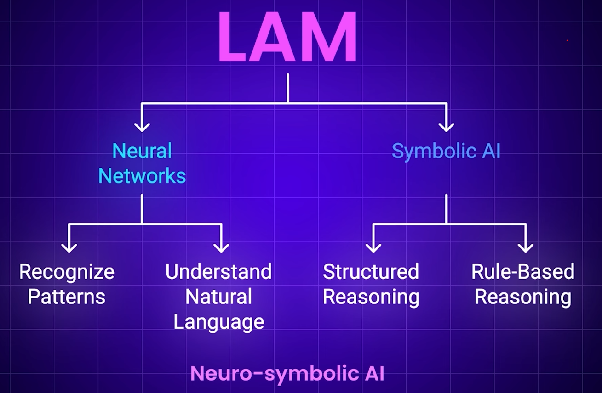
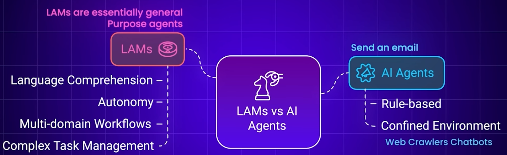
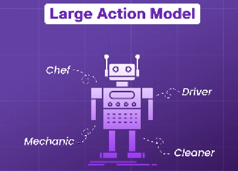
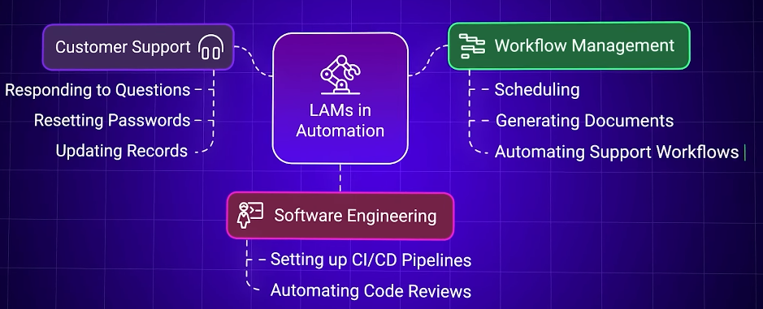

# AI application
## ✔️1. AI assistant
- architecture : UI + API + LLM 
- eg: ChatGPT
- just answers Questions.
- doest not take action - like running command, etc
- zero shot

---
## ✔️2. LAM 👈🏻👈🏻
- https://youtu.be/JYN6O5Gbxlc?si=pG2wePL8GwZind57
- can switch to multiple roles === think of **general purpose agent**
- architecture: LLM + **Additional layer**(to perform action) as below:
  - 
- can do **more complex task** 
- but **less autonomous** ( need human instruction, feedback, etc.)
- can learn from UI interactions.
- 
- 
- 
- 
- **Application**

---  
## ✔️3. Autonomous AI Agent  
- [02_02_Agentic-AI_workflow.md](../02_architecture/01_Agent-Overview.md)
- agent to perform a specialized task autonomously.