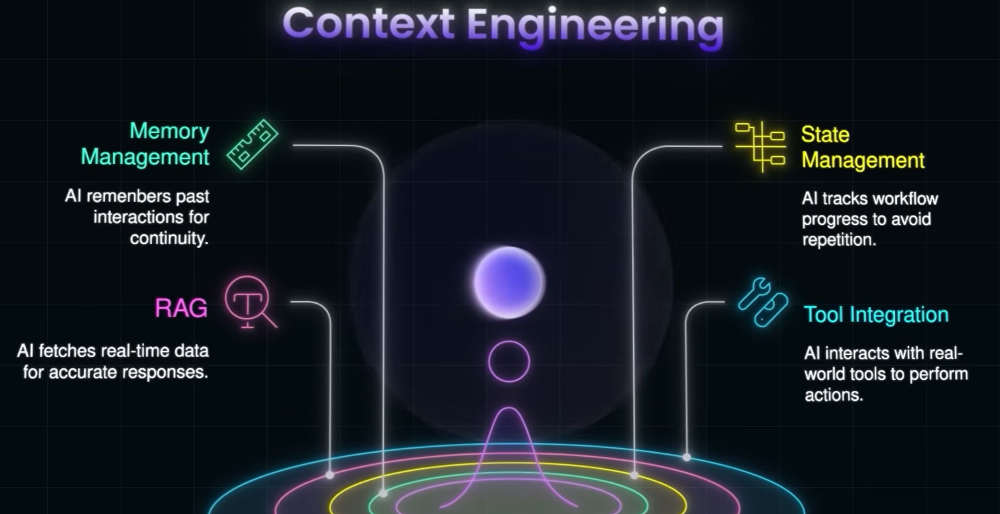
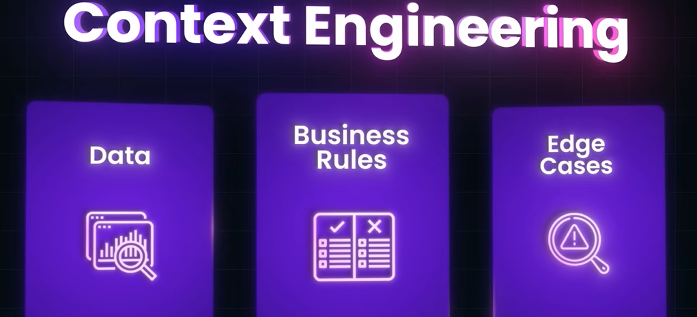
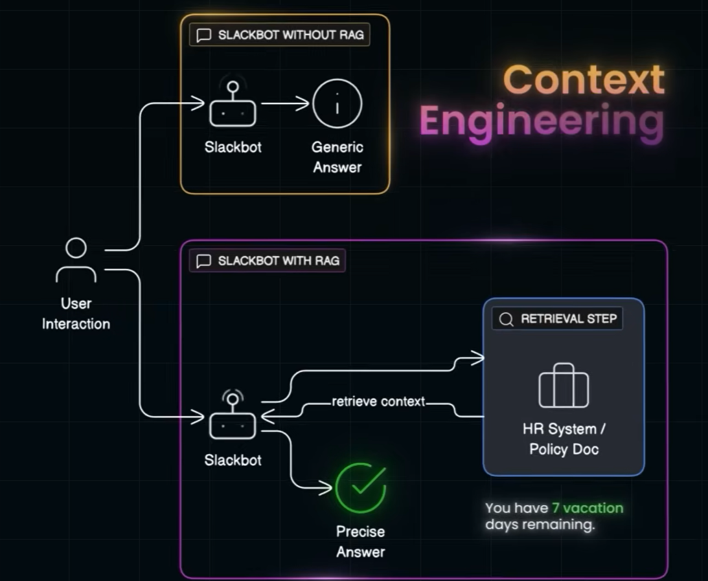

# Context Engineering
## Overview
- prompt engineering (passive) [more](../../01_AWS-AIF-C01/DC-01-Funda-of-ML-and-AI/02_03_prompt_eng.md)
  - practice of designing and refining prompts to get accurate, useful, and reliable model outputs.
  - it Does not real industry problem
  - but Agent with right context, does

### ➖ Memory mgt
- store previous interaction in vector db.
- store data across multiple session
- thus improve context for AI agent.

### ➖ State mgt
- remember previous step, so dont need to re-explain again.
- or start from scratch.
- track **workflow** progress and state.
- thus improve context for AI agent.

### ➖ RAG
- [01_02_RAG.md](01_02_RAG.md)
- Solve Out dated knowledge, limited context window, **hallucination problem** of LLM.
- thus improve the context for AI agent.
- since model is not limited to knowledge in training data.

### ➖ Tool Integration 
- Tool are ext api to act/action.
- API integration improved with [MCP](../03_protocol)

---
## AI Agent for understanding ( Slackbot )
- slackBot is giving response by revolving around company's data instead of generic data
- by using RAG to fetch context from company database.

