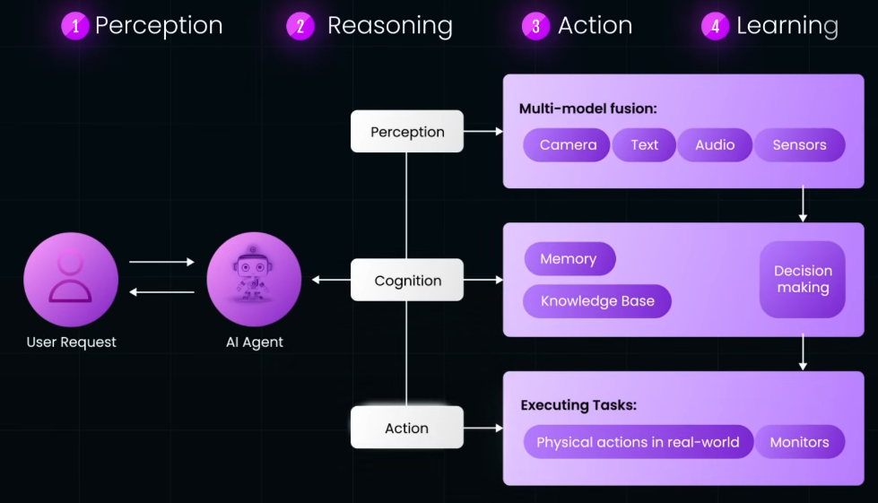
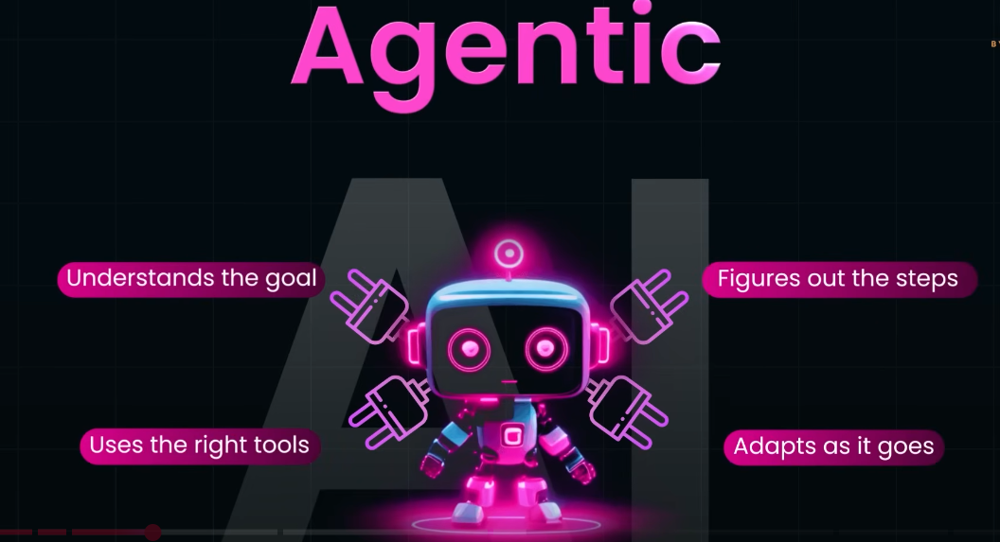
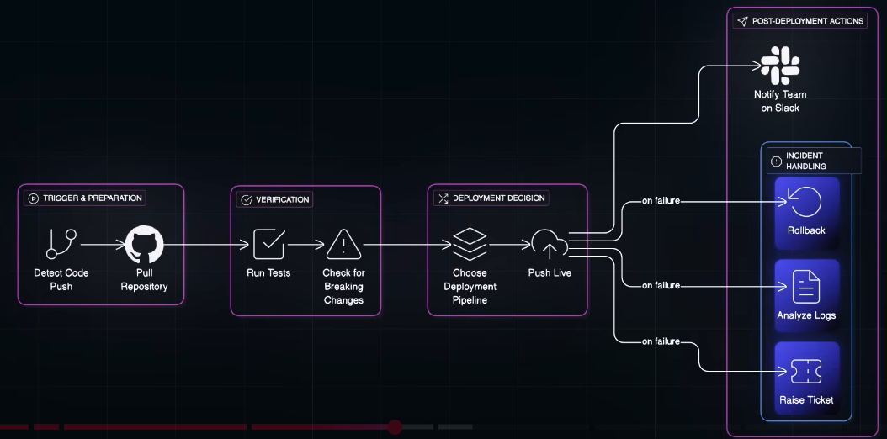
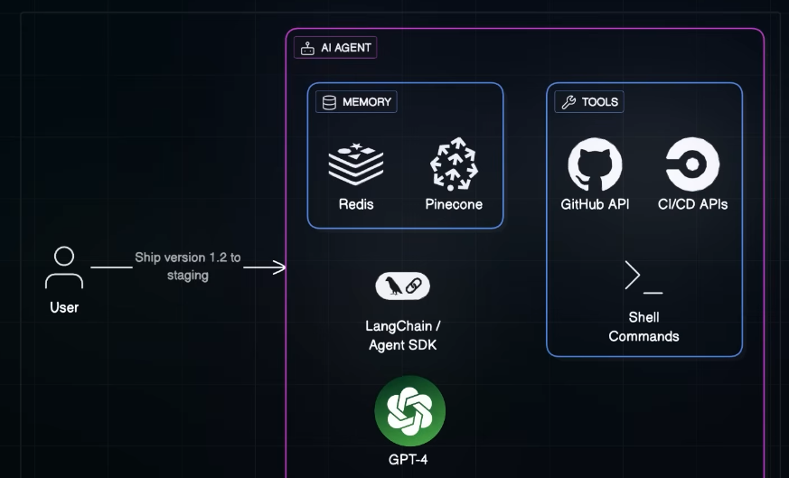
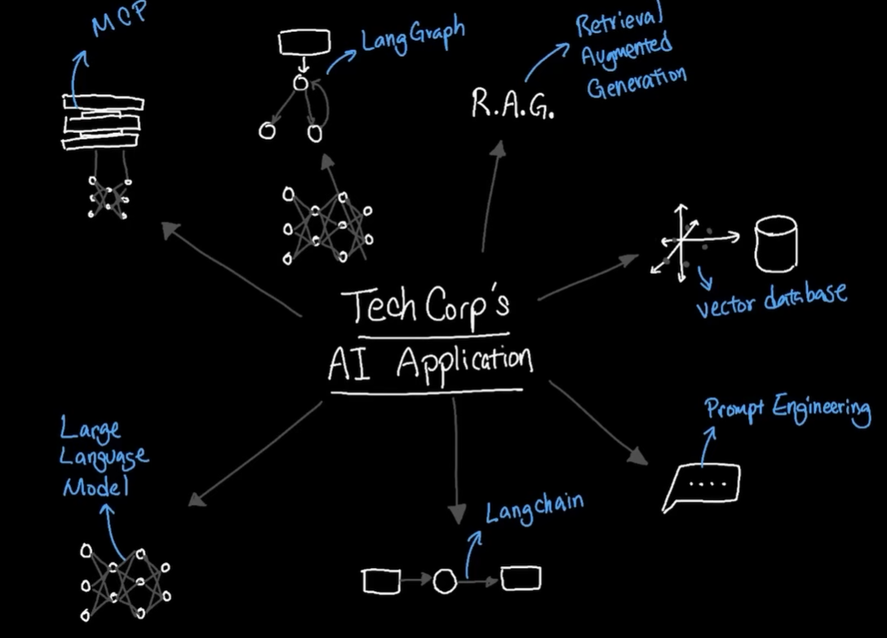
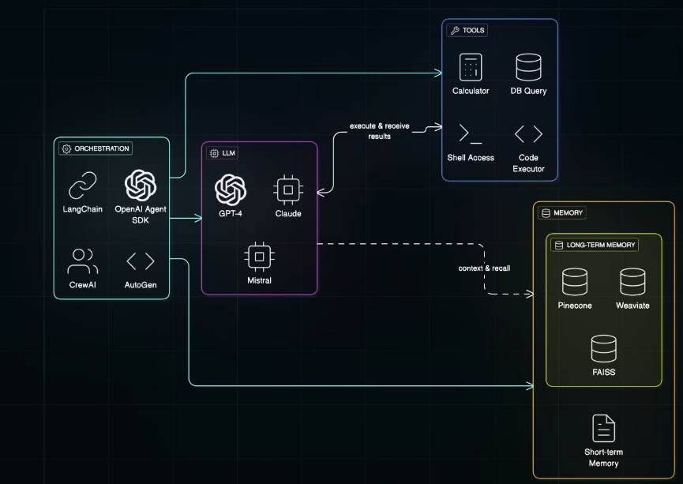

# AI application
## ✔️1. AI Assistant

---
## ✔️2. LAM
[02_01_LAM_workflow.md](02_01_LAM_workflow.md)

---
## ✔️3. Autonomous AI Agent  👈🏻👈🏻

### ➖ Overview 1 (2024)
- https://www.youtube.com/watch?v=SYHqSAWQ4NY&list=PLJq-63ZRPdBu38EjXRXzyPat3sYMHbIWU&index=11
  - Analyze Surrounding
    - **Adapt** to changing market conditions
    - learn from previous actions
  - Make/optimize Decision on pre-defined Goals
  - **Execute Action**
  - Autonomous : **No human instruction, feedback, etc**. But not 100% reliable. ◀️
  - 
  - 
- More:
  - Existing Application (passively follows instructions) + Add **additional layer (LLM)**
  - thus makes, s/w to think, reason, make decision, take action.
  - next level to **automation** approach
  - eg: Github Copilot, Copilot Studio, etc
  - But  LLM have limitations:
      - lack of up-to-date knowledge
      - limited context window (cant remember long conversation)
      - hallucination (wrong info/confidently wrong)
      - **solution**: MCP, RAG, memory, guardrails, orchestration, etc.

- **Application**
    - 
  
- **Open-Source Projects**:
    - https://github.com/lavague-ai/LaVague
    - https://github.com/TransformerOptimus
    - https://github.com/microsoft/autogen

---
### ➖ Overview 2 (Agentic 2025) ✅
- Trend: MCP aware agent
- https://youtu.be/Jj1-zb38Yfw?si=IbIOuVXidY1t0Qgg
- agents solve multi-actions problem by calling multiple tools and understand the full context in structured way
- `Agentic AI is framed as AI,`
  - that does not **just wait for commands** (`reactive`)
  - but takes a high‑level goal, figures out what to do, and pursues it within defined boundaries. (`proactive`)
  -  Follows --> **perceive–reason–act–learn** loop
  
```
Perceive: 
The agent gathers data from APIs, databases, user chats, sensors, or web searches, 
essentially “looking around” its environment for relevant signals.

Reason: 
An LLM such as GPT‑4 plans the task, decides which tools/APIs to call,
and may use retrieval‑augmented generation to pull in extra context.

Act: 
The agent executes steps by calling APIs, running code, sending emails, 
or issuing shell commands, and can self‑correct when actions fail.

Learn: 
Outcomes are stored as experience in memory so the agent gets better over time at similar tasks, 
closing the feedback loop.

```


- example: **Code-deployment agent**
  - 
  - 
  - **Github copilot coding agent**
    - AI Coding Agents Keep Breaking on Your Laptop
    - traditional: 1 laptop, 1 IDE, 1 developer
    - agentic: 1 laptop, 1 IDE, 1 developer + n agents  (crashing resource)
    - solution : use cloud workspace for agents

---
### Overview 3
- 
- Notice multiple component
- Application using:
    - "static brain (LLm)" vs
    - "LLM warped with tools and memory" === agentic AI
    - 

---
### ➖ Architecture of AI Agent

- **Component**:
    - LLM
    - Tools : MCP integration, [here](03_01_MCP.md), 
    - resource : Knowledge Base and RAG
    - **memory** (in vector Db) : user session, past steps, outcomes, long-term, short-term
    - guardrails
    - orchestration (monitoring, logging, RT insights, etc)
      - `Langchain, OpenAI SDK, CrewAI, AutoGen (MST)`
      - basically define the workflow of agent
---
### ➖ agentic-workflow-types
- single-agent,
- multi-agent,
- human-in-the-loop,
- routing,
- parallelism,
- evaluator-optimizer,
- orchestrator,
- Truly Autonomous

---
### ➖ agentic-design-patterns

---
### ➖ agentic-security

---
### ➖ agentic-mlops


