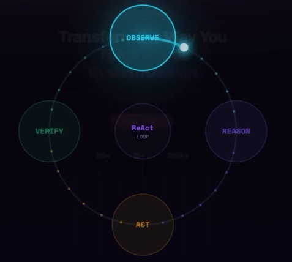

# Architectural Stack
> build reliable, scalable agent systems
- https://youtu.be/xKLf_rA2sQI?si=JxF-sD00EBGtj7ht
- `AWS NovaAct` | https://aws.amazon.com/nova/act/?trk=33dc490e-0fb2-4cb1-a521-3941c13b64c0&sc_channel=ps

---
## Core Problem: `Reliability`
- **Agents are NOT inherently reliable**: 
  - While they appear intelligent, 
  - they are probabilistic (guessing the next token). 
  - They often fail in production due to real-world variables 
  - like fluctuating page load speeds, pop-ups, changing UI layouts, and session expirations
- **Agents as Distributed Systems**: 
  - Once an agent interacts with the web, it becomes a distributed system 
  - involving models, browser states, external websites, and network stability. 
  - hence multiple failure points
  - and must engineer for failure 

## Key Architecture Patterns for Reliability
✔️ **The ReAct Pattern (Observe → Reason → Act):** 
- Instead of one-shot execution, 
- the agent operates in a continuous loop: 
  - observing the page (screenshot), 
  - reasoning about the task, 
  - and taking one small action at a time. 
- Verification after each action is essential.

✔️ **The Reliable Agent Stack:** 
Reliability emerges from layering several components

Workflow Definition: 
- Moving from natural language to version-controlled Python code 
- allows for proper testing and deployment
- Prompts

Orchestration Layer: 
- browser state.
- sessions 
- continuous ( observe-reason-act-verify ) cycle

Verification Layer: 
- Implementing post-condition checks (e.g., "Did the element appear?") 
- to prevent cascading failures 

Guardrails layer:
- Establishing strict permission controls and domain restrictions
- the "IAM for agents" 

Human-in-the-Loop (HITL): 
- A critical safety mechanism where the agent pauses 
- and escalates to a human when confidence is low 
- or high risk task

Observability layer: 
- Using distributed tracing for agents—telemetry, screenshots, and logs
- to debug failures by replaying execution traces

Control Plane layer: 
- Tools for deployment, versioning, and scaling workflows