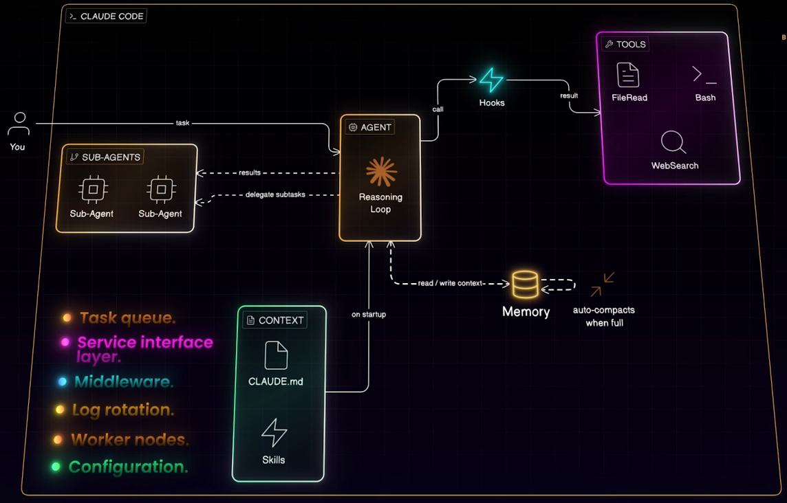

# Claude Code : Architectural Breakdown



**Claude Code's architecture mirrors patterns common in distributed systems** 👈

Agent Reasoning Loop === 'task queue'
- Instead of a single AI call, 
- the agent runs in a continuous loop, 
- making decisions at each step.

Tool System & Separation  === 'Service layer'
- The model handles the 'thinking,' 
- while a registry of over 20 tools (file operations, bash, web search) handles the 'doing.'

Hooks  === 'Middleware'
- These act as middleware, 
- allowing for safety checks, 
- observability, and interception of tool inputs/outputs.

Memory Management   === 'log rotation'
- To handle long-running tasks, 
- the system uses a 'compaction' process (similar to log rotation) 
- to summarize history and stay within the model's token limits.

Context & Skills   === 'configuration'
- The agent loads project-specific instructions via CLAUDE.md 
- and uses reusable instruction sets called 'Skills' for tasks like
  - documentation or code review.

Sub-Agent Orchestration  === 'worker Nodes'
- The orchestrator delegates complex sub-tasks to specialized sub-agents, 
- treating them as just another tool in the registry.

---

``````
The Leak
- Anthropic inadvertently included TypeScript source maps in their public npm bundle for Claude Code, 
- exposing the original source code to anyone who installed the tool.

The Reconstruction
- Engineers reverse-engineered the logic and performed a "clean-room" rewrite, 
- first in Python 
- and subsequently in Rust for better performance and memory safety, 
- achieving significant popularity on GitHub.
```