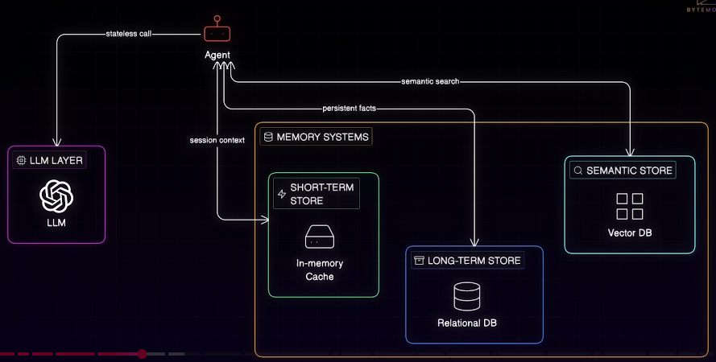
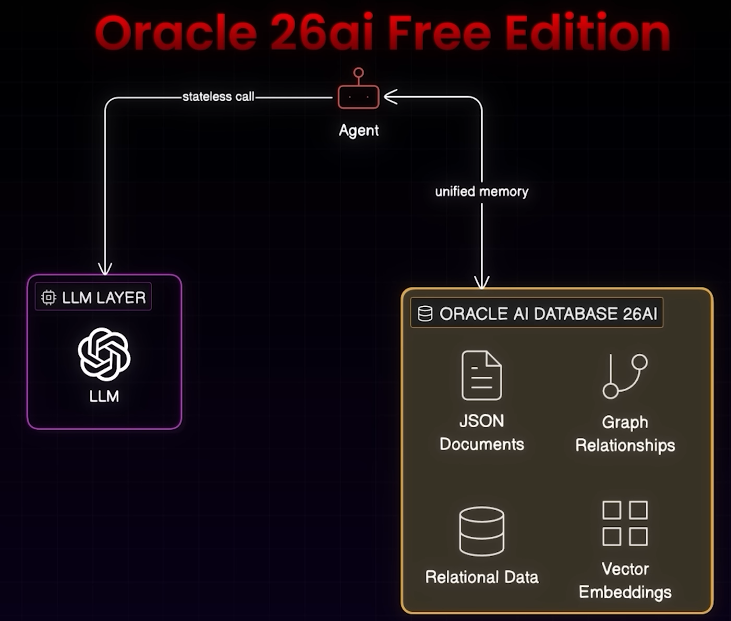

# Agentic memory
- https://youtu.be/xKLf_rA2sQI?si=Bes1VeEc4hrQdXrN
- sample agent code https://github.com/oracle-devrel/oracle-ai-developer-hub/blob/main/notebooks/agent_with_memory.ipynb?customTrackingParam=:ad:vd:yt:awr:a_nas::RC_DEVT260124P00001:Himalay
- `docker pull container-registry.oracle.com/database/free:latest`

## Overview
Coordination problem with 3 system, to get context

unified solution

