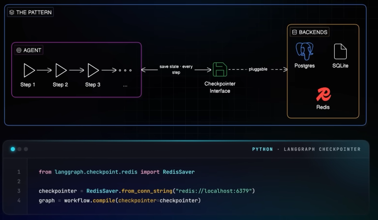

# Agentic memory
## Overview
**Coordination problem with multiple system**

---
## ✔️ 1.Oracle 26ai Database
- https://youtu.be/xKLf_rA2sQI?si=Bes1VeEc4hrQdXrN
- sample agent code https://github.com/oracle-devrel/oracle-ai-developer-hub/blob/main/notebooks/agent_with_memory.ipynb?customTrackingParam=:ad:vd:yt:awr:a_nas::RC_DEVT260124P00001:Himalay
- `docker pull container-registry.oracle.com/database/free:latest`
- provides **unified solution**

---
## ✔️ 2.Redis
- https://www.youtube.com/watch?v=19x8pKiaQVU
- [redisVL_demo.py](redisVL_demo.py) 👈👈
- Redis has evolved beyond a simple cache to become a **critical infrastructure layer** for production AI agents in 2026.
- Major frameworks (like LangGraph, OpenAI Agents SDK, Google ADK, Microsoft Agent Framework, and A2A SDK)
    - now ship with `first-party Redis integrations `
    - to solve below **foundational challenges** in agents.

### Short Working Memory
- Needed for Short-term state management during conversations.
- Traditional in-memory dictionaries fail, **during server restarts or timeouts.**
- **Redis Checkpointers** allow developers to save agent state at every step. 💠
- Benefits:
    - High durability,
    - microsecond-latency reads/writes,
    - ensuring the agent doesn't bottleneck on state storage.

### Long-term Memory
- **Redis Agent Memory Server** 💠
- Stores : Background extraction of **structured facts and entities**.
    - extract topic, fact
    - recognize entities
    - summarize
    - de-dupe
- **Semantic search** via vector embeddings.
- **Filtering** by user/session context.

### Retrieval (RAG)
- Accessing external data like product catalogs or documentation.
- [Production grade RAG.md](../04_RAG/04_01_RAG.md#-production-grade-rag)

### Redis AI Data Layer (`RedisVL lib`)
`RedisVL` (Vector Library) simplifies building retrieval systems with three primitives:
- Schema: 
  - Configures **indexing** (e.g., HNSW algorithm for performance) 
  - defines **data types** (tags, numbers, vectors).
- Vectorizer: 
  - Provides a consistent API for embedding generation.
- Query Builder: 
  - Facilitates complex hybrid queries using Python objects and filters.
- SemanticCache

- [redisVL_demo.py](redisVL_demo.py) 👈👈
