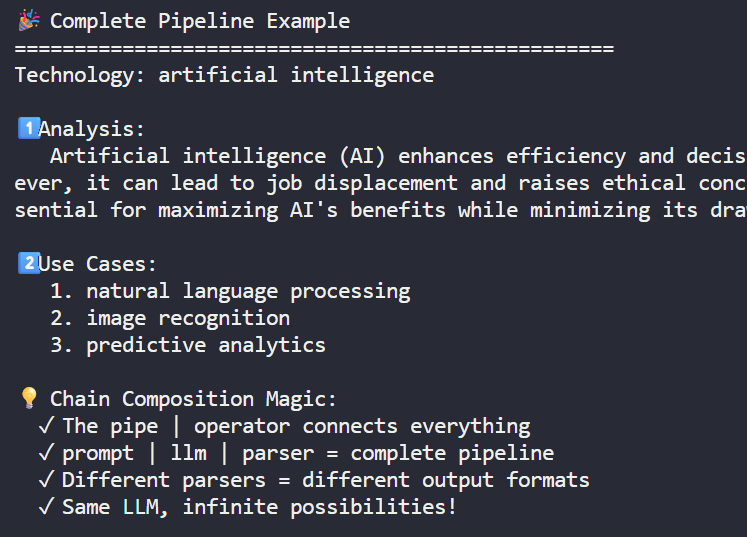

# langchain
## ✔️Overview
- **Scenario-1**:
    - Your startup built everything using the OpenAI SDK.
    - Now Google's Gemini is 3x cheaper
    - and X.AI's Grok is 2x faster.
    - But switching means rewriting thousands of lines of code...
    - ▶️with langchain, just change a single line of code!
    ```
    - Companies save 40% on average by finding the right model mix.
        - Some use GPT-4 for complex tasks,
        - Gemini for simple queries!  
    ```
- **Scenario-2**:
    - Agentic-ai app has so many **components**, need to tie together.
    - API call, vector DB call, Conversation memory, tool, web search, local file system, etc
    - ▶️langchain does all heavy lifting.

---
## ✔️python example


---
## ✔️LangChain Advantage
- One interface, infinite possibilities.
- Switch between providers with a single line change. No more vendor lock-in!
- Build **reusable templates** that work everywhere
- Transform messy AI text into clean data structures
- Build reusable templates that work everywhere
- Test OpenAI, Google, and X.AI with identical code

### prompt template
```
- template-1 = "Explain {topic} in {style}"
    - "Explain quantum computing in simple terms"
    - "Explain machine learning in simple terms"
```

### Output Parsers
- Tools that transform **unstructured AI text** into **structured Python data** (lists, dicts, objects) our code can actually use.
- translator between **human-readable AI responses** and **computer-friendly data structures**
```
- from langchain_core.output_parsers import 
  - StrOutputParser, 
  - JsonOutputParser, 
  - CommaSeparatedListOutputParser
```

### Chain Composition
- Connecting LangChain components with the | operator to create data pipelines - like Unix pipes for AI.
- chain = prompt | llm | parser
- 

