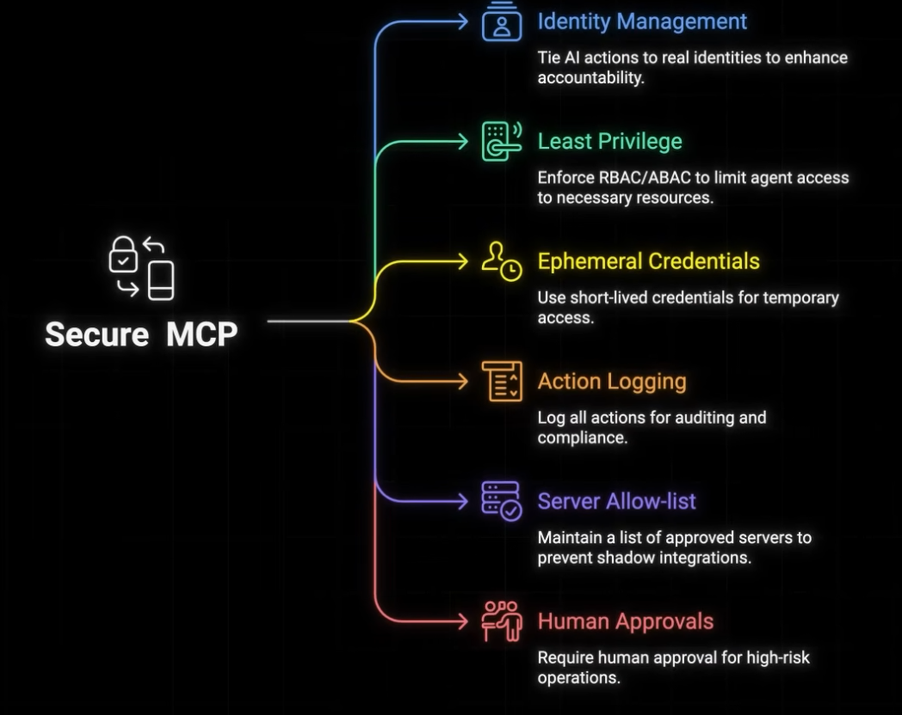
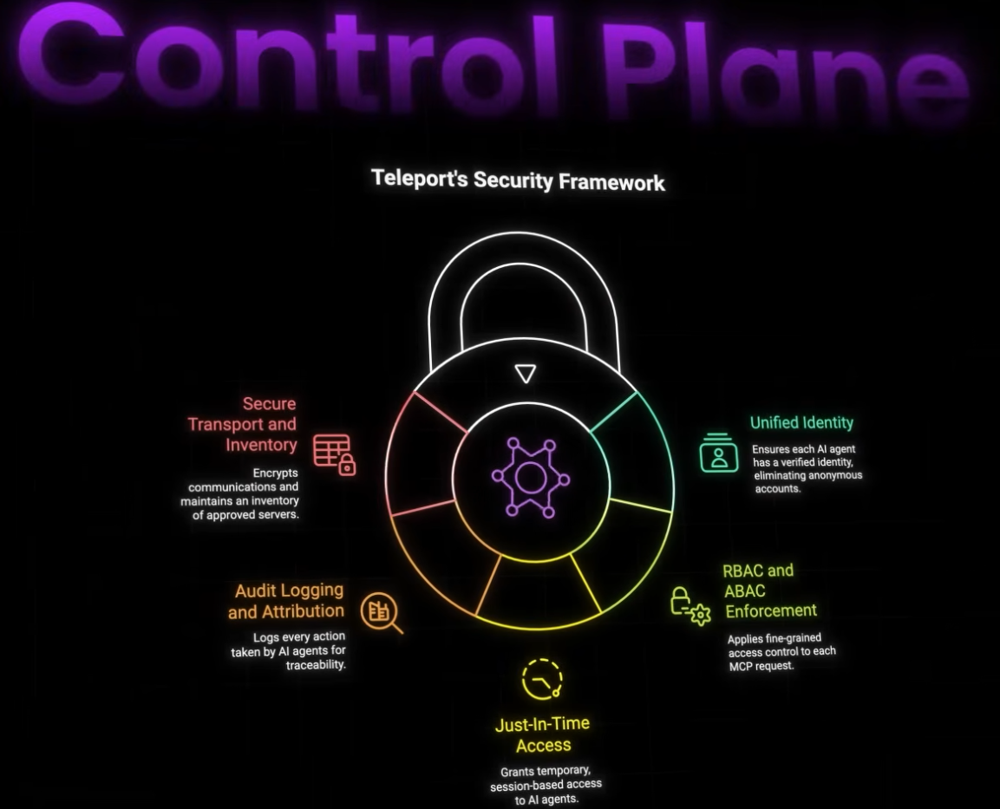
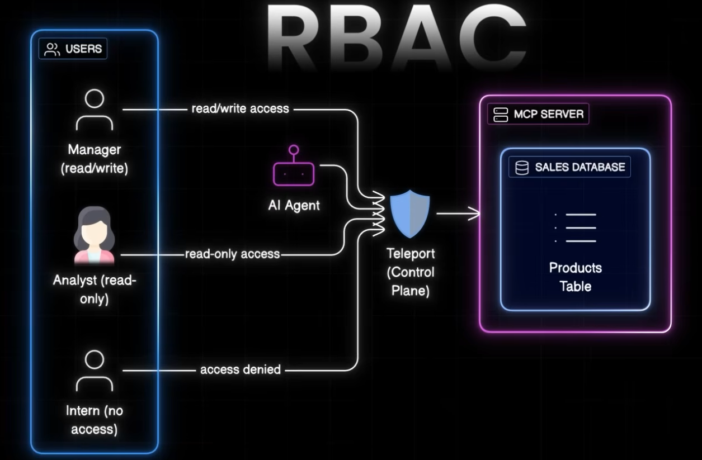

# Security with MCP 
## Best practice

---
## guardrail:: `Teleport`
### Overview
- https://bit.ly/45YwXVS
- https://youtu.be/x4XjSRUSRrg?si=PCrcTI9asX6oiocu
- provides secure access to infrastructure for engineers and developers. 
- acts as the **control plane for MCP**
- offers -  (RBAC), session recording, and audit logging.
- who access what and when, under which permission
- makes sures ai agent only **operates** within defined boundaries.
- 
- 

