# MCP (**Anthropic**) | Nov 2024
- A\ https://anthropic.skilljar.com/introduction-to-model-context-protocol
- BM1 https://youtu.be/-b6rGrIEG0w?si=A7SgF5D31U7RPhm3
- Bm2 https://youtu.be/PS9kw4W52Gs?si=rsffucXDfQY3zrOe
- KK1 https://www.youtube.com/watch?v=dyt-bhxrrbk

## Overview
- Think of universal adaptor between:
    - AI agent
    - external tools/data sources

**Problem**
- Integrations between AI agents and multiple external tools/data sources
- juggling between multiple - API specs, auth, rate-limiting, error-handling, data-formatting
- Custom integration for each external system.
  - multiple transport : REST/WS/RPC/GraphQL/webhooks

**Solution**
- Standardize **API Integration complexity** 
  - JSON-RPC (format)
  - HTTP/SSE (transport protocol)

## Benefits
- model-agnostic,  meaning it can work with different AI models and platforms.
- handle **multi-turn conversations** seamlessly
- manage context effectively,
- to do intelligent reasoning and decision-making

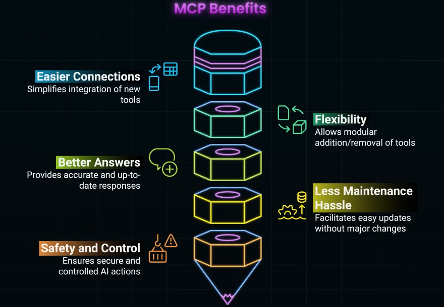

---
## MCP Adoption
- chatGPT can discover mcp tools and call them via mcp-client
- MS vscod support MCP to enhance copilot capabilities
- Claude Desktop (MCP client) can call MCP server tools

---
## Sample Code
✔️**Python SDK**

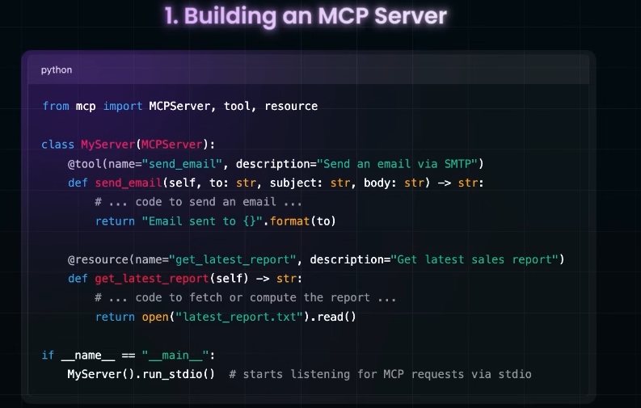

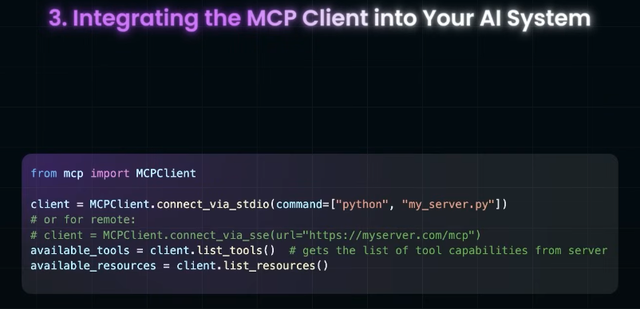

✔️**Postman** : 
Generate MCP server from postman collection.
- warp any existing API as MCP tool/resource.
- generate Node project and share zip.
- run local or inside container.

---
## Screenshots

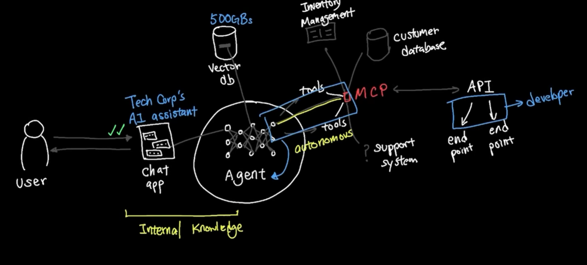

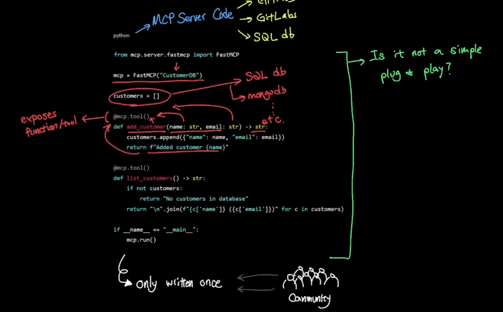

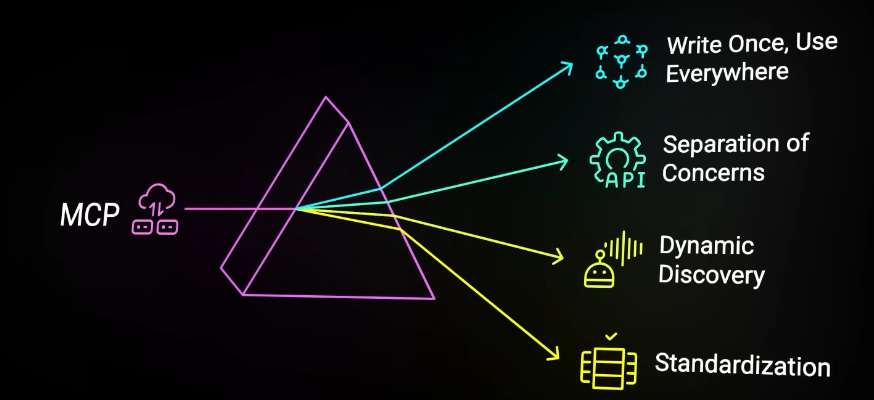

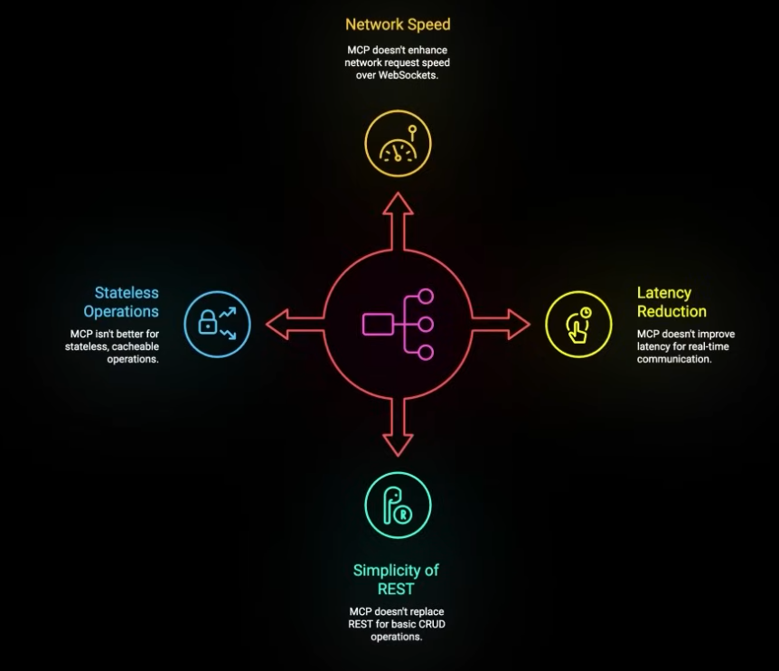

---
## Architecture 
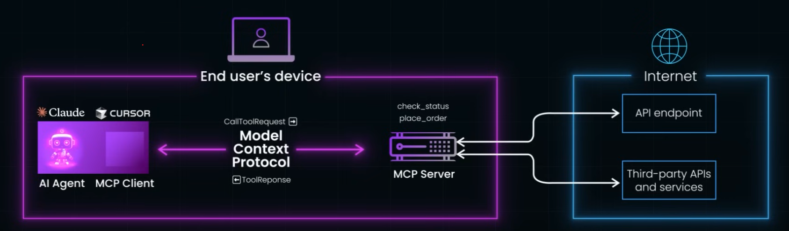

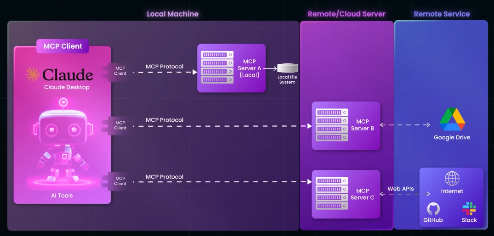

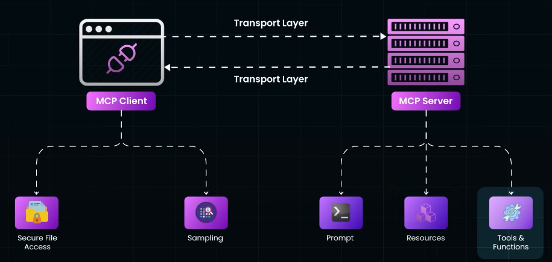

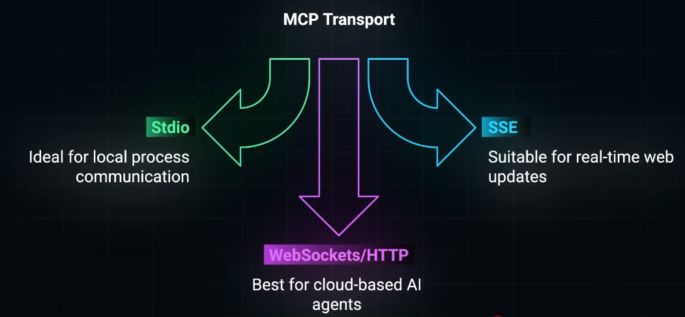

✔️ **Schema** 
- how req and response is structured
  - JSON-RPC (text based)

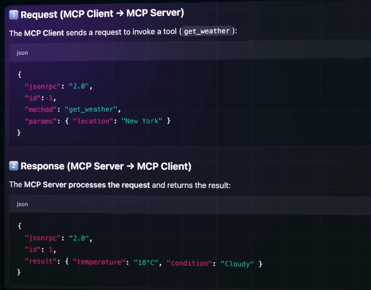

✔️ **Transport over**
- HTTP
- SSE
> Note: rpc not supported [check MCP_gRPC.md](03_MCP_gRPC.md)

✔️ **MCP Server** | hosted:  locally, cloud, k8s,  3rd-party vendors
  - 🔸Tools : actions that AI can perform (e.g., database queries, API calls, file operations)
  - 🔸resources: data sources that AI can access (e.g., documents, databases, web pages)
  - 🔸Prompts: predefined instructions/templates to guide AI interactions on tools/resources
  - **Reusability** : can reuse same mcp-server for multiple agents ◀️
  - has all the implementation logic for **action**. So not complex code changes needed on mcp-client side/ agent side ◀️
  - Can wrap any existing API as MCP tool/resource ◀️
  - Apply all System Design principles : scalability, reliability, security, observability, etc ◀️

✔️ **MCP Client** 
  - **Discovers** tools/resources from MCP server ◀️
  - Sends/received JSON-RPC requests/responses to/from MCP server over HTTP/WebSocket/gRPC ◀️
  - 🔸Sampling
  - 🔸Elicitation
  - 🔸Root: FileSystem, DB | eg: keep user preference

---
##  Reference:
- https://www.youtube.com/watch?v=RhTiAOGwbYE
- [MCP lab-1](https://learn.kodekloud.com/user/courses/youtube-labs-mcp?utm_source=youtube&utm_medium=video&utm_campaign=mcpcrashcourse_part1&utm_id=mcpcrashcourse_p1&utm_term=&utm_content=)
- [https://kode.wiki/4lFwf5p](https://kode.wiki/4lFwf5p)
- [https://www.perplexity.ai/search/mcp-introduction-explained-in-_WiQ4FksREuKr5HJlKqznw](https://www.perplexity.ai/search/mcp-introduction-explained-in-_WiQ4FksREuKr5HJlKqznw)
- [https://docs.anthropic.com/en/docs/mcp](https://docs.anthropic.com/en/docs/mcp)
- [bbgo links](https://github.com/lekhrajdinkar/solution-engineer/blob/main/docs/10_System_Design/blogs_01_byteByteGo.md#%EF%B8%8Fagentic-ai)
- byteMonk