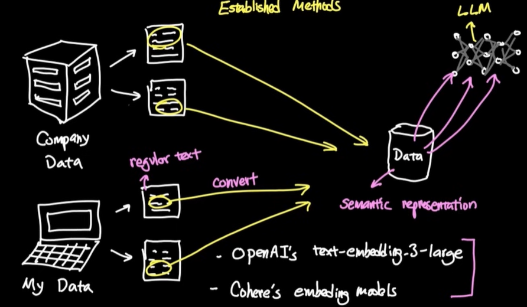
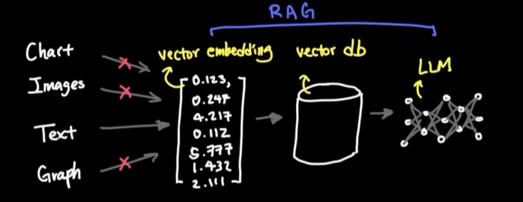
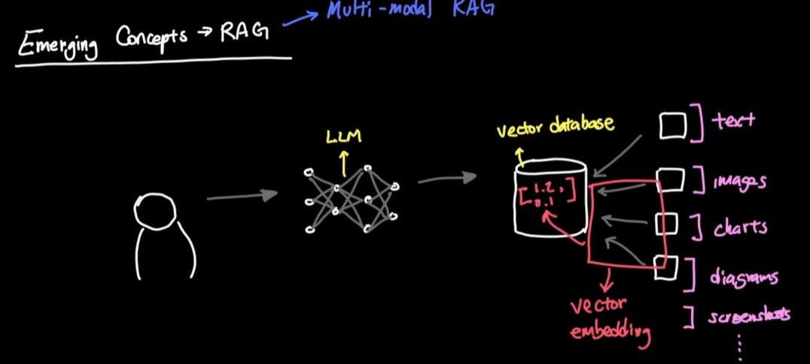

# RAG
```
📢 CEO's New Challenge:
"Don't just FIND the document, ANSWER the question! 
I want our system to say 'Yes, you can work 3 days from home'
not just show me a policy document!"
```

## Overview 1
- bm :  https://youtu.be/MlhZPTfOJBo?si=kFhUmi5_3ixa9IBn
- kk : https://www.youtube.com/watch?v=vT-DpLvf29Q (detailed + lab)  👈🏻
- Think of its as  brain memory where your AI will search  for answers. 👈🏻
- increase depth of knowledge beyond LLm training data, **improving context**
- Does not extend LLM memory.
- **calibrate** 2 systems: 
  - LLM (large language model)
  - external knowledge base (vector DB)
- so, no need to fine-tune LLM on specific domain data
- `spaCy` - **Advance NLP lib**
  - helps in sentence aware chunks
  - understand  sentence boundaries
  - break chunks bt NL boundaries (just jsut bty char)
  - eg: `SpactTextSpiltter`

## Overview 2






---
## RAG Architecture
```
Transform our semantic search into a complete RAG (Retrieval-Augmented Generation) system that:

RETRIEVES relevant documents (you built this!)
AUGMENTS with context
GENERATES perfect answers

User Question → Embedding → Vector Search → Retrieve Chunks
                                              ↓
                                         Augment Prompt
                                              ↓
                                         Generate Answer
                                              ↓
                                         Add Citations
                                              ↓
                                         Final Response
```
---
## Flow
### 0. Chunking
#### fixed size chunk
- by char
- by word

#### semantic chunk (natural breaking, if coherence drops)
- Achieve chunk overlap
- good balance

#### Agentic chunking 👈🏻
- using AI to understand doc
- chuck by symantic meaning and topic shift
- higher cost
- higher quality
- 
### 1. Retrieve
- retrieve relevant context from knowledge base (vector DB) based on user query
  - vector-store-1 for legal docs (chunking strategy-1)
  - vector-store-2 for product manuals (chunking strategy-2)
  - ...
- **symantic search** using embeddings on vector DB
- retrieve "symantic relevant chunks" from vector DB
- **Evaluate** chunks:
  - Are relevant/correct chunks ?
  - complete chunks loaded ?
  - chunks ranked properly ?
- **4 Evaluation ways**:
  - Recall@K
  - Precision@K
  - MRR mean reciprocal rank
  - NDCG normalized doc cumulative gain


### 2. Augment
- combine **retrieved context** with **user query** to create an **augmented prompt**


### 3. Generate
- pass augmented prompt to LLM to generate response


## Advance/new/emerging-concept 👈🏻👈🏻
As of jan 2026
### CAG
- [04_02_CAG.md](04_02_CAG.md)

### Agentic RAG
- [04_03_AgenticRAG.md](04_03_AgenticRAG.md)

### Multi-Query RAG
- [04_04_Multi-Query-RAG.md](04_04_Multi-Query-RAG.md)

### hierarchical_RAG
- [04_05_hirarchical_RAG.md](04_05_hirarchical_RAG.md)

### Multi-modal RAG


---
## Resources
- [LangChain Documentation](https://python.langchain.com/)
- [ChromaDB Guide](https://docs.trychroma.com/)
- [Sentence Transformers](https://www.sbert.net/)
- [RAG Best Practices](https://www.pinecone.io/learn/retrieval-augmented-generation/)