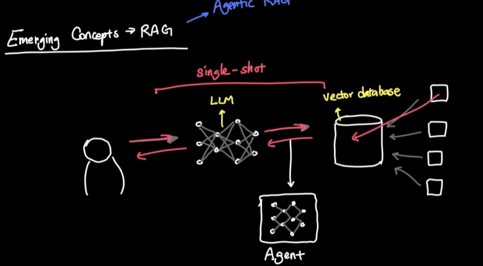
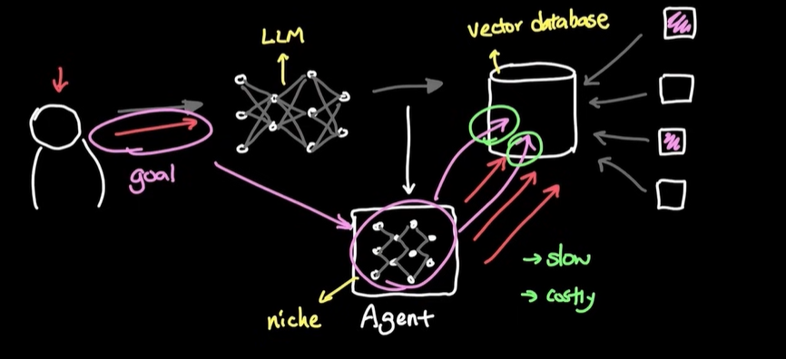

# Agentic RAG
## Overview
- RAG is one time call (one shot). hence **task based**.
- make it **goal based** with agentic RAG
- Agent will make few shot to RAG, until goal is archived 
- slow + $$

