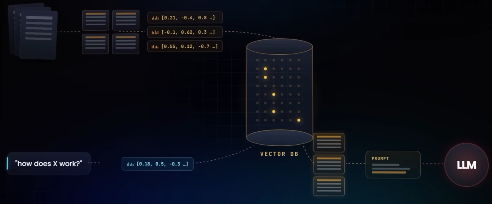
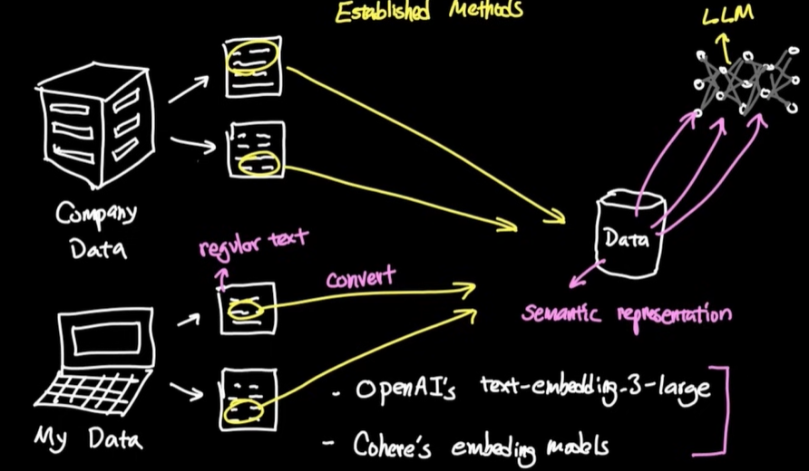
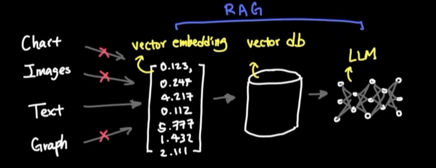
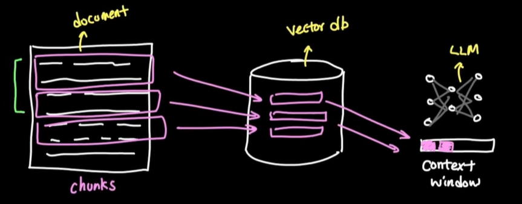
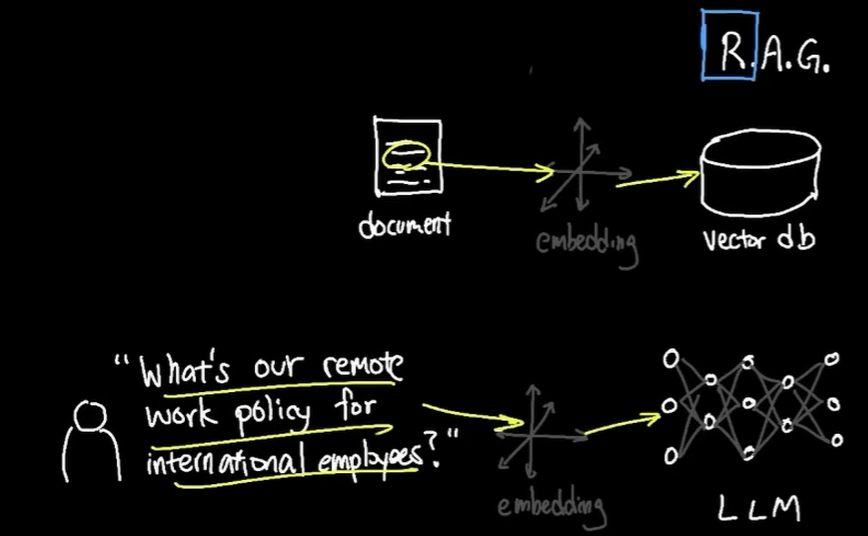
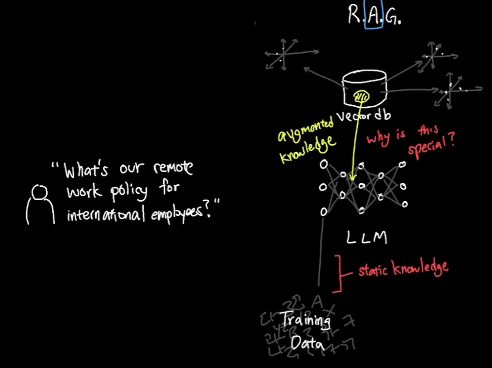
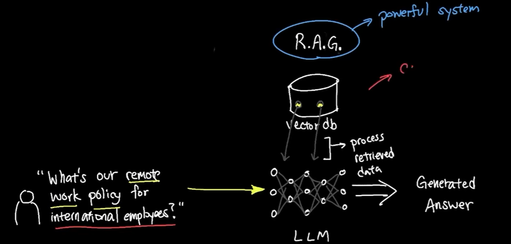
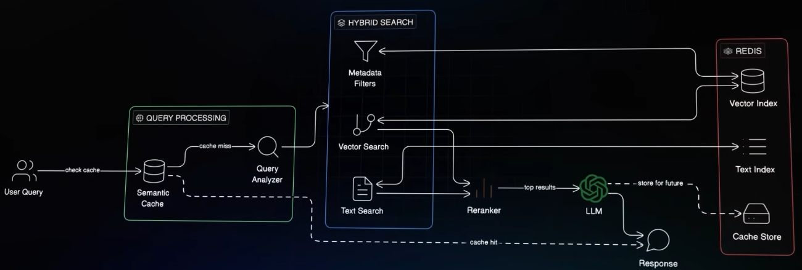

# RAG
```
Scenario:
📢 CEO's New Challenge:
"Don't just FIND the document, ANSWER the question! 
I want our system to say 'Yes, you can work 3 days from home'
not just show me a policy document!"
```



---
## ✔️Overview 1
- bm1: https://youtu.be/MlhZPTfOJBo?si=kFhUmi5_3ixa9IBn (Skip)
- bm2: https://www.youtube.com/watch?v=4KiiKQ9RVvA (Skip)
- bm3: https://www.youtube.com/watch?v=19x8pKiaQVU (Skip, 5:40 onwards RAG)
- kk : https://www.youtube.com/watch?v=vT-DpLvf29Q (detailed + lab)  👈🏻
- Think of its as  brain memory where your AI will search  for answers. 👈🏻
- increase depth of knowledge beyond LLm training data, **improving context**
- Does not extend LLM memory.
- **calibrate** 2 systems: 
  - LLM (large language model)
  - external knowledge base (vector DB)
- so, no need to fine-tune LLM on specific domain data

`spaCy` | **Advance NLP lib**
  - helps in sentence aware chunks
  - understand  sentence boundaries
  - break chunks by NL boundaries (just by char)
  - eg: `SpactTextSpiltter`

---
## ✔️Overview 2







---
## ✔️Architecture
```
Transform our semantic search into a complete RAG (Retrieval-Augmented Generation) system that:

RETRIEVES relevant documents (you built this!)
AUGMENTS with context
GENERATES perfect answers

User Question → Embedding → Vector Search → Retrieve Chunks
                                              ↓
                                         Augment Prompt
                                              ↓
                                         Generate Answer
                                              ↓
                                         Add Citations
                                              ↓
                                         Final Response
```
---
## ✔️Flow
### 0. Chunking
#### fixed size chunk
- by char
- by word

#### semantic chunk (natural breaking, if coherence drops)
- Achieve chunk overlap
- good balance

#### Agentic chunking 👈🏻
- using AI to understand doc
- chuck by symantic meaning and topic shift
- higher cost
- higher quality

### 1. Retrieve
- retrieve relevant context from knowledge base (vector DB) based on user query
  - vector-store-1 for legal docs (chunking strategy-1)
  - vector-store-2 for product manuals (chunking strategy-2)
  - ...
- **symantic search** using embeddings on vector DB
  - better to use **hybrid search** (regular text + semantic + metadata), based on scenario 👈
- retrieve "symantic relevant chunks" from vector DB
- **Evaluate** chunks:
  - Are relevant/correct chunks ?
  - complete chunks loaded ?
  - chunks ranked properly ?
- **4 Evaluation ways**:
  - Recall@K
  - Precision@K
  - MRR mean reciprocal rank
  - NDCG normalized doc cumulative gain



### 2. Augment
- combine **retrieved context** with **user query** to create an **augmented prompt**



### 3. Generate
- pass augmented prompt to LLM to generate response



---
## ✔️ Production-Grade RAG


To bridge the gap between mediocre and excellent retrieval/RAG, Follow these four key techniques:

**Hybrid Search**: 
- Combining vector similarity (meaning) with keyword search (exact matches like order numbers).

**Metadata Filtering**:
- Narrowing search to relevant slices of data (e.g., date ranges or user IDs).

**Re-ranking**: 
- A second-pass process to select the most precise results from a wider initial retrieval.

**Semantic Caching**: 
- Storing the meaning of queries to avoid expensive LLM calls for repetitive questions.
- [Caching.md](../02_architecture/02_Caching.md)

---
## 📚Resources
- [LangChain Documentation](https://python.langchain.com/)
- [ChromaDB Guide](https://docs.trychroma.com/)
- [Sentence Transformers](https://www.sbert.net/)
- [RAG Best Practices](https://www.pinecone.io/learn/retrieval-augmented-generation/)