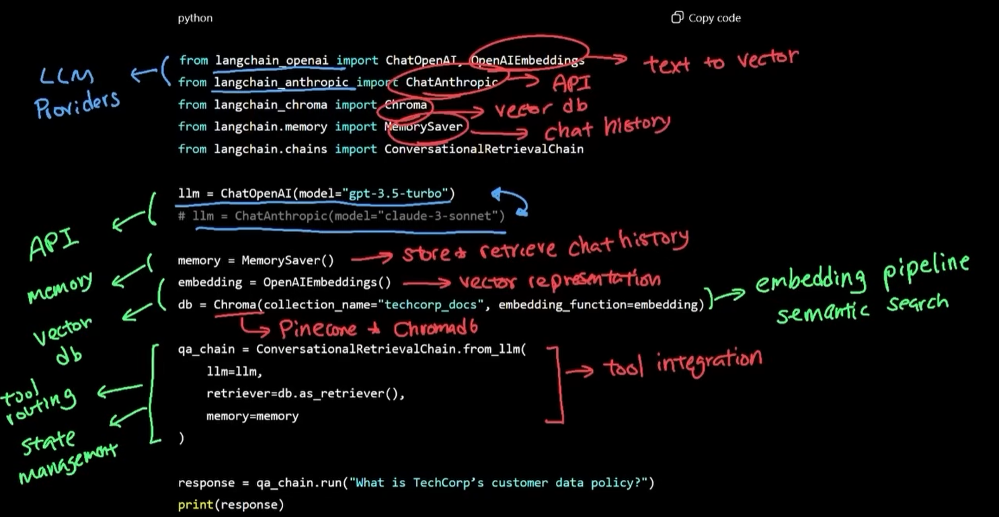
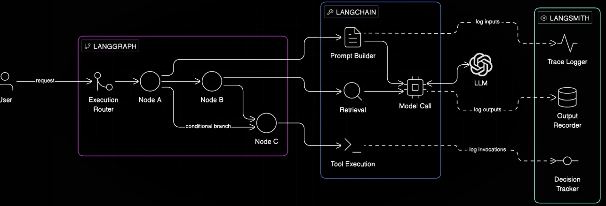
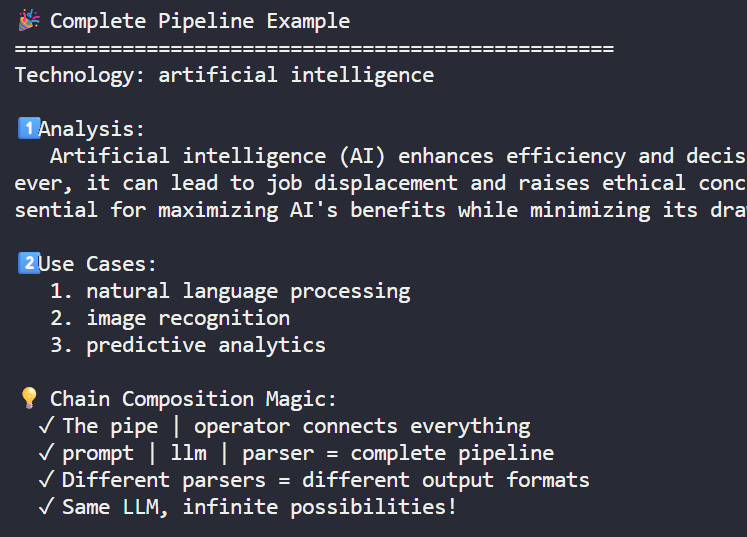

# langchain
- https://www.youtube.com/watch?v=e-GR3PlEOVU

## ✔️Overview
- **framework** for building AI pipeline by providing standardized building blocks/ **orchestrate component**, like:
  - **Prompt Templates**
  - Rigid **Chains** for multi-step workflows
  - **Tools** plumbing for enabling LLM actions (web seach, database, api, etc)
  - **RAG** plumbing
  




## ✔️Lab
- [lab_01_lanchain.py](../../../../src/y2026/lab_01_ai_agent/lab_02_lanchain.py) 👈

---
## ✔️LangChain Advantage
### Switch LLM Provider
- abstraction over switching multiple LLM
- Switch between providers with a single line change. 
- No more vendor lock-in!. 
- Test OpenAI, Google, and X.AI with identical code

### prompt template
Build **reusable templates** that work everywhere
```
- template-1 = "Explain {topic} in {style}"
    - "Explain quantum computing in simple terms"
    - "Explain machine learning in simple terms"
```

### Output Parsers
- Tools that transform **unstructured AI text** into **structured Python data** (lists, dicts, objects) our code can actually use.
- translator between **human-readable AI responses** and **computer-friendly data structures**
```
- from langchain_core.output_parsers import 
  - StrOutputParser, 
  - JsonOutputParser, 
  - CommaSeparatedListOutputParser
```

### Chain Composition 👈
- Connecting LangChain components with the pipeline `|` operator to create data pipelines 
- like Unix pipes for AI.
- `chain = prompt | llm | parser`



