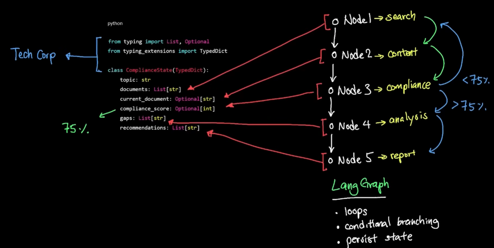

# langGraph (Stateful graph framework)
> tip: think of harness pipeline.
## ✔️Overview
- complex agentic workflow, automation tool
- **complex decision-making**:  
  - loop
  - branch - conditional routing (branching logic in pipeline)
  - State

## ✔️Lab
- [🧪Lab_langGraph_06](../../../../src/y2026/lab_01_ai_agent/langGraph_06)
- https://youtu.be/gyBxdNpFM-8?si=7A0ontQD8g8ZUyYh

---
## ✔️components
### StateGraph 
- container

### State (Dict)
- Data flowing through
- Shared between nodes
- Updated at each step

### Nodes
- py function 
  - takes arg - (state)
  - returns partial state

### Edge (transitional logic)
- connection between 2 nodes.
- Define execution order
- Can be conditional

### Router
- next node to be executed
- adds flexibility

### Calculator (tools)
- node with specific function
- `@tool fn()`
- register with llm
- llm_with_calculator = llm.bind_tools([calculator_tool])