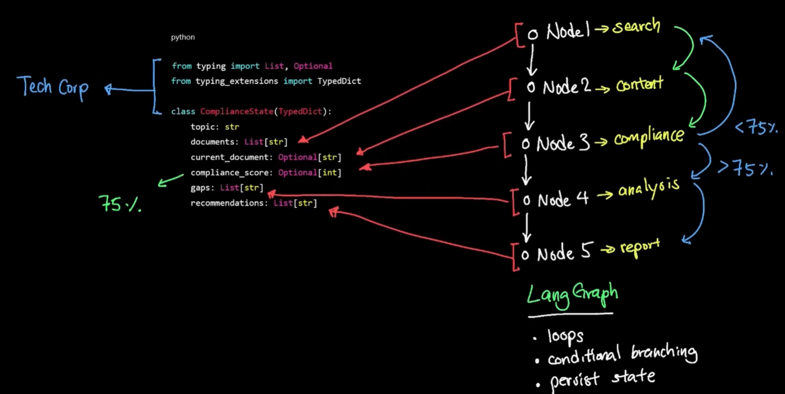

# langgraph
## ✔️Overview
- complex workflow automation tool
  - multi-steps, stateful
- Gives control on how data flow through application
- enabling complex decision-making, loop, conditional routing, 
- branching logic in pipeline
- think of harness pipeline.

---
## ✔️components
### State (Dict)

### Nodes
- py function 
  - takes arg - (state)
  - returns partial state

### Edge
- connection between 2 nodes.

### Router
- next node to be executed
- adds flexibility

### Calculator

---
## ✔️project