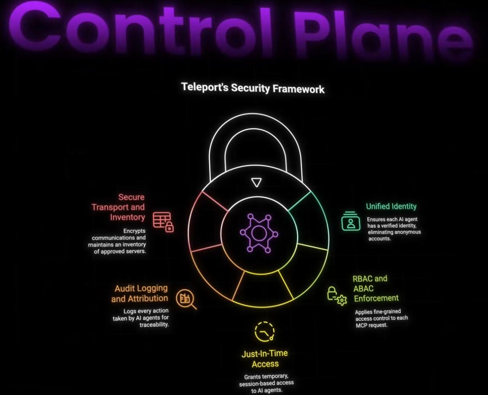
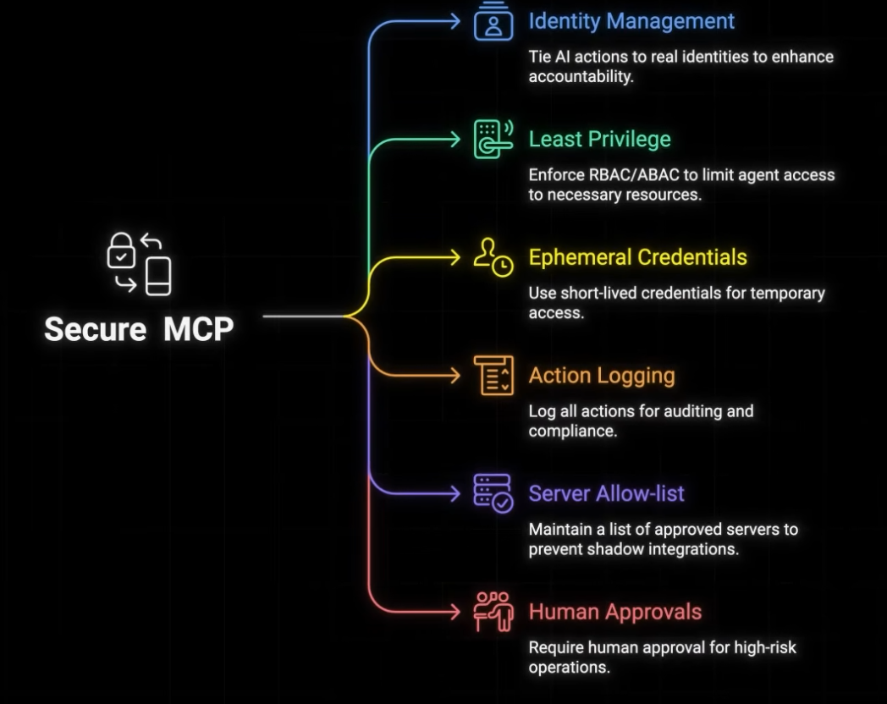

# MCP Security
- https://youtu.be/x4XjSRUSRrg?si=PCrcTI9asX6oiocu

## Security Problems
- MCP has lack of Guardrails: 
  - MCP was designed primarily for functionality. 
  - By default, it lacks **built-in identity**, **access control**, or **auditing** 
  - creating a "wide-open highway" for AI requests
  - thus can be vulnerable to [Prompt_injections attacks](01_Prompt_injections.md) 

---
## Solution/s
###  MCP guardrail

`Teleport` | https://bit.ly/45YwXVS

Identity-First Security: 
- Teleport assigns real identities to AI agents, 
- replacing anonymous or broad-access keys with short-lived, ephemeral certificates

Fine-Grained Access: 
- By enforcing RBAC/ABAC (Role/Attribute-Based Access Control), 
- Teleport ensures agents only perform actions permitted by the specific user they are acting on behalf of.

Audit & Compliance: 
- Every request—whether approved or denied—is logged, 
- providing a full audit trail for security teams

###  MCP gateway
- `Storm MCP` | https://stormmcp.ai/apps 

###  OAuth2 gateway
- `arcade`   | https://arcade.dev.plug.dev/QyccQEk 
- `scalekit` | https://auth.scalekit.com/a/auth/signup?utm_source=youtube&utm_medium=video&utm_campaign=bytemonk