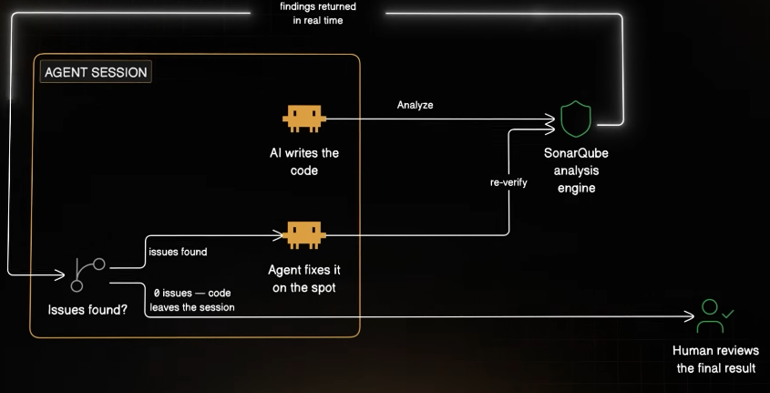

# SonarQube MCP server 
`Source : ByteMonk`
https://www.youtube.com/watch?v=MNiTL1NwTUM

---

## Security risks associated with "vibe coding"
- AI Coding agent/tools like **GitHub Copilot**,  ClaudeCode, Cursor, ChatGPT
  - highly effective for boilerplate and productivity
  - optimized for correctness (functionality) **rather than security**
  - trained from StackOverFlow, sample GithubCode project (not industry code), lib docs, etc
- **Common AI-Generated Vulnerabilities** (OWASP Top 10):
  - SQL Injection: 
    - Caused by direct concatenation of user input into queries 
    - instead of using parameterized queries 
  - Hardcoded Secrets: 
    - AI tools often insert secrets directly into code as seen in common online tutorials, 
    - rather than utilizing secure environment variables or secret managers 
  - Broken Access Control: 
    - AI often builds requested features 
    - but fails to implement implied authorization checks (e.g., admin-only access) because it was not explicitly prompted to do so (4:03–4:29).
  - Insecure Deserialization: 
    - The use of functions like Pickle in Python which,
    - while easy, can be dangerous if processing untrusted user input 

## The Structural Problem & Solutions:

- The Human Element: 
  - Junior developers often trust AI-generated code, 
  - and standard code reviews are often designed for maintainability 
  - rather than security,
  - causing these flaws to slip through
  
- Shift Left & Static Analysis: 
  - The industry solution is to "shift left," 
  - integrating security checks directly into the developer's environment.

- **Agentic Fixes:**  👈
  - A new advancement shown is the **SonarQube MCP server**,  
  - which allows **AI coding agents** to verify their own code,
    - identify issues (like hardcoded passwords), 
    - and automatically fix them before the human even reviews the code.

## SonarCube
- https://sonarcloud.io/organizations/lekhrajdinkar/projects
- https://sonarcloud.io/summary/overall?id=lekhrajdinkar_senior-system-engineer&branch=main