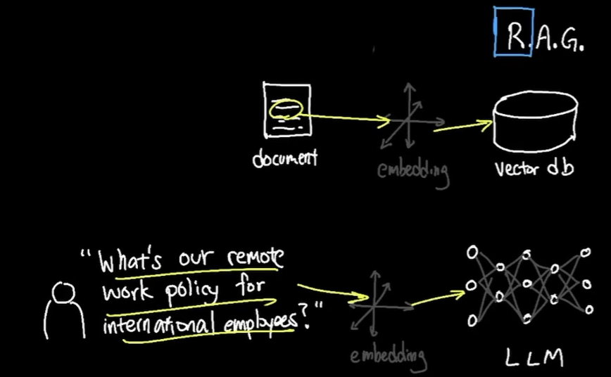
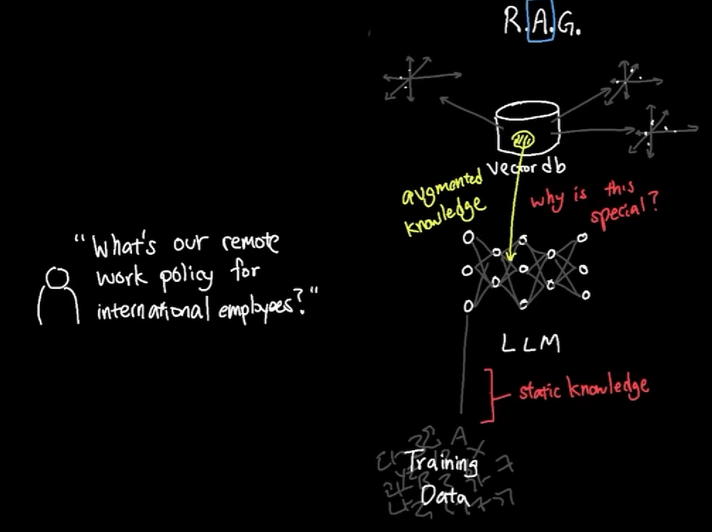
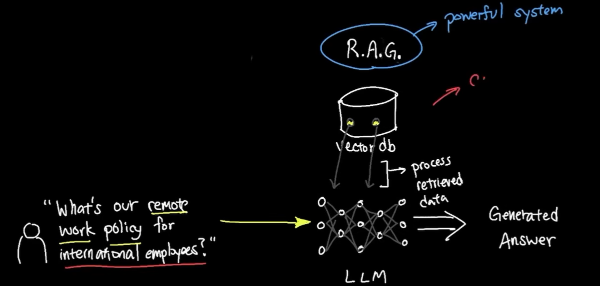

# RAG
## Overview
- Think of its as  brain memory where your AI will search  for answers. 👈🏻
- increase depth of knowledge beyond LLm training data.
- **calibrate** 2 systems: 
  - LLM (large language model)
  - external knowledge base (vector DB)
- so, no need to fine-tune LLM on specific domain data

```
Transform our semantic search into a complete RAG (Retrieval-Augmented Generation) system that:

RETRIEVES relevant documents (you built this!)
AUGMENTS with context
GENERATES perfect answers

---
📢 CEO's New Challenge:
"Don't just FIND the document, ANSWER the question! 
I want our system to say 'Yes, you can work 3 days from home'
not just show me a policy document!"
```
---
## RAG Architecture
```
User Question → Embedding → Vector Search → Retrieve Chunks
                                              ↓
                                         Augment Prompt
                                              ↓
                                         Generate Answer
                                              ↓
                                         Add Citations
                                              ↓
                                         Final Response
```

## Flow
### Retrieve
- retrieve relevant context from knowledge base (vector DB) based on user query
  - vector-store-1 for legal docs (chunking strategy-1)
  - vector-store-2 for product manuals (chunking strategy-2)
  - ...
- **symantic search** using embeddings on vector DB
- retrieve "symantic relevant chunks" from vector DB


### Augment
- combine **retrieved context** with **user query** to create an **augmented prompt**



### Generate
- pass augmented prompt to LLM to generate response


## Resources
- [LangChain Documentation](https://python.langchain.com/)
- [ChromaDB Guide](https://docs.trychroma.com/)
- [Sentence Transformers](https://www.sbert.net/)
- [RAG Best Practices](https://www.pinecone.io/learn/retrieval-augmented-generation/)