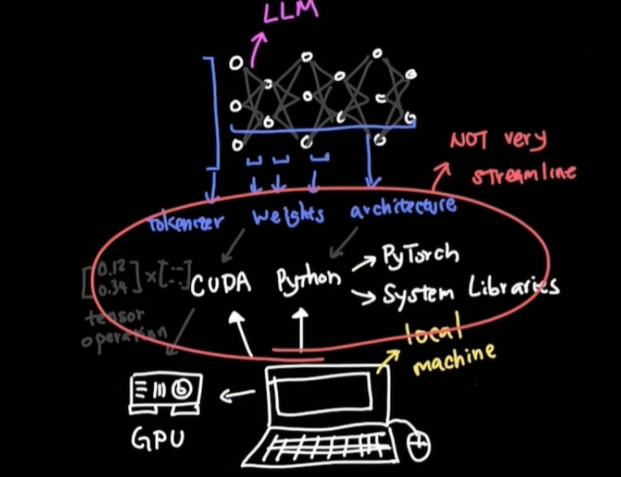

# LLM Local
## Overview
- https://www.youtube.com/watch?v=tYg6T_DAP-k
- [🧪lab_04_docker_model_runner](../../../src/y2026/lab_04_docker_model_runner) 👈🏻
- AI model, now can be stored as docker layered images.
- manage Dependency Hell - **Docker** 
  - https://hub.docker.com/repositories/lekhrajdinkar18 (signed-up up git account)
  - https://hub.docker.com/u/ai | `55 repositories`
  - **Docker Model Runners** 
    - to run Ai inference engine 👈🏻
    - without installing python, dependencies, ML setup, etc
    - follows same standard to run container
    - expose via API

- 
- 


### Inference Engine
  - llm is not like .exe, etc
  - but llm has raw artifact like - weight, arch, config file, tokenizers, driver , inference-Code, CUDA, etc
  - inference engine, loads the raw artifact

### CUDA (Compute Unified Device Architecture) 
- NVIDIA’s parallel computing platform 
- that lets software run code directly on the GPU, instead of the CPU
- massive matrix math
- bridge between deep learning frameworks and NVIDIA hardware
- KV-cache management
- etc
```
LLM Framework (PyTorch / TensorFlow / JAX)
        ↓
CUDA-enabled Libraries (cuBLAS, cuDNN, NCCL)
        ↓
CUDA Runtime & Driver
        ↓
NVIDIA GPU (A100, H100, RTX, etc.)

```