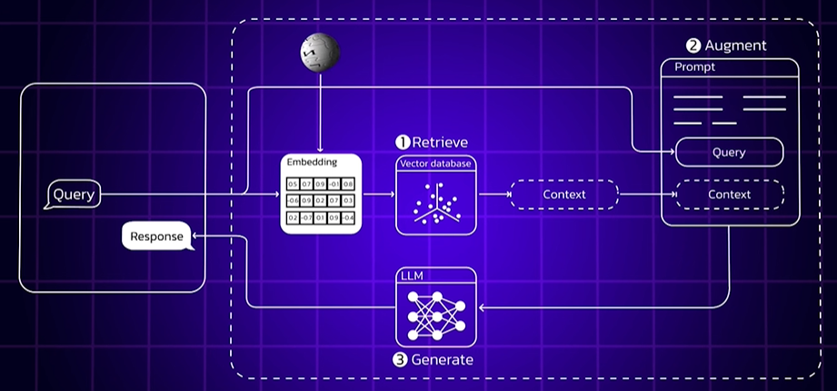
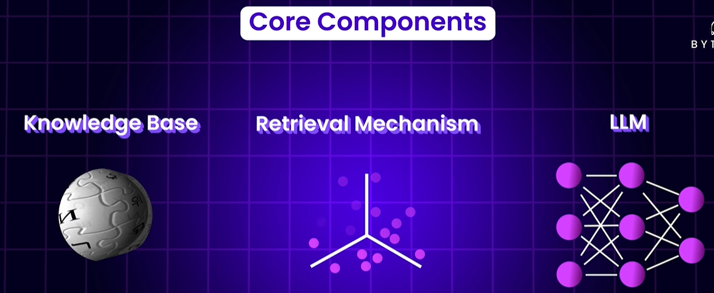
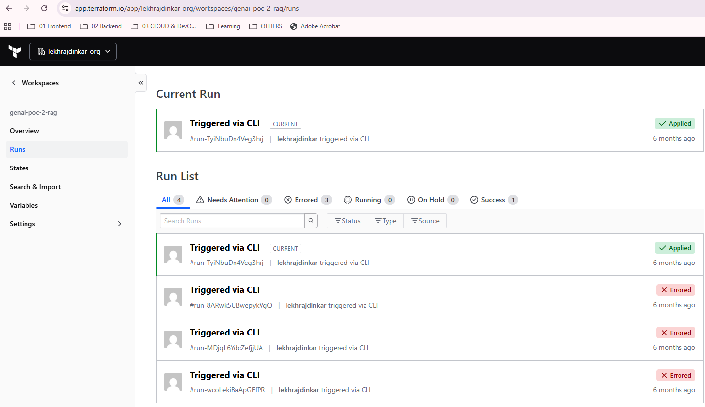
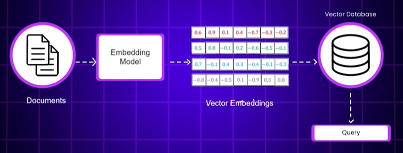

# RAG POC
## Overview


## ✔️RAG component
- Knowledge base: 
  - AWS S3 [arn](https://us-east-1.console.aws.amazon.com/s3/buckets/genai-rag-demo-lekhrajdinkar-bucket?region=us-east-1&bucketType=general)
  - kept here for local run:  [sample_docs](sample_docs)
- vector DB: DynamoDB table (name=rag_chunks) [arn](https://us-east-1.console.aws.amazon.com/dynamodbv2/home?region=us-east-1#table?name=rag_chunks)
- LLM model: **anthropic.claude-3-sonnet-20240229-v1:0** 👈🏻




## ✔️Setup
### ▶️Terraform-iac
- [HCP workspace - genai-poc-2-rag](https://app.terraform.io/app/lekhrajdinkar-org/workspaces/genai-poc-2-rag)

- IAC code : [main.tf](infra) | terraform apply
- **resources got created** (3) 
  - IAM role resourcesAllow access to S3, DynamoDB, Bedrock
  - dynamoDB table
  - AWS S3 bucket
  
> Note: AWS account is suspended now :(




### ▶️prepare embedding and store in vector DB
- `python -m src.AIModule.poc_2_rag.rag_ingest (ONCE) -> to store chunks in dynomaoDB from AWS S3/local files`
- embedding model: **bedrock.titan-embed-text-v1** 👈🏻

 


---
## ✔️Codebase
### ▶️framework
- langchain, textwrap, Decimal
- aws-sdk (bedrock)
- Streamlit (UI)

### ▶️run from UI
- `streamlit run .\src\AIModule\poc_2_rag\ui_streamlit.py`
- [query_engine.py](query_engine.py)
- k8s : [deployment](deployment)


### ▶️project structure and code flow
[reference](https://chatgpt.com/c/6861ffef-7224-800d-a81b-1fe26b66e9b4)
```
├── embedder.py           # Call Bedrock embedding model
├── rag_ingest.py         # Load files, chunk, embed, and store to DynamoDB/S3
├── dynamo_client.py      # DynamoDB helper for saving & querying
├── s3_client.py          # S3 file upload
├── utils.py              # Chunking, cleaning
└── sample_docs/          # Put PDFs or .md here

🔸 Step 1 :: rag_ingest.py

✅ Load .md or .txt files (ensure proper MIME/type check)
✅ Chunking (handled via utils.py)
✅ Embedding (using embedder.py, Bedrock Titan model)
✅ Storage:
    S3: Upload full file using s3_client.py
    DynamoDB: Save chunks with metadata using dynamo_client.py

🔸 Step 2 :: infra setup  

[poc_2_rag.md](poc_2_rag.md)1. IAM Role/User Permissions
    ✅ Bedrock full access (bedrock:* or specific InvokeModel)
    ✅ DynamoDB access:dynamodb:PutItem, GetItem, Query, BatchWriteItem
    ✅ S3 access:s3:PutObject, GetObject, ListBucket

2. DynamoDB Table: rag_chunks
    ✅ PK: doc_id (e.g., filename or UUID)
    ✅ SK: chunk_id (e.g., 0001, 0002, ...)
    ✅ Attributes:
            text (chunk content)
            embedding (vector array, stored as list of floats or base64)
            source (file name or S3 URI)
            metadata (optional: created_at, author, etc.)
            
3. S3 Bucket : genai-rag-demo-lekhrajdinkar-bucket
```
