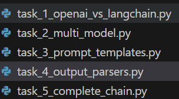

# KK labs 2026
- YT playlist: https://www.youtube.com/watch?v=ZaPbP9DwBOE&list=PL2We04F3Y_43f3x3n9pawcEuAwru7bcMG
- lab: https://kode.wiki/3Wh4DZ6
- **env setup**:
  - python3, venv, [requirements.txt](requirements.txt)
  - env variables: OPENAI_API_KEY, OPENAI_API_BASE | [.env](.env)

## 🧪Lab-1: openAI Call
- [01_01_verify_env.py](01_01_verify_env.py)
- [01_02_openai.py](01_02_openai.py)

## 🧪Lab-2: LangChain
- [02_01_lanchain.py](02_01_lanchain.py)
- 

## 🧪Lab-3: Prompt Engineering with LangChain

## 🧪Lab-4: Vector Databases - Build TechDocs Semantic Search Engine
- [README.md](04_vectors/README.md)

## 🧪Lab-5: The RAG Revolution

## 🧪Lab-6: LangGraph Basics - Build Stateful AI Workflows

## 🧪Lab-7: Advanced MCP Concepts - Extend LangGraph with External Tools

