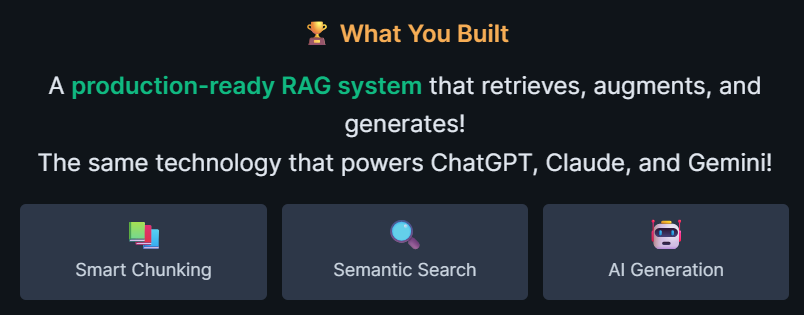

# AI AGENT lab(7)
🏅 https://learn.kodekloud.com/user/certificate/fc188fcc-6bcb-4144-98f2-1dca6c695909

## overview
- YT https://www.youtube.com/watch?v=ZaPbP9DwBOE&list=PL2We04F3Y_43f3x3n9pawcEuAwru7bcMG
- lab: https://kode.wiki/3Wh4DZ6 | https://learn.kodekloud.com/user/courses/youtube-labs-ai-agent-fundamentals
- **env setup**:
  - python3, venv, [requirements.txt](requirements.txt)
  - env variables: OPENAI_API_KEY, OPENAI_API_BASE | [.env](../../../.env)
- Note: [02_AgenticAI](../../../docs/2026/02_AgenticAI) 📚

## 🧪Lab-1 / 2 llm
- openai SDK [01_02_openai.py](lab_01_openai.py)
- lanChain abstraction [02_01_lanchain.py](lab_02_lanchain.py)
  - **switch between multi model/llm**
  - **output parser**
- **Run**
```bash
cd C:\Users\Manisha\Documents\github-2025\genai; 

python -m src.y2026.lab_01_ai_agent.lab_01_openai
python -m src.y2026.lab_01_ai_agent.lab_02_lanchain
```

## 🧪Lab-3: Prompt Engineering with LangChain
- [README.md](prompt_eng_03/README.md)

## 🧪Lab-4: Vector Databases 
- Build TechDocs - **Semantic Search Engine**
- [README.md](vectors_04/README.md)

## 🧪Lab-5: The RAG Revolution
- vector DB revision
- [README.md](rag_05/README.md)
- 

## 🧪Lab-6: LangGraph Basics - Build Stateful AI Workflows
[langGraph_06](langGraph_06)

## 🧪Lab-7: Advanced MCP Concepts - Extend LangGraph with External Tools
[mcp_07](mcp_07)


