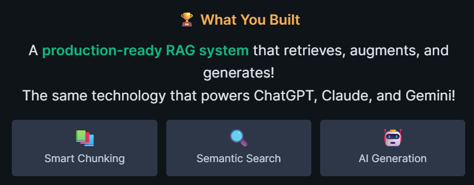

# AI AGENT FUNDAMENTAL (kk-lab) | `Jan-2026`
- theory on https://www.youtube.com/watch?v=ZaPbP9DwBOE&list=PL2We04F3Y_43f3x3n9pawcEuAwru7bcMG
- lab can be found here:
  - short url https://kode.wiki/3Wh4DZ6  
  - long url  https://learn.kodekloud.com/user/courses/youtube-labs-ai-agent-fundamentals
  - (lab provides sandbox env. Code backup also taken here from sandbox, as shown below)
- completed and got certificate on jan-18-2026 
  - 🏅 https://learn.kodekloud.com/user/certificate/fc188fcc-6bcb-4144-98f2-1dca6c695909

---
## Lab-1
- First API call ( with `openai SDK`) 
- [01_02_openai.py](lab_01_openai.py)
- python3, venv, [requirements.txt](requirements.txt)
- env variables:  [.env](.env) ⚠️ missing

```bash
cd C:\Users\Manisha\Documents\github-2025\genai; 
python -m src.y2026.lab_01_ai_agent.lab_01_openai
```
---
## lab-2
- lanChain abstraction
- [02_01_lanchain.py](lab_02_lanchain.py)
- python3, venv, [requirements.txt](requirements.txt)
- env variables:  [.env](.env) ⚠️ missing

```bash
cd C:\Users\Manisha\Documents\github-2025\genai; 
python -m src.y2026.lab_01_ai_agent.lab_02_lanchain
```
---
## Lab-3: Prompt Engineering with LangChain
[README.md](prompt_eng_03/README.md)

## Lab-4: Vector Databases 
[README.md](vectors_04/README.md)

## Lab-5: The RAG Revolution
[README.md](rag_05/README.md)



## Lab-6: LangGraph Basics - Build Stateful AI Workflows
[README.md](langGraph_06/README.md)

## Lab-7: Advanced MCP Concepts - Extend LangGraph with External Tools
[README.md](mcp_07/README.md)


