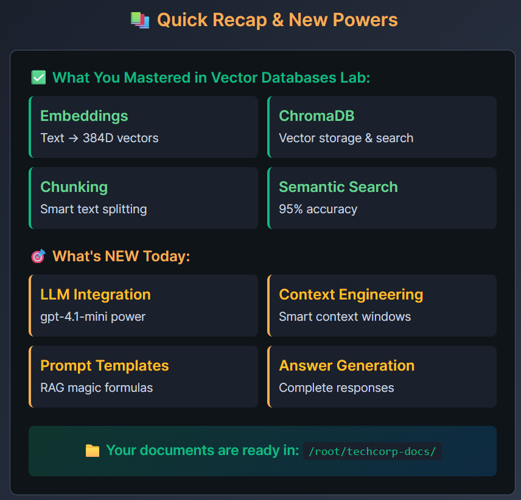
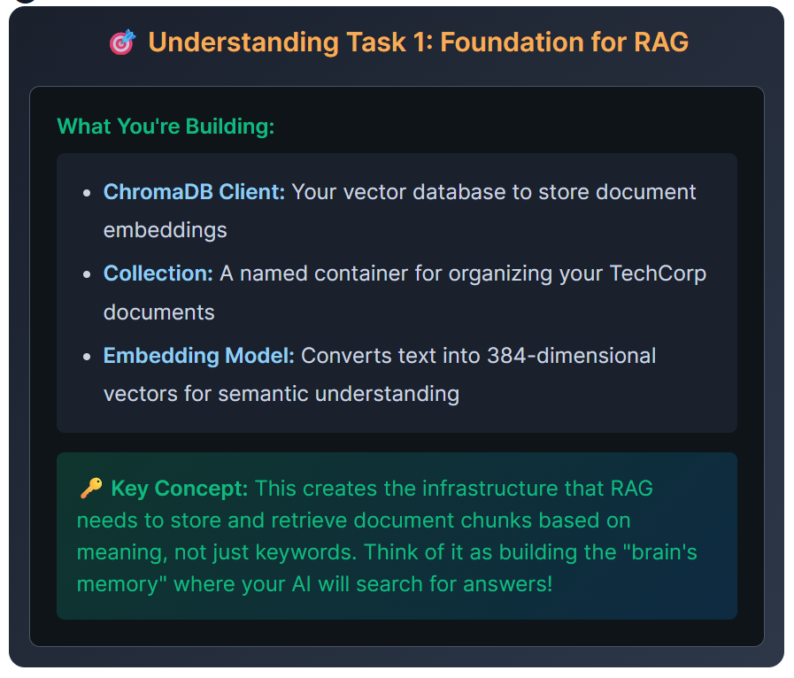
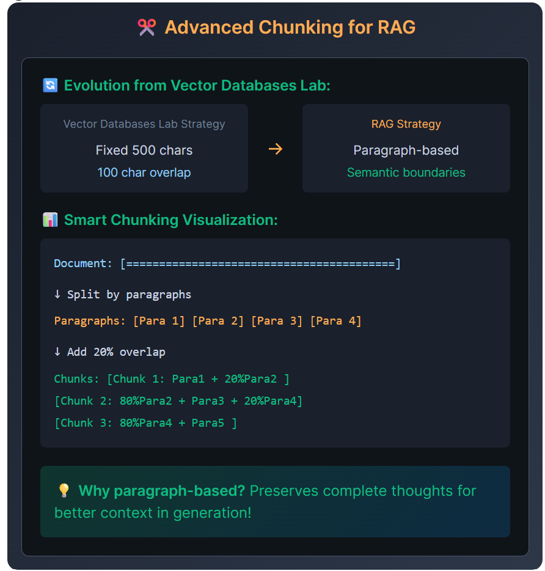
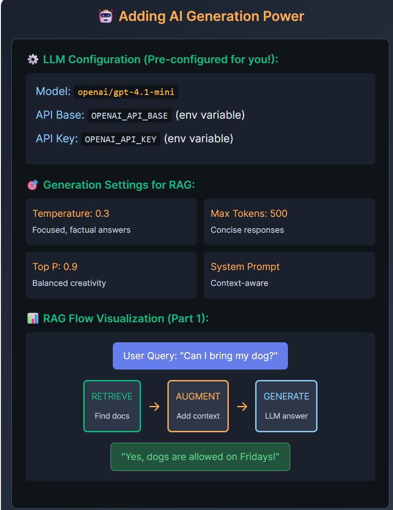
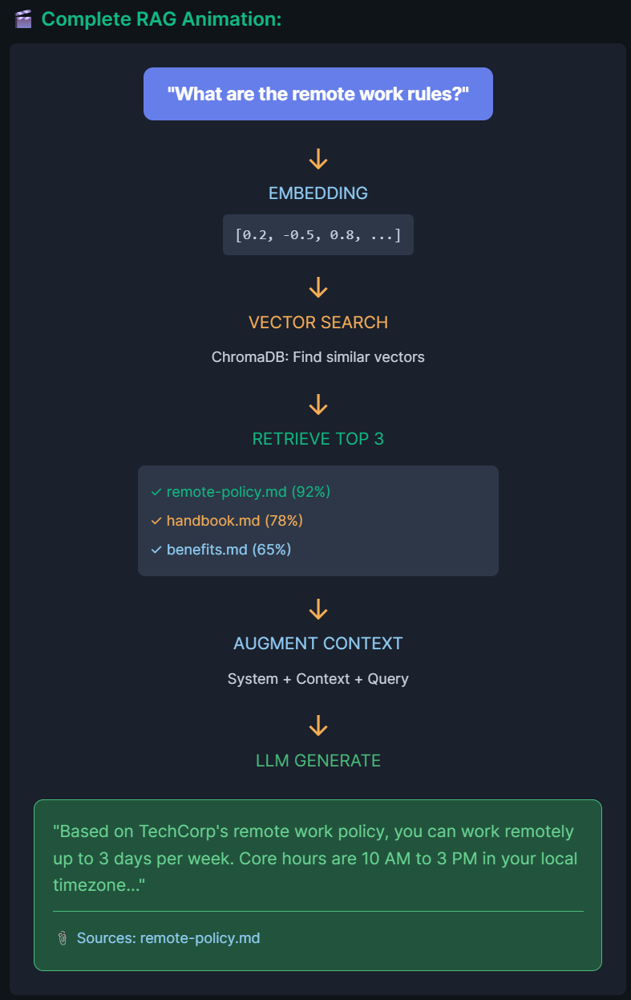

# RAG Lab


## Environment Setup and run
- https://console.groq.com/keys | [.env](../../../../.env)
- lib:
  - `chromadb` - Vector database
  - `sentence-transformers` - Embeddings (local)
  - `langchain` - RAG framework
  - `langchain-openai` - LLM integration
  - `numpy` - Vector operations

```bash
uv add chromadb sentence_transformers

cd C:\Users\Manisha\Documents\github-2025\genai; python -m src.y2026.lab_01_ai_agent.rag_05.rag_test

```

---
## tasks
### task 0: Recap on previous lab (vector)


### Task 1: Vector Store Setup (chroma) 🔧
- infra set for rag
- vector - AI brain's memory where AI can search before.
- Initialize **ChromaDB client** with persistent storage
- Create **collection** named container, for TechCorp documents
- **embedding model**(locally) : `all-MiniLM-L6-v2`
  

### Task 2: Document Processing 📄
- Implement smart paragraph-based chunking
- Add 20% overlap for context preservation
- Store documents with metadata (source, section)
- 

### Task 3: LLM Integration 🤖
- Configure LangChain ChatOpenAI client
- Set temperature (0.3) for focused answers
- Configure max tokens (500) for concise responses
- 

### Task 4: Prompt Engineering 📝
- Create system prompt for context-aware answers
- Build user prompt with retrieved chunks
- Format prompts for optimal generation

### Task 5: Complete RAG Pipeline 🚀
- Wire together all components
- Implement the complete RAG flow
- Add source citations to answers
- 

