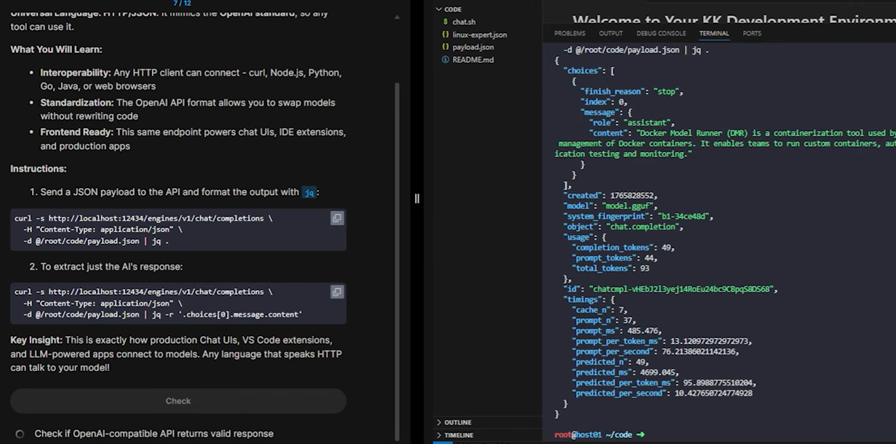

# Docker Model Runner Lab
## overview
- lab: https://kode.wiki/4qP9myB (paid)
- https://www.youtube.com/watch?v=tYg6T_DAP-k, watch lab on YouTube
- must have GPU on my desktop.
  -  **intel uhd graphics 630**, good for small model.

## Steps
```bash
# 1. install docker-model-plugin on desktop
# confirm DMR "docker-model-runner" installed ?
docker model version

# 2. pull AI model as **OCI artifact**
# stored as cached layer (config, Weigth, manifest)
docker model pull Smollm2:latest 

# 3. list: 
docker model ls
docker model ps

# 4.1 run Model
docker model run Smollm2:latest

# 4.2 run Model (Expose API, http)
# DMR docker-model-runner, expose model as openAI compatible API on port "12434"
docker model status
# if nor running, start
docker model start-runner

# 5. call API with Any http-client
```

