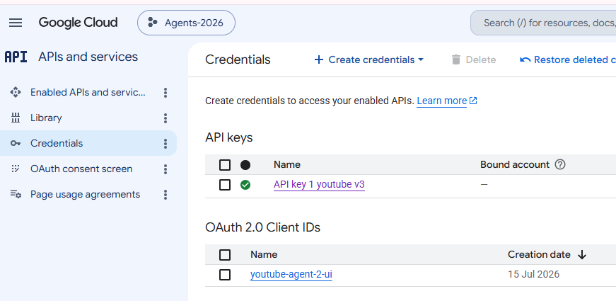

# Backend 
## ✔️Run
### Run - backend ⭐
```bash
python -m venv .venv
.\.venv\Scripts\Activate.ps1
pip install -r requirements.txt

uvicorn src.y2026.youtube_agent_2.backend.main:app --reload --port 8001
uvicorn src.y2026.youtube_agent_2.backend.main:app --reload --port 8001 --host 127.0.0.1 
```

### Run - react UI ⭐
```bash
# Start Vite
# Dependencies are installed at the repo root (`../../..`). No separate `npm install` needed here.
cd src\y2026\youtube_agent_2\frontend;
npm run dev
```

---
## ✔️docs 
- [docs](docs)
- [deployment](deployment)
- [render.yaml](deployment/render/render.yaml)

---
## ✔️One time configuration
- update environment variables 
  - [.env.example backend](backend/.env.example)
  - [.env.example frontend](frontend/.env.example)
- [firebase](docs/firebase-setup.md) | Authn + database
- Console Console | GCP 
  - https://console.cloud.google.com/apis/library/youtube.googleapis.com?project=agents-2026-502600
  - https://developers.google.com/youtube/v3/docs/?apix=true | usage docs
  - Setup API service to call YT API 
  - OAuth client (fastapi), fetch and store it firebase database
  - 

```
Steps
- Navigation menu → APIs & Services → Library.
- Search for “YouTube Data API v3” → Enable.
- APIs & Services → OAuth consent screen.
- Choose “Internal” (G Suite only) or “External” (most apps use External).
- Create OAuth 2.0 Client ID
    - APIs & Services → Credentials → + Create Credentials → OAuth client ID.
    - Application type: choose “Web application”.
    - Name: e.g., “youtube-learning-ui”.
    - Authorized JavaScript origins: (if needed) e.g., http://localhost:5173 , UI URL
    - Authorized redirect URIs:  http://localhost:8001/auth/google/callback , backend api URL
```

---
## FASTAPI DOCs
http://127.0.0.1:8001/docs  👈
### Authentication
- `GET /auth/google/login` — Start Google OAuth flow, get access token and save in sqLite3
- `GET /auth/google/callback` — OAuth callback (automatic redirect)
- `GET /auth/google/debug` — Debug access token info
- `POST /auth/google/logout` — Clear access stored tokens
- test
  - http://localhost:8001/auth/google/login
  - http://localhost:8001/auth/google/debug
  
### Fetch Videos
- `GET /api/channels` — List subscribed channels (OAuth required)
- `GET /api/{channel_id}/playlists` — List playlists for a channel
- `GET /api/videos?channel_id={channel_id}` — Get all videos from channel
- `GET /api/videos?channel_id={channel_id}&playlist_id={playlist_id}` — Get videos from specific channel's playlist
- test
  - http://127.0.0.1:8001/api/channels
  - http://127.0.0.1:8001/api/UCzCsyvyrq38R6TnztEzOmgg/playlists
  - http://127.0.0.1:8001/api/videos?channel_id=UCzCsyvyrq38R6TnztEzOmgg&playlist_id=PLJq-63ZRPdBt-RFGwsJO9Pv6A8ZwYHua9
  - http://127.0.0.1:8001/api/videos?channel_id=UCzCsyvyrq38R6TnztEzOmgg
  - [json-dumps](backend/json-dumps) 👈

### Source Sync and Course Refresh
- `GET /api/sources/sync-metadata` — Read persisted channel/playlist sync metadata
- `POST /api/sources/sync-metadata` — Refresh source metadata and flag courses needing refresh
- `POST /api/plans/{plan_id}/courses/{course_id}/discover-new-videos` — Stage unseen videos; optional `channel_id` and `playlist_id`
- `POST /api/plans/{plan_id}/courses/{course_id}/ai-suggest-refresh-feed` — Add reviewed staged videos to the course

Video responses include duration, publish date, tags, category, captions, embedding status, views, likes, and recording date when YouTube provides them.

### Learning Plans
- `POST /api/plans` — Create a learning plan
- `GET /api/plans` — Get all plan detail
- `GET /api/plans/{plan_id}` — Get plan details
- `DELETE /api/plans/{plan_id}` — Delete plan details

### Create Course in the plan
- `POST /api/plans/{plan_id}/add-course-manually` — Add course into plan
- `POST /api/plans/{plan_id}/add-course-ai-suggested` — Organize videos into course by AI , then add into plan's course
