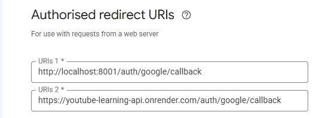
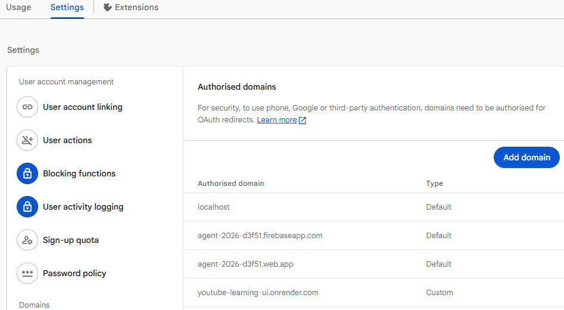

# Deploy to Render

> https://dashboard.render.com/blueprint/exs-d9ensvv7f7vs73b1qfd0/sync/exe-d9enummrnols73ek4g2g

This application deploys as two Render services from [render.yaml](../deployment/render/render.yaml)

- `youtube-learning-api` — FastAPI, Firebase Admin, Firestore, and the
  server-side YouTube OAuth callback.
- `youtube-learning-ui` — React/Vite static site.

The blueprint does not contain confidential values. Configure them in Render.

The API is configured with Render's `free` instance plan for initial testing.
Free web services can cold-start after inactivity, so the first request can be
slow. Change `plan: free` to `starter` only when you need an always-on API.

## 1. Prepare the repository

1. Confirm local Firebase sign-in and YouTube connection work.
2. Do not commit either local `.env` file or Firebase service-account JSON.
3. Commit and push the application changes, including `render.yaml` and this
   guide, to a repository Render can access.

## 2. Create the Render Blueprint

1. In Render, select **New → Blueprint** and connect the repository.
2. Choose `src/y2026/youtube_agent_2/deployment/render/render.yaml` when Render requests the
   Blueprint path.
3. Create the Blueprint. Render creates the API and static UI services.
4. Wait for their initial builds, then copy both `onrender.com` URLs.

The first UI deployment may be incomplete until its API URL is configured in
step 4.

## 3. Configure the API service

Open `youtube-learning-api` → **Environment** and set these values:

| Variable | Value |
| --- | --- |
| `FIREBASE_SERVICE_ACCOUNT_JSON` | Complete Firebase Admin **service-account** JSON, on one line. https://console.firebase.google.com/u/0/project/agent-2026-d3f51/settings/serviceaccounts/adminsdk|
| `FRONTEND_URL` | https://youtube-learning-ui.onrender.com |
| `GOOGLE_CLIENT_ID` | Google OAuth Web client ID used for YouTube access. https://console.cloud.google.com/apis/library/youtube.googleapis.com?project=agents-2026-502600|
| `GOOGLE_CLIENT_SECRET` | Matching Google OAuth client secret. |
| `GOOGLE_REDIRECT_URI` | `https://<api-url>/auth/google/callback` exactly. |
| `YOUTUBE_TOKEN_ENCRYPTION_KEY` | A valid Fernet key, such as the locally tested value. Keep it stable after deployment. |

Keep the Blueprint defaults enabled:

```text
FIREBASE_ENABLED=true
FIREBASE_AUTH_REQUIRED=true
FIREBASE_PROJECT_ID=agent-2026-d3f51
YOUTUBE_OAUTH_STATE_SECRET=<Render-generated value>
```

Download the service-account key from Firebase Console → **Project settings →
Service accounts → Generate new private key**. Treat it as a production secret;
never add it to Git or the React application.

## 4. Configure the UI service

Open `youtube-learning-ui` → **Environment** and set:

| Variable | Value |
| --- | --- |
| `VITE_API_BASE_URL` | https://youtube-learning-api.onrender.com |
| `VITE_FIREBASE_API_KEY` | Firebase Web app API key. https://console.firebase.google.com/u/0/project/agent-2026-d3f51/settings/general/web|
| `VITE_FIREBASE_APP_ID` | Firebase Web app ID. |

The Blueprint provides these non-secret values:

```text
VITE_FIREBASE_AUTH_DOMAIN=agent-2026-d3f51.firebaseapp.com
VITE_FIREBASE_PROJECT_ID=agent-2026-d3f51
```

Vite embeds `VITE_*` values at build time, so redeploy the UI after changing
any of them.

## 5. Configure Google and Firebase

1. In Google Cloud Console, 
   - Add https://youtube-learning-api.onrender.com/auth/google/callback 
   - to the OAuth Web client's authorized **redirect URIs**.
   - 
   - https://console.cloud.google.com/auth/clients/580924677921-mf3lg1qmfq96kimb6pdn0mjirv67pkqj.apps.googleusercontent.com?project=agents-2026-502600
2. In Firebase Authentication → **Settings → Authorized domains**, add the
   deployed UI host if Firebase does not already accept it. 
   - `youtube-learning-ui.onrender.com`
   - https://console.firebase.google.com/u/0/project/agent-2026-d3f51/authentication/settings
   - 
3. Confirm Google sign-in remains enabled in Firebase Authentication →
   **Sign-in method**.
```json
{
  "status": "ok",
  "firebase_enabled": true
}
```


## 6. Deploy in order

1. Save API environment values and deploy the API.
2. Confirm `https://<api-url>/health` reports `firebase_enabled: true`.
3. Save UI environment values and redeploy the UI.
4. Open the deployed UI and sign in with Google.
5. Connect YouTube and confirm its OAuth callback returns to `/profile`.

## 7. Production verification

Test using two different Google accounts:

1. Sign in as user A, create a plan, course, and sync metadata.
2. Sign in as user B and confirm user A's data is not visible.
3. Connect YouTube for each account and confirm each profile shows its own
   connection status.
4. In Firestore, confirm data is stored beneath `users/{firebase-uid}/...`.

Existing SQLite data is not automatically associated with Firebase users. Keep
it as a backup or migrate it only after deciding which Firebase user owns each
legacy plan.

## Troubleshooting

- `401` from `/api/*`: the browser did not send a valid Firebase ID token;
  sign out and sign in again.
- `Fernet key must be 32 url-safe base64-encoded bytes`: generate a value with
  `python -c "from cryptography.fernet import Fernet; print(Fernet.generate_key().decode())"`.
- OAuth callback error: verify `GOOGLE_REDIRECT_URI` and Google Cloud's
  authorized redirect URI match exactly.
- Browser CORS error: ensure `FRONTEND_URL` is the exact deployed UI origin,
  then redeploy the API.
