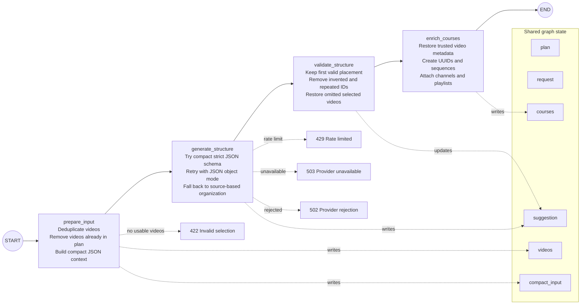

```mermaid
flowchart TD
    A[User opens AI Course Modal] --> B[Load subscribed YouTube channels]

    B --> C[User selects channels]
    C --> D[Load playlists for selected channels]
    D --> E{Playlist selected?}

    E -->|Yes| F[Fetch videos from selected playlists]
    E -->|No| G[Fetch all videos from selected channels]

    F --> H[Build AI generation request]
    G --> H

    H --> I["POST /api/plans/{planId}/add-course-ai-suggested"]

    I --> J[Load existing learning plan]
    J --> K[Validate request and remove duplicate videos]

    K --> L[Prepare compact LLM input]
    L --> M["Video ID<br/>Title<br/>Description<br/>Tags<br/>Duration<br/>Channel and playlist IDs"]

    M --> N[LangGraph workflow]

    subgraph LG[LangGraph Course Generation]
        N --> O[Generate course structure with LLM]
        O --> P["Compact structured LLM output<br/>Course titles and descriptions<br/>Module titles<br/>Ordered video IDs"]
        P --> Q[Validate LLM output]
        Q --> R{Output valid?}

        R -->|No| S["Normalize placements<br/>Remove invented or duplicated IDs<br/>Restore missing selected videos"]
        S --> T
        R -->|Yes| T[Enrich AI output]
    end

    T --> U["Restore original metadata<br/>URL<br/>Thumbnail<br/>Duration<br/>Published date<br/>Views and likes<br/>Tags"]

    U --> V["Generate application fields<br/>UUIDs<br/>Timestamps<br/>Playback defaults<br/>Watched status"]

    V --> W[Build courses and modules]
    W --> X[Attach source channels and playlists]
    X --> Y[Merge courses into existing learning plan]
    Y --> Z[Save complete learning-plan JSON]

    Z --> AA[Return updated learning plan]
    AA --> AB[Frontend reloads plan]
    AB --> AC[Display generated courses and modules]
```

## POC implementation

The diagram matches the implemented flow, with two important trust boundaries:

- The LLM returns only course/module titles, course descriptions, and ordered video IDs. It does not create URLs, thumbnails, timestamps, playback state, engagement counts, labels, revised titles, or application IDs.
- The API keeps the first valid placement, removes invented or repeated IDs, and adds omitted selected videos to a deterministic fallback module. Nothing is saved until the complete graph succeeds.

The frontend sends the selected source metadata and the full YouTube metadata needed for later display. Video descriptions are excluded from the LLM prompt; titles, a subset of tags, duration, and channel/playlist provenance provide the organization context. The full trusted metadata remains in graph state and is restored afterward.

## LangGraph state flow



```json
{
  "videos": [
    {
      "video_id": "youtube-video-id",
      "title": "Original title",
      "revised_title_from_ai": "Original title",
      "description": "Video description",
      "thumbnail": "https://...",
      "url": "https://youtube.com/watch?v=...",
      "duration_secs": 900,
      "published_at": "2026-01-15T00:00:00Z",
      "tags": ["python", "agents"],
      "view_count": 1000,
      "like_count": 50,
      "channel_id": "channel-id",
      "playlist_id": "playlist-id"
    }
  ],
  "source_channels": [
    {
      "channel_id": "channel-id",
      "title": "Channel title",
      "url": "https://youtube.com/channel/...",
      "thumbnail": "https://...",
      "video_count": 20,
      "playlists": [
        {
          "id": "playlist-id",
          "playlist_id": "playlist-id",
          "title": "Playlist title",
          "thumbnail": "https://..."
        }
      ]
    }
  ]
}
```

The POC uses a four-node `StateGraph`:

1. `prepare_input` removes duplicate/already-added videos and builds compact model context.
2. `generate_structure` calls a LangChain `ChatGroq` model with a compact strict Pydantic schema. If Groq reports `json_validate_failed`, the node retries with JSON object mode. If Groq still cannot return parseable structure, a deterministic source-based fallback preserves every selected video instead of failing the request. Application labels and display titles are derived afterward.
3. `validate_structure` normalizes placements to enforce the one-to-one video-ID contract.
4. `enrich_courses` restores metadata and creates application-owned fields.

Configure it with `GROQ_API_KEY`; `AI_LLM_MODEL` defaults to `openai/gpt-oss-20b`. `AI_MAX_VIDEOS_PER_REQUEST` defaults to 50 to keep a free-tier request within a practical context and rate-limit budget. The endpoint returns `429` for a provider rate limit, `503` when AI configuration/dependencies or connectivity are unavailable, `422` for an invalid selection, and `502` for another provider rejection. Full exception details are logged by the plans service.
