```mermaid
flowchart TD
    A[User opens AI Course Modal] --> B[Load subscribed YouTube channels]

    B --> C[User selects channels]
    C --> D[Load playlists for selected channels]
    D --> E{Playlist selected?}

    E -->|Yes| F[Fetch videos from selected playlists]
    E -->|No| G[Fetch all videos from selected channels]

    F --> H[Build AI generation request]
    G --> H

    H --> I["POST /api/plans/{planId}/add-course-ai-suggested"]

    I --> J[Load existing learning plan]
    J --> K[Validate request and remove duplicate videos]

    K --> L[Prepare compact LLM input]
    L --> M["Video ID<br/>Title<br/>Description<br/>Tags<br/>Duration<br/>Channel and playlist IDs"]

    M --> N[LangGraph workflow]

    subgraph LG[LangGraph Course Generation]
        N --> O[Generate course structure with LLM]
        O --> P["Structured LLM output<br/>Courses<br/>Modules<br/>Video placements<br/>AI revised titles<br/>Topical labels"]
        P --> Q[Validate LLM output]
        Q --> R{Output valid?}

        R -->|No| S["Reject output<br/>Invented, duplicated, or missing video IDs"]
        R -->|Yes| T[Enrich AI output]
    end

    T --> U["Restore original metadata<br/>URL<br/>Thumbnail<br/>Duration<br/>Published date<br/>Views and likes<br/>Tags"]

    U --> V["Generate application fields<br/>UUIDs<br/>Timestamps<br/>Playback defaults<br/>Watched status"]

    V --> W[Build courses and modules]
    W --> X[Attach source channels and playlists]
    X --> Y[Merge courses into existing learning plan]
    Y --> Z[Save complete learning-plan JSON]

    Z --> AA[Return updated learning plan]
    AA --> AB[Frontend reloads plan]
    AB --> AC[Display generated courses and modules]
```

## POC implementation

The diagram matches the implemented flow, with two important trust boundaries:

- The LLM returns only course/module organization, topical labels, exact video IDs, and revised titles. It does not create URLs, thumbnails, timestamps, playback state, engagement counts, or application IDs.
- The API rejects output when a selected video ID is missing or repeated, or when the model invents an ID. Nothing is saved until the complete graph succeeds.

The frontend sends the selected source metadata and the full YouTube metadata needed for both organization and later display. A shortened description and a subset of tags are sent to the LLM, while the full trusted values remain in graph state and are restored afterward.

```json
{
  "videos": [
    {
      "video_id": "youtube-video-id",
      "title": "Original title",
      "revised_title_from_ai": "Original title",
      "description": "Video description",
      "thumbnail": "https://...",
      "url": "https://youtube.com/watch?v=...",
      "duration_secs": 900,
      "published_at": "2026-01-15T00:00:00Z",
      "tags": ["python", "agents"],
      "view_count": 1000,
      "like_count": 50,
      "channel_id": "channel-id",
      "playlist_id": "playlist-id"
    }
  ],
  "source_channels": [
    {
      "channel_id": "channel-id",
      "title": "Channel title",
      "url": "https://youtube.com/channel/...",
      "thumbnail": "https://...",
      "video_count": 20,
      "playlists": [
        {
          "id": "playlist-id",
          "playlist_id": "playlist-id",
          "title": "Playlist title",
          "thumbnail": "https://..."
        }
      ]
    }
  ]
}
```

The POC uses a four-node `StateGraph`:

1. `prepare_input` removes duplicate/already-added videos and builds compact model context.
2. `generate_structure` calls a LangChain `ChatGroq` model with strict Pydantic structured output.
3. `validate_structure` enforces the one-to-one video-ID contract.
4. `enrich_courses` restores metadata and creates application-owned fields.

Configure it with `GROQ_API_KEY`; `AI_LLM_MODEL` defaults to `openai/gpt-oss-20b`. `AI_MAX_VIDEOS_PER_REQUEST` defaults to 50 to keep a free-tier request within a practical context and rate-limit budget. The endpoint returns `503` when AI configuration/dependencies are absent, `422` for an invalid selection, and `502` when the hosted model does not produce an acceptable structure.
